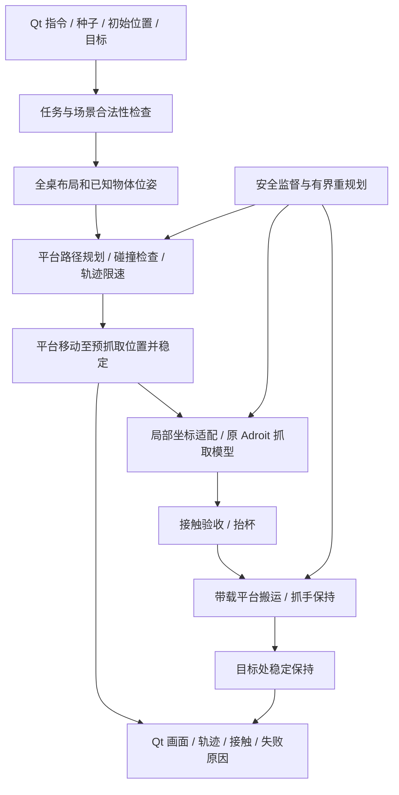

# 整桌随机抓杯任务书：方向调整与历史方案

## 2026-10-07 用户变更

**当前采用直接移动 Adroit，不再添加 XYZ 机构。** 新方案、命令和验收以 [无平台导航与局部抓取适配](ADROIT_NAVIGATION.md) 为准。下面的 XYZ 任务书是历史设计，不应再据此新增平台。

当前 F1 空手导航完成基础验收；F2 两视频平移后的局部抓取通过，但连续预抓交接未通过；F3 空手避障与带杯模块已实现，第一视频带杯通过、第二视频加速度未过，带杯绕障未验证。F4 Qt 新模式及 F5/F6 整桌冻结评估未开始。沿用搬运并保持、不松手的目标，保留原模型和旧 Qt。

---

## 历史 XYZ 任务书（不再作为当前实施指令）

建立：2026-10-06；更新：2026-10-07。状态：**F1 平台与整桌场景已实现，F2–F6 未开始，未训练。** F1 基础验收和未消除的物体微抖见 [实现与边界](WHOLE_TABLE_F1.md)。

## 1. 目标与范围

在现有 85 × 80 cm 仿真桌面上，固定杯型 `025_mug`、缩放 0.8，杯子和 0–4 件其他物体均可在整桌合法位置出现。取消 v6 的中央无障碍通道和干扰物仅在两侧的规定。初始杯位置直接已知，首版其他物体的位姿与碰撞模型也由仿真场景提供；RGB-D 感知误差另做扩展，不能把已知位姿结果说成视觉识别效果。

用户已确认采用 **XYZ 移动平台搭载 Adroit**。完成条件为抓起、搬到 Qt 指定目标、稳定保持；**放下、松手不在本阶段**。先沿用杯子固定朝向，不把变杯型、变姿态或实物部署纳入本次验收。

“任意位置”指整个桌面支撑区域，而不是物体中心可以越过桌边。应按各物体旋转后实际碰撞轮廓计算边界，保留 5 mm 初始边缘余量；初始实体不能相交。不能因杯子偏远、被挡或规划困难，就重新抽取容易位置并漏掉失败。

拥挤场景可能确实没有可用抓取路径：系统必须安全失败、解释原因，并计入任务成功率。目标是定义分布上的实测成功率超过 80%，不是承诺所有任意堆放都一定可解。

## 2. 当前基础和限制

- 稳定基线：提交 `181e09a`，入口 `scripts/169_launch_random_tabletop.sh`。不改默认入口、旧数据、原权重和已冻结报告。
- 复用：两视频局部抓法、结构化残差模型、接触/穿透审计、MuJoCo GPU 渲染、Qt 进程通信和语言指令准入。
- 现有 `control_scene.py` 假定前 30 个关节对应 30 个执行器；新增平台会使该假定失效，不能直接拼接 qpos。
- `training_inputs.py` 是 139 维输入，包含局部 qpos/qvel、相对位置、阶段和参考动作；不只靠修改杯子坐标就能泛化到平台运动。
- 新平台改变运动机构和惯性耦合，旧模型能否无训练复用要实测。旧 80/80 不属于整桌验收。

## 3. 方案与控制边界



平台使用三个有惯性、阻尼、行程和执行器约束的平移关节。先建简化笛卡尔机构，不引入移动底盘、机械臂 IK 或 ROS2。机构可视化和碰撞几何需包含支架/滑台及连接件，不能只检查一个点。

原 30 维手部通道保留，平台额外三个通道：`CompositeCommand.platform_joint_target_m` 是米，`local_normalized_action` 是 [-1,1]，禁止把两者作为同一种量二次归一化。使用名称查询模型关节/执行器索引。物体 freejoint 不算在 33 个受控标量通道中。

控制权交接草案：transit/align 时平台移动、手保持预抓姿态；grasp/lift 时平台保持、局部模型推进；transport 时平台负责远距离搬运、手负责局部保持；hold 时两者稳定保持。旧手部还包含全局平移/旋转关节，必须限制它们与平台重复纠偏。全局 transit 不消耗原示范帧，局部 reach/grasp/lift/transport 的参考时钟独立管理；新增 hold 不是原模型已有的第五个技能。F2 要验证阶段交接的位姿、速度、参考帧连续性，不能直接让旧 transport 与平台同时追同一远目标。

坐标约定：W 为桌面世界系，G 为平台安装系，L 为旧策略局部参考系，O 为杯子系。`T_WO` 表示把 O 系坐标变到 W；`T_LO = inverse(T_WL) @ T_WO`。所有位置米、角度弧度、四元数 wxyz；Qt 显示毫米。平台零点、安装变换 `T_GL` 和旧参考映射在 F1/F2 标定，不从随机杯位姿偷偷重设机械手初态。

执行阶段仅写执行器控制并积分物理；不得写杯子 qpos、加额外物体助力或移动世界中的固定 body 来跟随目标。初始化、规划副本可以设状态，但不得回灌到正在执行的仿真。

## 4. 按顺序执行的工作包

每阶段验收通过再进入下一阶段。F0 已完成，F1 实现和证据已归档，F2–F6 未开始。F1 附加低速度诊断未全部通过，不能宣称桌面物体完全静止。

| 阶段 | 实际工作 | 交付物 | 验收标准 |
| --- | --- | --- | --- |
| F0 已完成 | 隔离目录、配置、接口、任务书、论文调研、检查命令 | `whole_table/`、本任务书、参考表、单元测试 | 不依赖 GPU 即可检查；明确整桌抓取未实现；旧入口未改 |
| F1 平台与场景 | 新建三轴 MJCF、名称索引；按物体轮廓采样全桌布局；固定初始手位姿 | `scene.py`、`layout.py`、独立模型/加载入口、九宫格到位报告 | 中心/边缘/角点可达；实测平台限位与制动；初始不穿模、不掉桌；动作通过物理积分 |
| F2 局部策略适配 | 世界/平台/旧参考坐标转换；名义位置平台锁定对照；两视频局部抓握验证 | `adapter.py`、坐标测试、至少九个位置的双视频抓取记录 | 30/139 契约不变；阶段采样正确；接近/闭合/抬杯无不连续；不能以画面接近代替物理验收 |
| F3 避障与带载运动 | OMPL 接入场景有效性及边有效性检查；时间参数化；空载/带杯扫掠检查 | `planning.py`、`collision.py`、`timing.py`、堵路和窄通道用例 | 手、平台、载荷不撞非目标物体；规划副本与执行场景一致；超时/无路安全停止，不自动删除障碍 |
| F4 任务与 Qt | 连续接近→抓握→抬杯→搬运→保持；失败分类、停止、最多两次重规划；整桌位置控件 | `runner.py`、Qt 独立模式和 worker | 中途不能更改任务参数；停止有效；无 GL 回归；输入坐标与实际布局相符；三指对握和到位保持达标 |
| F5 开发覆盖与冻结 | 开发集调参；仅在必要时采集纠偏和小规模训练；冻结平台/策略/采样器/阈值 | 开发记录、失败清单、训练决策、留出清单和哈希 | 两视频分开过关；不得把专家/学习策略混记；测试集未参与调参；没有默认授权长训 |
| F6 独立验收与归档 | 运行冻结留出集合；分区域/视频/物数统计；整理图和报告 | `evaluation.json`、覆盖热图、成功/失败图、版本提交 | 每视频完整任务成功率 >80%；报告布局级区间和薄弱区域；失败不剔除；不将旧 v6 结果并入 |

F1 已实现无干扰物空手悬停到位，不实现避障或训练。平台行程 X/Y ±0.60 m、Z 0–0.45 m，`S_grasp = gantry_q + (0,0,0.10)` m；九个台面上方位置和六个近限位点经过物理验证。这不是九点抓取验证。速度/加速度/加加速度是仿真工程设定，尚无真实硬件依据。

F2 若原策略在平台冻结时就失败，先修坐标和参考，不立即训练。仅在接口一致、轨迹可执行但闭环偏离仍存在时，提出小规模纠偏训练方案；保持旧基线可回退。

F3 首选高位通行后下降，但所有上升、平移、下降及闭合轨迹都必须做碰撞检查；“飞过障碍”不是直接假定可行。平台无新增偏航自由度，先用原手腕可达姿态；需要额外偏航轴时另行确认机构，不静默增加。

## 5. 初步验收协议

完整成功要求：真实接触形成持续三指对握、杯底相对初始高度至少增加 50 mm、目标误差 ≤20 mm 并保持 1 s、穿透峰值 ≤1 mm、没有非目标碰撞或掉杯、所有新增平台速度/加速度/行程门槛通过。沿用旧指尖判定的具体验证脚本，在 F2 明确迁移；不得把米制滑轨越界误记成弧度。

建议留出布局按桌面 4×4 分区，每格 10 个独立布局，两视频配对执行：**160 布局、320 回放**。物数 0–4 分层均衡；加入边缘/角点专项集和无路安全集，专项集与随机成功率分开。几何合法、规划失败的随机布局必须留在分母；初始化错误单列并修正生成器，不能反复补抽到通过为止。

建议最低门槛：每视频至少 129/160 完整成功；另报告每格、各物数、首次尝试/包含有界重试的成功率、规划耗时、路径长度、接触中断、障碍间距、目标误差和穿透。每格低于 8/10 标为覆盖不足，不用总体均值掩盖。正式种子、分布和阈值在 F5 冻结，当前不抽取或执行留出集。

重规划上限 2 次，不能重置杯子后把第三次当首次；耗时和干预必须计入同一任务。两个视频共享布局，置信区间按独立布局计算，并分别报告视频结果。无路场景“安全停止通过”不是“抓取任务成功”。

## 6. 文件与接口

已建立：

```text
configs/whole-table-v1.json
src/fromrealhand/whole_table/
  __init__.py
  config.py          配置检查、框架状态；运行入口明确拒绝
  contracts.py       对象位姿、任务、复合动作、遥测、阶段
  interfaces.py      场景、平台规划、局部策略适配的抽象接口
scripts/174_inspect_whole_table.py
tests/test_whole_table_scaffold.py
docs/WHOLE_TABLE_TASKBOOK.md
docs/WHOLE_TABLE_REFERENCES.md
docs/presentation/whole_table/README.md
```

F1 新增 `configs/whole-table-f1.json`、`whole_table/{scene,layout,motion,platform_checks}.py`、脚本 175–177 和五项软件测试。独立原生窗口：`bash scripts/177_launch_whole_table_f1.sh`。F0 配置仍用于只读接口检查，不自动切换为抓取执行。

未来 `SceneBackend` 的遥测从物理状态采集；`TransitPlanner` 不拥有执行环境；`LocalPolicyAdapter` 不直接控制平台。安全监督拥有唯一任务状态，Qt 只提交请求和显示，不直接写 qpos。现有语言模型先继续输出高层技能，平台 transit/align 是执行器内部子阶段，不因此立即重新 LoRA。

框架检查，不会开始仿真：

```bash
cd /home/smgbro/mujoconew/GITHUB
python3 scripts/174_inspect_whole_table.py
PYTHONPATH=src python3 -m unittest discover -s tests -p 'test_whole_table_scaffold.py'
```

`configuration_valid=true` 只表示接口配置通过；检查命令自身不执行物理，因此 `physics_executed=false`。`runtime_ready=false` 指完整抓取任务尚未实现；平台演示入口单独列出，不能与完整运行时混淆。

## 7. 环境与资料管理

不升级或污染现有 `dexmv`、MuJoCo 2.0、Qt、语言模型环境。F0 框架只依赖 Python 3.7+ 标准库；F1 复用已有 NumPy、SciPy、MuJoCo 和 YCB 资产。OMPL/Ruckig 后续先在隔离规划环境验证；必要时与旧物理进程通过有版本的消息交换，不能直接安装最新版破坏旧依赖。未安装新规划库、未下载新模型或数据。

新实验文件放 `/media/smgbro/shared/visual_grasp/whole-table-v1/`，F1 最终结果在 `f1-final/`；不放到 `lora`。模型保留原路径。Git 仅收录源码、配置、报告和少量截图。

每阶段保留命令、版本、成功分母、失败类型。当前保留两张真实 F1 仿真图；带载避障轨迹和独立评估热图后续补充，不能用空手平台图冒充抓取成功。

## 8. 当前状态

- [x] 用户确认 XYZ 平台，任务终点为搬运并保持。
- [x] 框架、任务书、参考调研和检查入口已建立。
- [x] 平台 MJCF、全桌采样器、名称映射、独立空手物理移动入口。
- [ ] 附加低速度诊断全部通过；当前干扰物仍有微抖，公开记录。
- [ ] 避障和带载物理执行。
- [ ] 两视频局部策略适配、Qt 新模式、整桌独立评估。
- [ ] 任何新训练或实物部署。

下一阶段是 **F2 局部策略适配**，开始前检查残余物体抖动对接触判定的影响。开源依据和兼容性见 [参考资料](WHOLE_TABLE_REFERENCES.md)。
