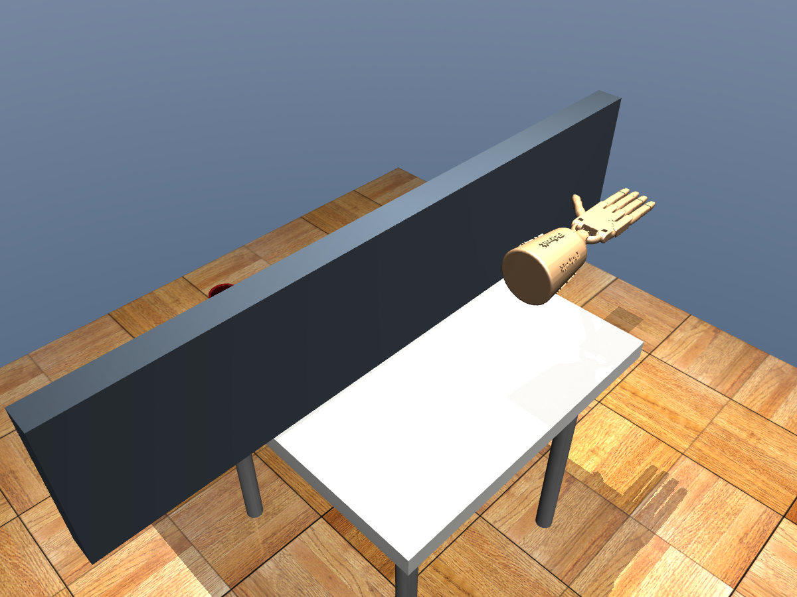
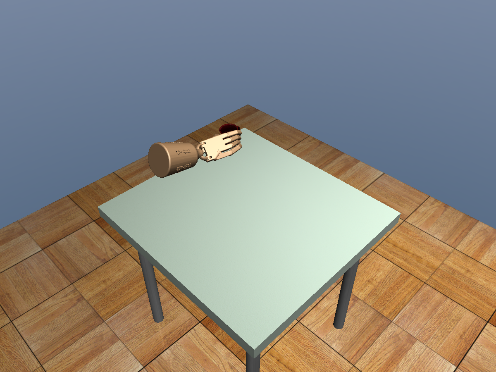
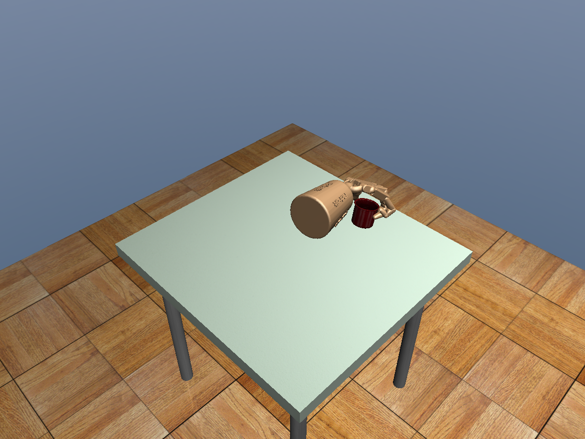

# 答辩素材：直接移动 Adroit 的导航与抓取

日期：2026-10-07。数据来源和源码哈希见 [results.json](results.json)。完整运行说明见 [ADROIT_NAVIGATION.md](../../ADROIT_NAVIGATION.md)。

## 建议五页讲解

1. **问题与架构**：旧模型只在局部工作区验证。新模式不用 XYZ 机构，采用手掌参考中心导航、局部学习抓取、负载保持三层控制。已知位姿场景，不是视觉泛化或真实硬件。
2. **坐标契约**：139 输入、30 动作不变；初始化共同平移使杯-掌和目标-杯特征不变。与统一起点连续导航是不同验收，不能混为一谈。
3. **避障方法**：按手部组件的 AABB 膨胀障碍，稀疏图 Dijkstra 加连续边检查；带杯时将杯几何并入载荷包络。无路必须保留失败。
4. **动力学修正**：保留学习手指动作；补偿杯重力和力矩，平滑切换根部控制。只写 actuator ctrl，杯子 freejoint 不锁定。
5. **结果和局限**：空手 6/6、绕墙通过；两段视频平移后局部抬杯通过；第一视频带杯通过。第二视频虽然到位，动态验收未过；近桌面交接和带杯绕障仍待完成。没有整桌 >80% 的新结论。

## 关键代码

来自 `tabletop/training_inputs.py` 的位置特征：

```python
pose[:3, 3] - palm
goal - pose[:3, 3]
```

共同平移后上述差值不变，但前提是安装参考、来源位姿和目标一致变换。执行期间不可不断搬动固定 body 来“适配”。

来自 `whole_table/local_adapter.py` 的负载补偿主式：

```python
ctrl[:6] += (jp.T @ force + jr.T @ torque) / self.kp[:6]
```

`force`、`torque` 是抓稳后的一次负载标定，不是往杯子 freejoint 施加虚拟助力。带杯不是重训出来的全桌神经策略。

## 截图

### 空手绕墙后的实际物理状态



四个路点，手和前臂作为完整几何接受检查。这是空手例，不是带杯绕障证据。

### 第一视频搬运并保持



从局部初态完成学习抓取，再物理搬运约 42 cm；此例通过当前组件门槛，没有先执行统一起点导航。

### 第二视频到位，但未通过全部门槛



截图能说明位置，不能证明动态平稳。杯子到位且末秒对握，但交接加速度超标，明确保留失败。

## 答辩时避免的表述

不要说“整桌任意位置都成功”“新学习策略比专家更强”“通过吸附搬杯”或“已能部署实物”。可说：已验证导航和局部学习的模块化结合，记录了近桌面交接与负载动态的剩余问题。
