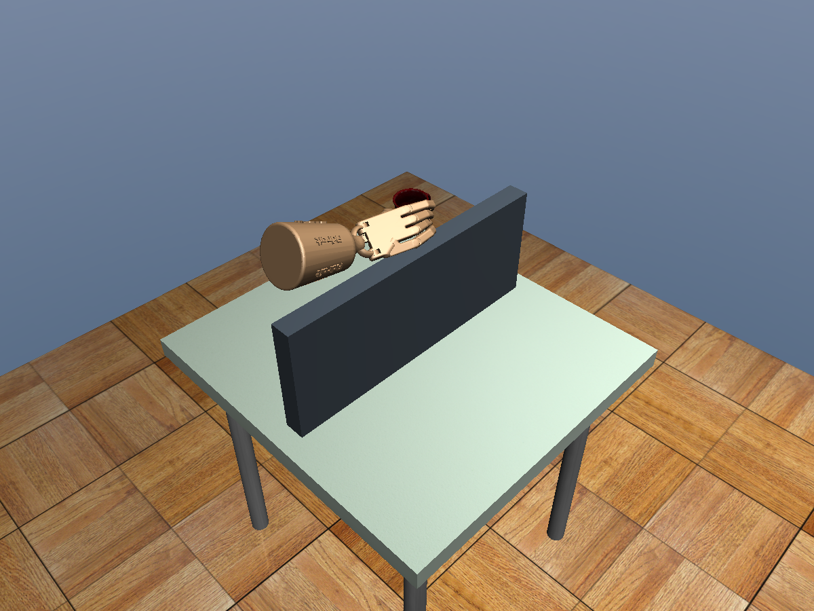
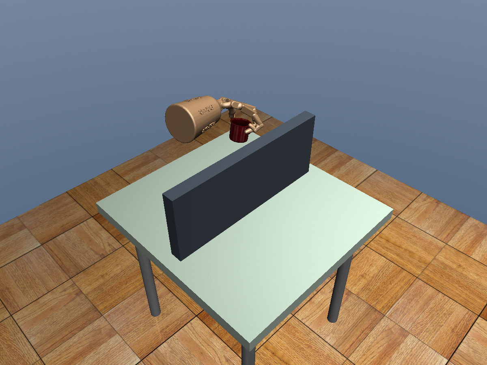
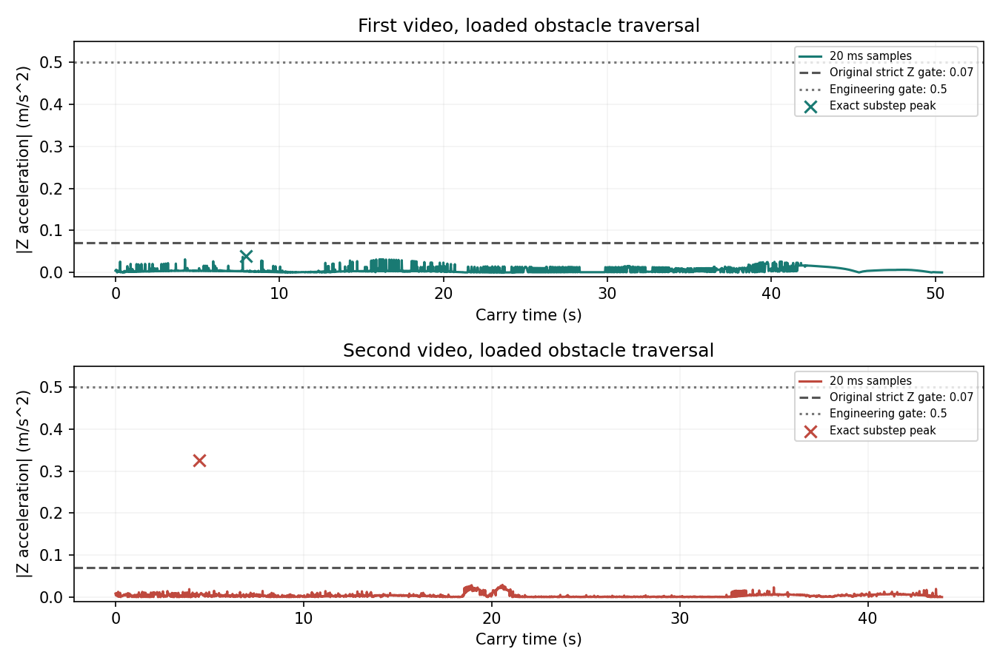

# 连续抓取与带杯绕障答辩素材

2026-10-07。两视频、无墙/有墙四个开发用例完成宽松工程验收。不是新的独立泛化成功率。详见 [方法与操作](../../ADROIT_NAVIGATION_V2.md) 和 [结果及源码哈希](results.json)。

## 四页讲解顺序

1. **为什么旧版不能连续运行**：导航与抓取初态贴桌；控制器硬切换使受力不连续；空手包络没有包含载荷。展示旧失败记录，避免只展示成功。
2. **如何解决交接**：区分渲染/碰撞几何；远距离连接与低速接近分段；第一视频悬停高 6 mm；一秒执行器力混合，不重置物理状态。
3. **如何带杯绕障**：杯子是自由刚体，靠真实接触保持；规划使用手加杯的包络，轨迹实际通过物理积分。两视频分别 4/5 路点越过固定障碍。
4. **结果与口径**：目标误差 0.23–1.13 mm，末秒支持率 100%；第二视频有动态尖峰，按用户授权接受 0.5 m/s² 工程上限，同时保留旧严格失败标记。四个开发通过不代表整桌 >80%。

## 第一视频实际带杯越障

与 v1 不同，这次截图来自统一起点导航、连续交接、学习抓取后的真实带杯运动。路径长约 72 cm。

## 第二视频实际带杯越障

约 67 cm 路径，最终杯子误差约 0.23 mm，末秒对握保持。墙从开局存在，手和杯子未穿过墙。

## 动态门槛同时展示

曲线是 20 ms 采样值，叉号单独标出每个物理子步监测到的精确峰值，避免低频图遗漏尖峰。第一视频同时通过旧严格与工程版；第二视频只通过工程版，没有声称严格平稳问题已完全解决。

## 关键代码和来源

- `control_scene.py:ControlEnv.step`：旧力到新控制量的换算和平滑混合。
- `hand_scene.py:HandScene.hand_shapes`：只过滤纯渲染几何，未禁用真实碰撞。
- `181_check_free_hand_local.py`：初始化固定障碍、两段导航、连续抓取和过墙截帧。
- `navigation_runner.py`：逐步物理审计及双门槛报告。

方法依据为 MoveIt 的分段任务思想、已有 SciPy 图搜索和 MuJoCo 动力学。当前成果是连续系统的工程实现，不是新算法优越性或真实机器人迁移证明。

补充边界：第一视频的局部接近动作仍会轻触桌面，局部手部穿透峰值约 0.43 mm，未超过原 1 mm 门槛；导航和带杯阶段无环境接触。不要把“无障碍物碰撞”扩大成“全程不触桌”。
