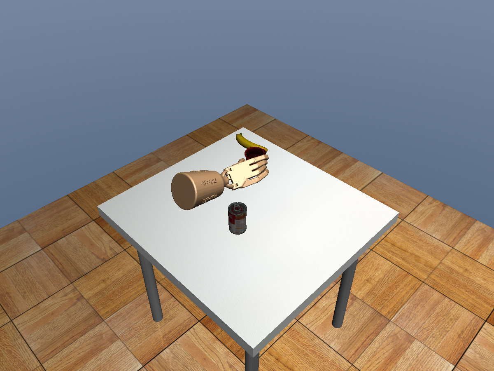
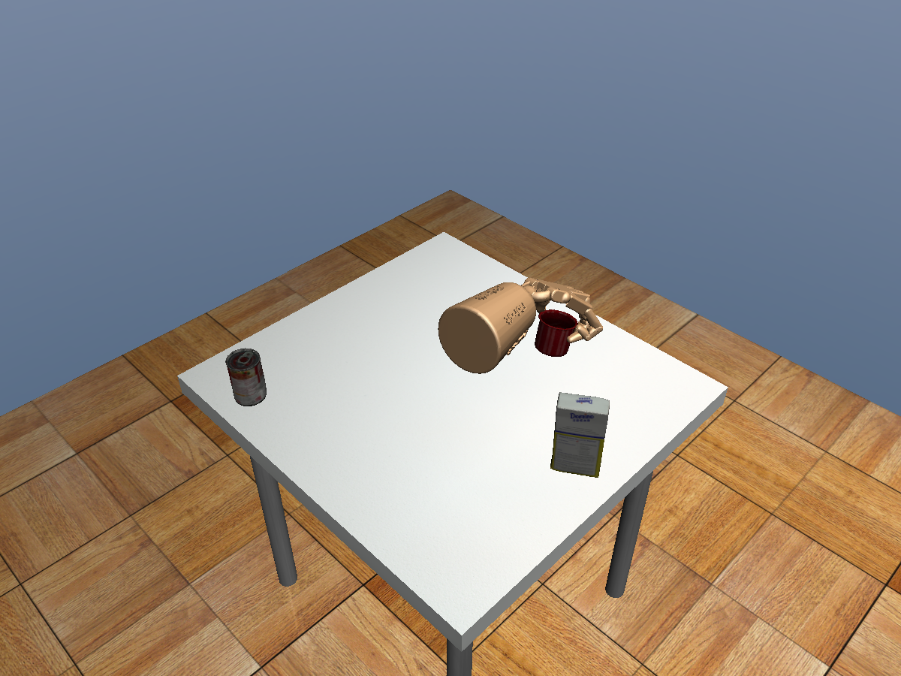
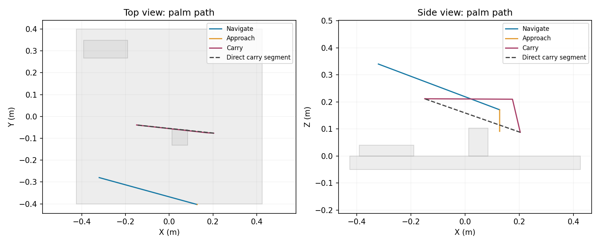

# 随机桌面的连续导航、抓取与搬运

2026-10-07。本轮复用原结构化残差 BC 抓取模型，不训练新模型，不替换 Qt 默认入口。允许三维避障，包括从物品上方通过，不要求全部沿桌面横向绕行。

## 测试设计

固定种子 4301–4304，每个种子分别测试两段视频的抓法。杯型与尺度不变，杯子初始 XY 为 `(±0.20, -0.04)` 或 `(±0.16, 0.04)` 米；目标为另一侧 X=±0.20 m、Y=0.08–0.12 m、Z=0.20 m。每桌有 2–4 件干扰物，按整桌网格包围盒规则随机放置，不预留中央通道。

同一随机种子的两种抓法使用相反侧杯位，并非完全相同布局；单案例的两轮测试保持全部布局和目标不变。每轮先冻结所有布局再运行，不因失败重抽场景。

流程：统一起点导航 → 低速接近 → 一秒控制力交接 → 学习策略 reach/grasp/lift → 稳定对握 → 手加杯的包络规划 → 带杯搬运 → 末秒保持。

物体只在初始化时放置，此后保持自由刚体；不使用吸附约束、逐帧写杯子位姿或给杯子额外助力。远距离导航和搬运是规划加反馈控制，局部抓取才调用学习模型，不应称为端到端自主视觉抓取。

## 两轮对照

第一轮配置为 `adroit-navigation-v2.json`。第二轮使用实验配置 `adroit-navigation-v3.json`，增加受约束的抓后退让尝试：只有正常规划起点不满足 25 mm 余量时，才检查 10 mm 规划余量下的 12 cm 上升退让；实际执行仍保持 8 mm 净空检查。没有降低物理碰撞、穿透或掉杯标准。

第二轮不是新的独立留出集，不将重复测试的分母当成独立泛化样本。v3 仍是实验开关，原 v2 为默认配置。全部结果及失败记录在 [results.json](results.json)，每轮 manifest 保存了执行前的布局和源码哈希。

两轮均为 **5/8 完整任务成功（62.5%）**，合计 16 次执行，不是 16 个独立案例。导航和低速接近均为 8/8，抓取抬杯为 7/8，搬运保持为 5/8。原严格动态门槛的完整任务通过为 2/8。不能称为整桌 >80% 验收通过。

| 种子 | 第一视频 | 第二视频 |
| --- | --- | --- |
| 4301 | 抓取抬杯成功；糖盒侵入搬运起点净空，拒绝搬运 | 完整成功，目标误差 0.435 mm |
| 4302 | 完整成功，目标误差 0.536 mm | 完整成功，目标误差 0.379 mm |
| 4303 | 抓取抬杯成功；芥末瓶侵入搬运终点包络，拒绝搬运 | reach 第 411 次动作触及芥末瓶，子步安全停止 |
| 4304 | 完整成功，带杯路径有绕行，目标误差 0.661 mm | 完整成功，目标误差 0.409 mm |

5 条成功任务的末秒支持率均为 100%，局部最大穿透为 0.719 mm，搬运最大穿透为 0.706 mm；第一视频仍有受限触桌。失败第二视频的食指末节与芥末瓶接触深度约 0.140 mm，不能将这个案例描述为全程零障碍接触。

v3 没有提高成功率：4301 的第一视频起点连 8 mm 执行净空也不满足，不能开始退让；4303 的终点冲突不能靠退让消除。该批次没有一条真正进入退让执行，故只验证了拒绝分支，未验证该新运动分支的物理收益，不启用为默认配置。

## 验收口径

- 导航、接近、搬运分别记录到位、跟踪、速度、加速度和碰撞。
- 抓取要求拇指与至少共三指承力且具有对握，抬杯底面不低于 5 cm。
- 带杯目标误差不超过 2 cm，末秒持续支持；杯子自由关节不变。
- 延用工程版 0.5 m/s² 加速度上限，另报原严格动态门槛。局部手部相关穿透上限 1 mm。
- 局部策略可有受限触桌，不等于全程零接触。审计在物理子步立即停止的失败接触，可能不会进入最后一个完整控制帧的 trace，必须同时检查 `failure_contacts`。

## 答辩讲解

1. 从“空手能到达”到“抓住后能搬走”：包络必须包含手和杯，且局部策略动作也可能碰到旁边物体。
2. 已知初始杯位与局部坐标适配：只平移手的参考坐标，已放置的杯子不再重复平移；之后全程连续物理积分。
3. 成功案例展示实际带杯路径，而不是仅看路径规划结果。俯视图和侧视图一起说明允许越过障碍。
4. 公开失败：起点安全余量、终点被占据、局部接近碰撞是不同问题，不用重新抽种子掩盖。







轨迹图取 4304 第一视频，展示导航、末段接近、带杯阶段的实测掌心位置；局部学习抓取段没有在此图中连接。灰色为物体几何包围盒，虚线为带杯端点之间的直线，紫色实际轨迹先上升再越过罐头。检查的是整个手加杯包络，不是仅检查图中的掌心点。

## 复现

直接打开原生 MuJoCo 窗口，连续执行同一成功案例：

```bash
cd /home/smgbro/mujoconew/GITHUB
bash scripts/188_launch_navigation_grasp.sh \
  --case /media/smgbro/shared/visual_grasp/navigation-grasp-v1/seed-4304-first
```

完成后窗口保持打开，关窗口结束。第二视频可将案例改为 `seed-4301-second`。这是重新运行完整物理控制，不是视频播放或状态写入回放。新查看记录放在打印出的 `/tmp/adroit-navigation-grasp-*/run`，不覆盖批量验收结果。

原生窗口额外全程检查通过：4304 第一视频渲染 3426 帧，杯子最终误差 0.461 mm，末秒支持率 100%，搬运无环境接触，严格动态也通过，无 GL 报错。该可视化重跑不计入上述两轮批量对照分母。软件回归共 277 项通过。

完整输出位于共享盘 `visual_grasp/navigation-grasp-v1/` 和 `navigation-grasp-v2/`。每条任务包含导航/接近 adapter、局部逐帧 trace、carry 轨迹、成功条件与失败接触对。

```bash
cd /home/smgbro/mujoconew/GITHUB
bash scripts/137_tabletop_gpu.sh scripts/185_test_navigation_grasp.py \
  --output /media/smgbro/shared/visual_grasp/navigation-grasp-repeat
```

输出目录必须不存在。第二轮实验需另加 `--config configs/adroit-navigation-v3.json`。原始轨迹和 checkpoint 不上传 GitHub，提交源码、精简结果、布局、方法说明和三张图。

## 下一步优先级

1. 在开始局部抓取前检查整段参考动作对干扰物的扫掠空间，而不只检查导航终点；存在冲突时换抓取方向或拒绝。
2. 把稳定抓姿和搬运起点净空联合检查，避免出现“能抓起但不能进入安全搬运区”。
3. 对指定杯子目标检查相应手加杯的终态包络，目标不可达时明确报告，不能静默改目标或删除障碍。

## 方法参考

- [MoveIt Grasps](https://moveit.picknik.ai/main/doc/examples/moveit_grasps/moveit_grasps_tutorial.html)：将接近、抬升、退让分成明确运动阶段。本项目借鉴分段思想，没有安装或声称运行 MoveIt。
- [MoveIt 的抓后载荷碰撞表示](https://moveit.picknik.ai/main/doc/examples/move_group_interface/move_group_interface_tutorial.html)：规划时应考虑被抓物体。本项目只合并规划包络，MuJoCo 中杯子仍靠接触保持，未加固定约束。
- [OMPL 状态和运动合法性检查](https://ompl.kavrakilab.org/core/stateValidation.html)：端点合法性和整段运动合法性需要分别验证。本项目仍使用已有 SciPy Dijkstra 和连续线段/AABB 检查，不将换规划器当作解决抓取碰撞的替代。
