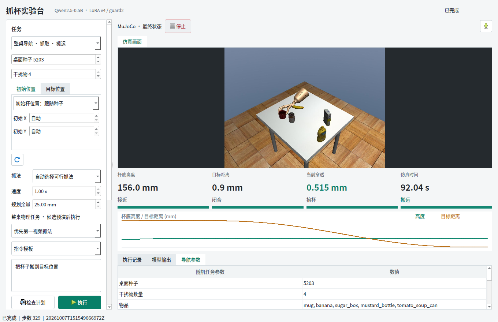
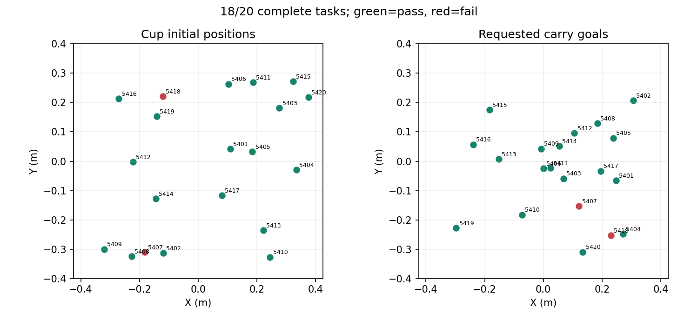

# 答辩素材：整桌导航与 Qt 可调抓取

## 本轮结果

| 项目 | 结果 |
| --- | --- |
| 新的独立桌面种子 | 5401–5420，共 20 个 |
| 完整工程任务 | **18/20，90%** |
| 旧严格动态门槛 | 6/20，单独记录 |
| 成功任务最大目标误差 | 0.783 mm |
| 成功任务最大搬运穿透 | 0.932 mm |
| 末秒对握支持 | 成功任务全部 100% |
| 第 380 帧入口的独立成功案例 | 5412 反向；5420 正向 |
| 计算成本 | 57 次预演，18 次实际执行；规划中位数 48.42 s |
| Qt 验收 | 六项全部通过；停止响应 0.576 s |
| 软件回归 | 287 项通过 |

两个失败种子 5407、5418 保留。90% 是已知位姿、同 MuJoCo 模型预演下的系统样本成功率，不是纯网络或实物成功率；采用此前的工程动态阈值，不放宽碰撞与穿透门槛。

## 六页讲解顺序

1. **问题**：局部视频抓取动作不能直接覆盖整桌；长接近轨迹可能扫到杂物，抓住后也可能没有安全退出空间。
2. **结构**：语言计划负责技能顺序，几何规划负责空手/带杯导航，参考条件学习策略负责局部接触。抓取候选在独立物理场景中验证后，只选择一个实际执行。
3. **改动**：支持两视频候选、近参考帧入口、抓姿方向候选、低速交接与带杯上撤；Qt 可改种子、杯位、目标、速度、规划余量。
4. **实现证据**：使用 `qt-clutter.png` / `qt-second.png` 两张实际界面截图。模型通过执行器完成动作，杯子为自由刚体，不逐帧写入杯位姿。
5. **实验**：使用 `coverage.png`，同时列出完整 20 轮的成功/失败、源码冻结情况、预演数量与时间。读取 `statistics.json` 和 `heldout-results.json`，不要只讲成功截图。
6. **边界**：已知初始位姿、固定杯型/朝向、同仿真模型预演，采用工程动态门槛。不是端到端视觉策略，不是机械臂实物成功率，也不是仅靠学习策略达到同样指标。

## 可展示的代码

文件位置均相对于仓库根目录：

- `src/fromrealhand/whole_table/task.py`：`run()` 保留候选失败，并将 `actual_executions` 限制为 0 或 1；`_candidate()` 连接导航、局部策略和带杯执行。
- `src/fromrealhand/tabletop/random_task.py`：`start_reference_step` 改变参考轨迹的进入位置，不改变物体状态；`env.step(action, audit)` 检查物理子步。
- `src/fromrealhand/whole_table/loaded_motion.py`：载荷包络包含杯子，保持阶段每步检查支持、接触和穿透。
- `src/fromrealhand/desktop/navigation_window.py`：Qt 参数传给同一任务后端，避免图形演示与测试使用两个不同控制器。
- `scripts/192_evaluate_navigation_task.py`：执行前保存所有场景与哈希，所有失败计入总分母。

## 证据文件

- `heldout-manifest.json`：预先固定的布局、目标、模型和代码 SHA256。
- `heldout-results.json`：20 轮实际结果与所有候选尝试。
- `previous-heldout-summary.json` / `previous-heldout-manifest.json`：v4 首轮独立测试 13/20 的完整失败证据。它与最终版使用不同新种子，不能解释为同样本配对提升。
- `statistics.json`：成功数、严格动态数、误差、穿透、预演计算量与失败原因。
- `qt-quality.json`、`qt-*.json`：参数传递、帧数、界面响应、停止、执行锁、非法指令与进程退出。
- `development.json`：开发阶段失败记录，不追加到独立测试样本中。
- `files.json`：归档文件 SHA256。
- `release-source-audit.json`：冻结版本 `37a3a12` 与评估哈希的核对；评估后仅显示层遥测修正，不改变物理控制。

完整方法、口径与复现命令见 [操作文档](../../NAVIGATION_QT.md)。原始逐步轨迹和模型仍在共享盘 `visual_grasp/navigation-v4/`、`visual_grasp/dual-learn-v4/`；GitHub 只保存源码、精简记录与三张图。
