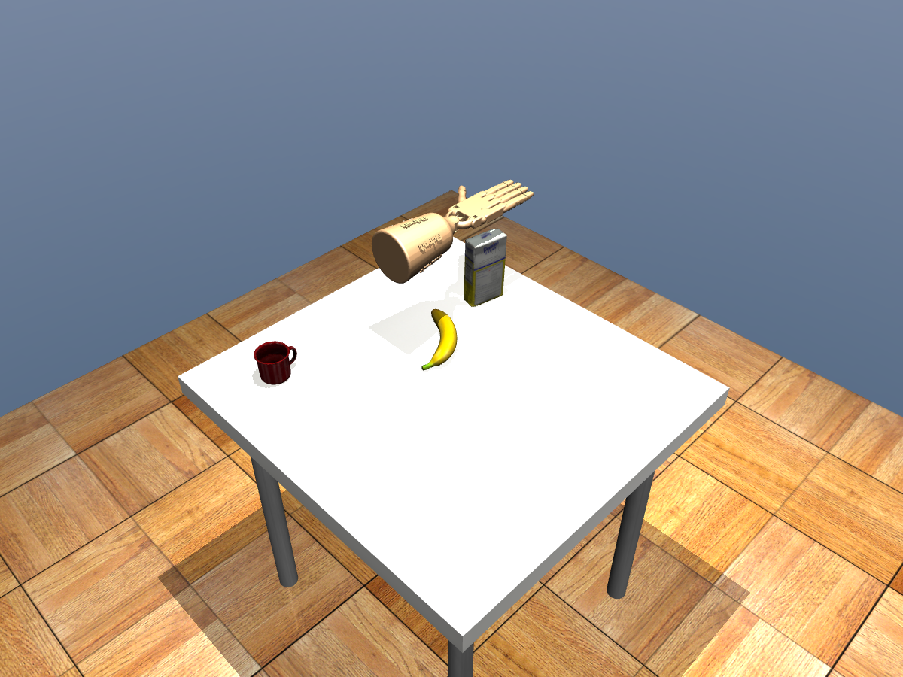
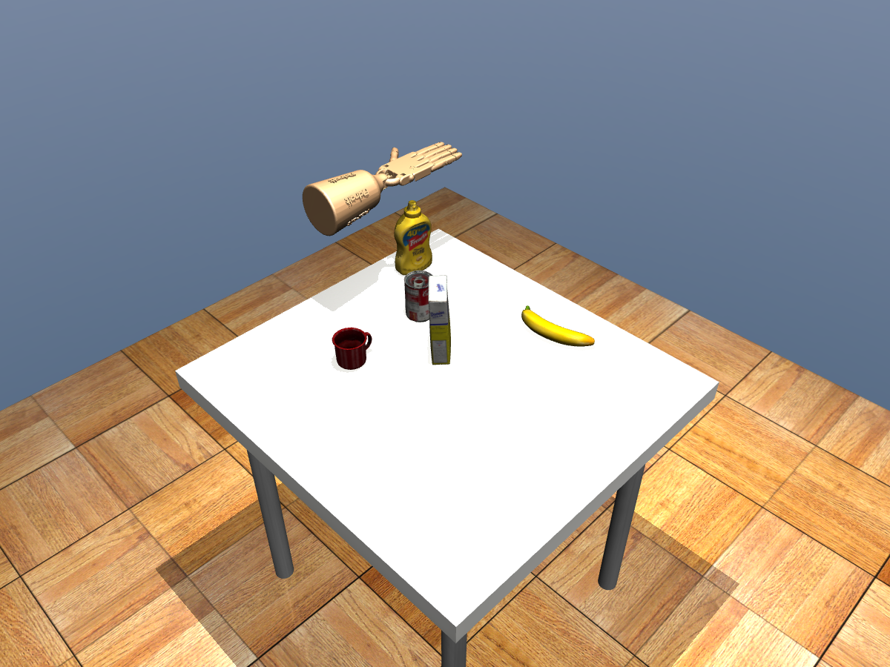

# 随机物品桌面：空手定点导航测试

2026-10-07。本轮只测试空手导航，不抓杯、不训练，不更改 Qt 默认入口或已有学习模型。

## 测试设计

- 固定种子 4101–4106，桌面分别放置 3、4、5、3、4、5 件 YCB 物品，包含原水杯；位置和其他物体朝向按种子采样。
- 全部案例在物理执行前保存到 `manifest.json`，不根据成功与否更换种子或重抽布局。
- 每个布局按最高物品的投影中心确定横向穿越路线，起终点为桌子两侧的掌心 X=-0.60/+0.60 m。初始高度按该物品高度确定，范围 0.10–0.18 m；这是有意设置的障碍穿越用例，不是任意目标的独立泛化测试。
- 每个种子执行去程和回程，回程不重置物理状态，共计划 12 次。遇到失败原样记录，无法继续的回程也保留在分母。
- 使用原空手控制限值，规划余量 25 mm、执行余量 8 mm，到位误差 <3 mm，跟踪误差 <15 mm，无手与环境碰撞。**未使用 0.5 m/s² 宽松抓杯动态门槛。**
- 起终点在桌外是为了保证初态与终态本身有几何空间；测试的是经过物品上方/周围的路径，不是桌面任意点抓取。

全量结果：`/media/smgbro/shared/visual_grasp/navigation-seeds-v1/`。每个种子目录有 `case.json`、`initial_obstacles.json`、`forward.json` 和 `reverse.json`；往返路径、逐步实际位置、速度、加速度及物品位移均保存。初始化后杯子和物品自由运动，执行只控制手的执行器。

## 实测结果

**6 个桌面、12 次导航全部通过原空手物理门槛，12 次均为绕行路径，手与环境接触次数为 0。** 未启动训练或执行抓取。

| 种子 | 物品数 | 去程到位误差 mm | 回程到位误差 mm | 往返最大跟踪误差 mm |
| --- | --- | --- | --- | --- |
| 4101 | 3 | 0.0101 | 0.0165 | 7.1220 |
| 4102 | 4 | 0.0469 | 0.0115 | 8.0917 |
| 4103 | 5 | 0.0504 | 0.0060 | 8.0918 |
| 4104 | 3 | 0.0112 | 0.0273 | 7.0882 |
| 4105 | 4 | 0.0382 | 0.0055 | 6.9331 |
| 4106 | 5 | 0.0135 | 0.0288 | 7.3968 |

单次规划耗时 1.43–2.18 秒。物品相对初始静置后的最大位移为 0.237 mm；未检测到手与物品接触。到位误差是本仿真控制器的数值结果，不代表实物定位精度。

本目录保存 [结构化结果](summary.json) 和两张绕行关键帧，便于答辩引用：





结论仅覆盖这 6 个预先确定的开发布局、固定手姿态和选定的往返端点。尚未验证狭窄通道、动态障碍、任意旋转或带杯导航；12/12 不能外推为任意桌面的成功率。

## 直接看原生 MuJoCo 窗口

```bash
cd /home/smgbro/mujoconew/GITHUB
bash scripts/180_launch_adroit_navigation.sh \
  --case /media/smgbro/shared/visual_grasp/navigation-seeds-v1/seed-4101/case.json
```

窗口会重新执行该布局的去程和回程，完成后保持打开。这是执行器驱动的物理仿真，不是图片或逐帧写入位置。将 `4101` 换成 `4102` 至 `4106` 可以看其他布局。该入口已经过 6 秒原生窗口检查，渲染 301 帧，未出现 GL 错误。

重新跑批量测试，输出目录必须不存在：

```bash
bash scripts/137_tabletop_gpu.sh scripts/184_test_random_navigation.py \
  --output /media/smgbro/shared/visual_grasp/navigation-seeds-v1-repeat
```

## 方法与检查

复用已有实际碰撞几何包络、配置空间障碍膨胀、SciPy Dijkstra 和五次时间轨迹；没有引入新模型或依赖。本轮相关 8 项导航单元测试通过。主要验收依据是实际 `sim.step()` 的物理结果，而不是规划器返回了路径。

`direct=false` 表示原直线被碰撞空间拦截并规划了绕行；它不是新增训练的成功指标。物品在重力和接触求解下可能轻微漂移，因此记录位移，不把非零位移直接当成被手撞击。
