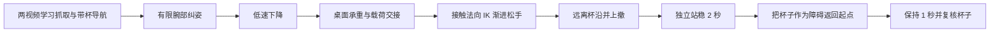
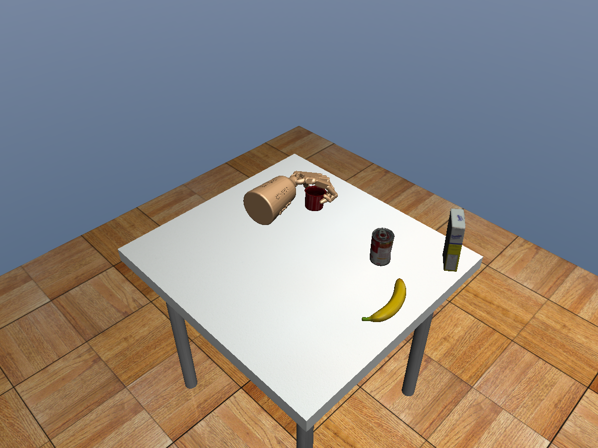
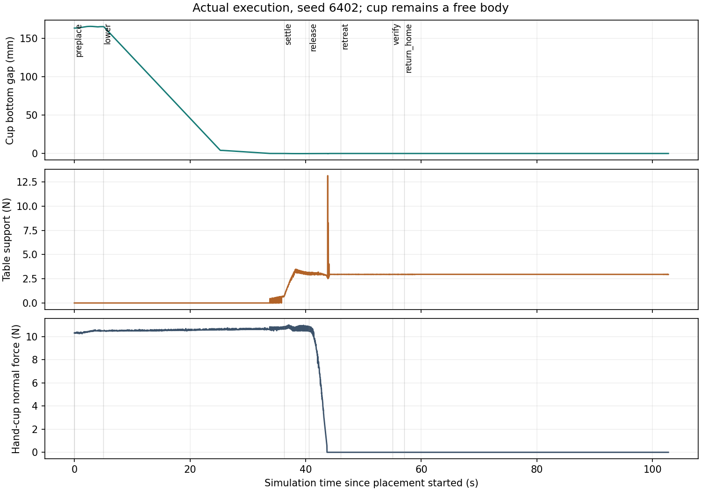
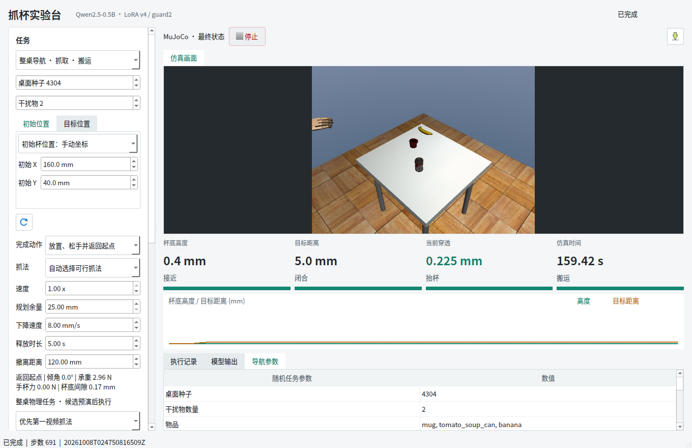

# 放置、松手、撤离与返回起点：验收和答辩材料

日期：2026-10-08。任务书 P1-P5 已按本轮工程范围完成。**冻结后的 20 个新桌面场景，16 个完整成功，样本成功率 80%。** 原有搬运并保持模式保留，未训练或替换模型。

## 结果与范围

| 项目 | 实测结果 |
| --- | --- |
| 整链成功 | 16/20；未找到可行候选的 4 例也计失败 |
| 实际执行 | 16 次，16 次放置和返航均通过；未通过预演的场景不执行 |
| 成功任务抓法 | 第一视频 6 次，第二视频 10 次；不是各抓法独立成功率 |
| 成功任务最大最终 XY 误差 | 5.632 mm，上限 20 mm |
| 成功任务抓取至返航穿透峰值 | 0.908 mm，上限 1 mm |
| 成功任务最大返航中心误差 | 0.0046 mm，上限 3 mm |
| 稳定检查 | 撤离后 2 s、返航后 1 s，按物理子步而非截图检查 |
| 软件回归 | 300/300 |
| Qt | 两抓法整链、停止、释放中停止、锁定、非法指令拒绝通过 |
| 实际执行与对应预演 | 两项 Qt 用例最终杯位置和手关节数值相同 |
| 冻结检查 | 132 个源码/配置哈希保持一致，模型哈希核对通过 |
| 计算成本 | 79 次完整或提前失败的候选预演；20 例共 78.92 min，单例中位数 219.8 s |

预演总耗时约 49.25 min，包含在上述总耗时中。会话中断前留下的一次未完成预演另存，不计入这 79 次及耗时；断点恢复核对原种子、配置、代码和权重，不更换案例。

固定训练杯型 `025_mug`、缩放 0.8、初始朝向固定；杯位及 2/3/4 件杂物位置随机。放置目标在桌内，并预留杯投影到杂物投影 120 mm 的轴向释放工作区。几何准入在控制前执行，不能根据预演结果重抽布局。80% 是这批有限样本的结果，不是整个桌面所有布局、RGB-D 误差或实物成功保证。

## 方法流程



高层新指令走明确规则白名单，局部抓取复用现有两视频参考条件策略。新放置部分是接触反馈状态机，不是新训练出的语言或端到端放置策略。

1. 杯轴与杯底由实际 mesh 标定；接触力从接触坐标转换到世界竖直方向，避免把夹持力当作桌面承重。
2. 放置前搜索小幅腕部旋转，使杯轴接近直立、手与桌面留空；仅在独立 FK 副本中求解姿态。
3. 接近桌面减速，以承重反馈微调下降并逐步卸载施加在手执行器上的载荷前馈。承重不稳定则保持抓握并停止，不能按固定时间强行松手。
4. 根据当前手杯接触点外法向生成分离目标，求解有限关节范围内的张手动作，使用 5 s 平滑插值执行；不直接倒放抓取动作。
5. 撤离保留释放末态控制，避免控制切换导致重新闭合；远离杯子后再切换空手姿态伺服并返航。
6. 杯子全程为自由刚体。实际执行只控制手执行器并积分，不写入杯子位姿，不给杯子额外力，不通过删除碰撞来放下。

来自 [placement.py](../../../src/fromrealhand/whole_table/placement.py) 的载荷交接片段：

```python
alpha = min(1., (i + 1) * dt / 2.)
bridge.payload_wrench = tuple(v * (1 - alpha) for v in wrench)
target[2] -= np.clip((.95 - q['table_weight_ratio']) * .001,
                     -.0005, .0005) * dt
q = tick(bridge, target)
```

承重门槛还要求连续 0.3 s 满足 0.85-1.1 倍杯重且低速；释放后的独立稳定窗口采用任务书的 0.8-1.2 倍平均承重门槛。这两个判据对应不同阶段。

## 实际执行截图

以下三帧都来自 **种子 6402 的同一次实际执行**，不是候选预演或运动学摆拍。选择该例是因为杯子遮挡较少；全部 20 例统计独立保留。

| 桌面承重确认 | 松手完成 | 撤离后独立站稳 |
| --- | --- | --- |
|  |  |  |



曲线显示手杯力降为零后，桌面仍承担约 2.96 N 杯重。释放转换中保留了真实的瞬态承重峰值，没有平滑删除；本轮未定义实物冲击力上限，不能据此声称实物安全。



Qt 图片来自操作回归场景 4304，不冒充种子 6402。返航中心位于桌外，当前总览相机在最终状态会裁掉部分手臂画面；返航是否完成由记录的中心误差和物理验收判断。

## 四个失败

| 种子 | 主要阻碍 | 处置 |
| --- | --- | --- |
| 6409 | 通常抓法受阻；一项旋转抓法可搬运，但杯倾角超出 30 度纠姿范围 | 12 个候选均未通过，未实际执行 |
| 6413 | 多项抓法受阻；可进入放置的反向抓法未在 8 s 内完成承重持续确认 | 保留抓握并终止候选，未实际执行 |
| 6415 | 抓取或带杯起点净空不满足，无法进入可行放置链路 | 未实际执行 |
| 6416 | 可进入放置的反向抓法承重确认超时，其余候选受阻 | 未实际执行 |

这些安全拒绝在完整任务分母中均算失败。以后可在新的开发集优化承重收敛时间、拥挤起点与姿态规划，但本轮没有为通过率修改超时、门槛或剔除种子。还存在预演较慢、同模型依赖、杯型和朝向覆盖有限等边界。

## 如何演示

```bash
cd /home/smgbro/mujoconew/GITHUB
bash scripts/191_launch_navigation_qt.sh
```

1. 完成动作选“放置、松手并返回起点”，自动选择可行抓法，保留默认速度和释放参数。
2. 第一抓法示例：种子 4304，杂物 2，手动杯位 `(160,40)` mm，目标 `(-200,80)` mm；优先第一视频。
3. 第二抓法示例：种子 6302，杂物 0，手动杯位 `(-150,100)` mm，目标 `(-160,-120)` mm；优先第二视频。
4. 输入“把杯子放到目标位置并返回起点”，点击执行。先候选预演，再显示实际物理执行。
5. 目标页 Z=200 mm 是搬运悬停高度；最后落桌高度自动确定。返回的是手的起始参考中心，不恢复初始手指角，也不把杯子搬回原位。

开放调参不意味着每种参数组合均达到 80%；正式统计使用默认 8 mm/s 下降、5 s 松手、120 mm 上撤。旧“搬运并保持”模式独立保留。

## 数据索引与答辩提纲

- [20 例完整结果](summary.json)、[预先冻结的场景与哈希](manifest.json)、[精简指标](statistics.json)、[失败详情](failure-details.json)。
- [截图例放置记录](example-placement.json)、[Qt 完整任务检查](qt-quality.json)。
- 原始数据：`/media/smgbro/shared/visual_grasp/tabletop-placement-v1/heldout-6401/`；Qt 位于同级 `qt-complete-03`、`qt-controls-01`、`qt-release-stop-02`，旧模式回归在 `hold-regression`。
- [开发过程与失败修复](../../run_logs/2026-10-08-tabletop-placement.md)、[完整任务书](../../TABLETOP_PLACEMENT_TASKBOOK.md)、[Qt 操作](../../NAVIGATION_QT.md)。

答辩建议 4 页：① 原系统边界与新增状态机；② 接触承重、松手 IK 与连续控制；③ 三阶段真实截图及接触力曲线；④ 16/20 结果、四个失败、计算成本与实物边界。贡献表述为现有学习抓取系统的连续物理任务扩展，不宣称提出新的基础学习算法。
