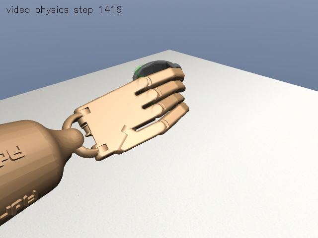
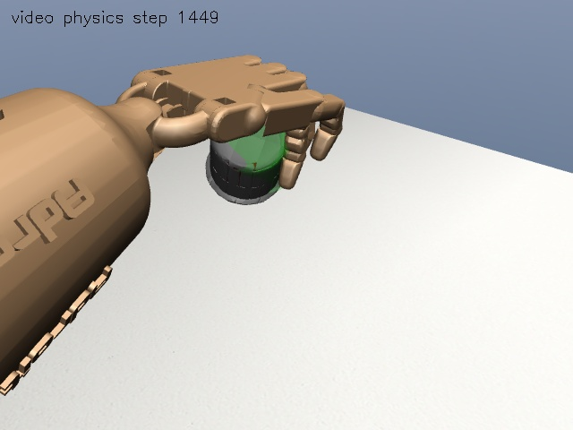

# 第 200 次策略：独立评估与收尾

## 结论

2026-10-02：200 次 DAPG 已完成；本轮完成 64 次配对新工况回放和 4 次标准场景/半步长复核。
**最低任务率达标，但预注册的“不低于训练前策略”条件未通过。保留旧策略，阶段 3 不标为完全验收通过。**

| 指标 | 冻结训练前策略 | 第 200 次策略 |
|---|---:|---:|
| 新工况任务通过 | 31/32 (96.875%) | 30/32 (93.75%) |
| 第一视频任务通过 | 16/16 | 16/16 |
| 第二视频任务通过 | 15/16 | 14/16 |
| 稳定抬杯 | 32/32 | 32/32 |
| 旧严格抓法通过 | 17/32 | 16/32 |
| 平均目标距离 | 12.432 mm | 12.119 mm |

配对结果为 0 个任务改善、1 个任务退化。样本有限，不能据此宣称统计显著变差；
但它足以否定本轮“200 次训练已经证明收益”的说法。略小的平均目标误差不抵消穿透失败。

训练后标准/半步长共 4/4 通过任务及旧严格门槛。第一视频目标距离为 1.579/1.115 mm，
第二视频为 3.722/12.195 mm；半步长复核不是独立场景泛化。

## 评估设计

评估前固定 `configs/stage3-post200-eval-v1.json`，两已知视频各 16 个新随机工况。
对照为冻结的训练前策略与固定第 200 次 checkpoint，二者均保留同一预测接触修正器。
不选择中间 checkpoint，不改任务/严格门槛，不据测试结果重新训练。

阶段 3 产物：`data/processed/dual_video_v14c/post200_independent_v1/`。
原训练模型仍在 `data/processed/dual_video_v14c/long_training/`，未移动或覆盖。
共享盘 `/media/smgbro/shared/lora/` 仅用于阶段 6 语言模型、隔离环境和训练产物。
目录按用户澄清在完成 10/64 次回放后调整，冻结协议与两模型哈希保持不变，
保留全部已完成结果并从断点继续；未完成的第 11 次重新执行。
`protocol-v1.json` 是运行前冻结副本，完整统计、失败记录、模型哈希和两张截图见 [evidence/v1](evidence/v1)。

扰动范围：杯子 XY 各 ±4 mm，目标 XY 各 ±18 mm，杯子偏航 ±6 度；随机种子 2026100241。
每视频 16 个新组合，两模型配对比较；没有测试后调参，也没有选择中间 checkpoint。
任务准入保持原 v12 定义，严格抓法保持原 v10 定义；每视频任务率 >=75%、抬杯率 >=87.5%，
另要求总任务通过数不低于旧策略及标准/半步长全部通过。最后两项中“不退化”未通过。

## 失败定位

| 工况 | 实测结果 | 解释 |
|---|---|---|
| 第二视频 unseen_13，两策略 | 保持末段食指/中指承力接触均为 0 | 仅拇指和无名指持续承力，未满足三指支撑任务门槛 |
| 第二视频 unseen_14，第 200 次策略 | 最大穿透 1.068 mm；旧版 0.912 mm | 新增任务失败；原 1 mm 门槛保持不变 |
| 同上穿透峰值 | 7.538 s，`C_thdistal` / `collision_mug_13` | 发生在抬杯阶段，属于拇指接触余量不足 |
| 同上目标距离 | 21.305 mm | 通过任务级 30 mm，但不通过严格级 20 mm |

其余严格失败包含抓法/指尖误差等，全部保存在 `failures.json`，没有从分母删除。
第二视频闭合和抬杯阶段仍没有持续无名指接触，不能以末段四指接触代替全程视频忠实度。

## 答辩素材





两图固定选取各视频 `unseen_00`，不是挑选最佳工况。它们是在线策略产生的保存动作经物理引擎重放，
不是逐帧写杯子位姿，也不是截图过程中重新调用策略网络。误差核对见 `screenshots.json`。

建议 3 页：① 视频参考 + 学习残差 + 预测物理修正的架构；② 上述配对结果及独立协议；
③ 7.538 s 的拇指穿透失败与下一步接触安全训练。展示负结果，不只放成功图。

关键代码：

```python
# scripts/109_evaluate_post200.py：同一工况、同一过滤器，比较不同权重。
report, demo, audit = rollout(checkpoints[method], video, source)
row = dict(video=video['name'], method=method, **old.gates(report, gates))
# 总体验收不因成功截图或较低平均误差而改变。
passed = minimum and no_regression and all(r['task_pass'] for r in nominal)
```

## 查看与复核

```bash
cd /home/smgbro/mujoconew/GITHUB
export LD_LIBRARY_PATH=/home/smgbro/.mujoco/mujoco200/bin:/usr/lib/x86_64-linux-gnu
export LD_PRELOAD=/usr/lib/x86_64-linux-gnu/libstdc++.so.6
export __NV_PRIME_RENDER_OFFLOAD=1 __GLX_VENDOR_LIBRARY_NAME=nvidia
/home/smgbro/miniconda3/envs/dexmv/bin/python scripts/113_view_post200.py second
# 查看新增失败工况；同样是保存动作的物理重放。
/home/smgbro/miniconda3/envs/dexmv/bin/python scripts/113_view_post200.py second --case unseen_14
```

原模型：`data/processed/dual_video_v14c/long_training/iteration_0200.pickle`。
新评估：`data/processed/dual_video_v14c/post200_independent_v1/summary.json`。
可重复检查哈希：`scripts/109_evaluate_post200.py verify --output data/processed/dual_video_v14c/post200_independent_v1`。

下一步应在开发工况改善抬杯接触余量，形成新的候选和**新的**留出协议；本测试集不再能作为调参后的独立证明。
本轮不继续追加 DAPG 轮数、不自动替换旧策略、不把阶段 6 语言训练视为阶段 3 缺陷的修复。

范围仅为已知两视频下新的合成位置、目标与朝向组合，不等于新视频、人类受试者或实物迁移。
