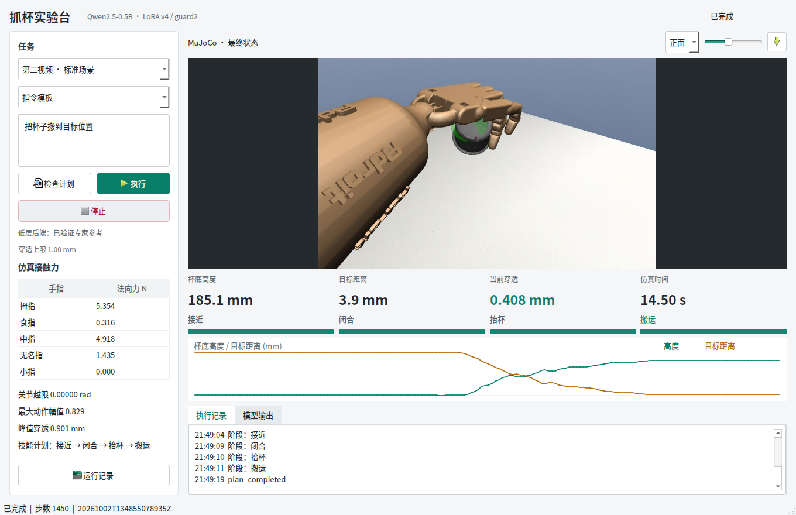
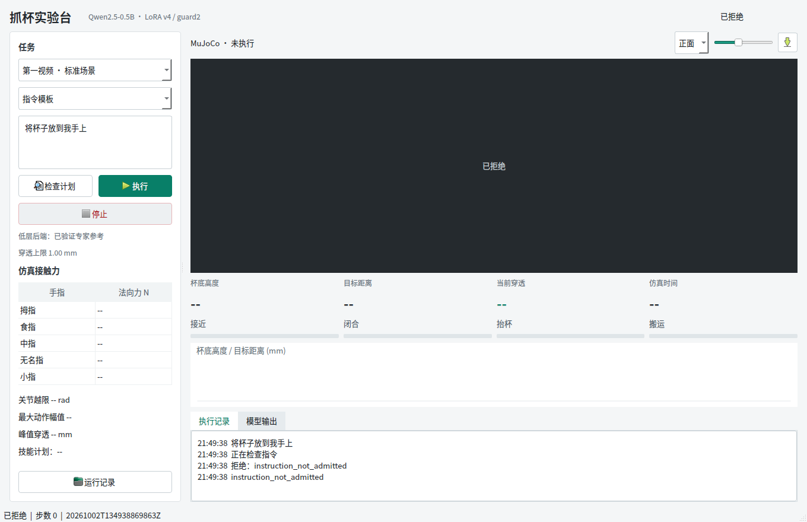

# Qt 可视化集成答辩材料

## 本轮结论

实现“中文指令 -> 已训练 LoRA 高层 -> 门控计划 -> 专家技能 -> 实时 MuJoCo -> 可视化参数”的完整桌面链路。修复 `Missing GL version`、隐藏窗口 GLX 配置、Qt 库冲突和小窗口控件重叠。保留原有阶段 3 模型与阶段 6 冻结验收。

**边界：高层是学习模型，低层是已验证专家动作，不是 200 次 DAPG 网络。没有新训练，也没有新增物理泛化结论。**

## 图 1：第二视频搬运完成



真实 Qt 截图。杯底高度 185.1 mm，目标距离 3.858 mm，最大穿透 0.901 mm。五指力为仿真法向接触力，不是视频标签。绿色杯形是目标标记，黑色杯子是动力学物体。

## 图 2：越界指令被拒绝



“将杯子放到我手上”未在任务范围内。前置意图门控拒绝，不调用语言模型，不创建仿真，0 步；旧任务的图像、参数、阶段和日志已清空。

## 可直接使用的 5 页提纲

| 页 | 要讲的内容 | 证据 |
| --- | --- | --- |
| 1 | 从已训练语言计划到物理执行的可观察闭环，当前两标准场景范围 | 系统架构、低层边界 |
| 2 | 三进程隔离：Qt、语言、MuJoCo；两次计划校验；停止清理 | `runtime.py`、`planning.py`、`window.py` |
| 3 | 渲染失败根因与修复：CPU/OSMesa 误选、GLX 单缓冲、Qt 库冲突 | `gl-failure.json`、两个 GPU probe JSON |
| 4 | 双视频搬运、接近、停止、越界、检查计划、重复执行及关闭 | 两张图、`gui-summary.json` |
| 5 | 结果与限制：9/9 交互、187 测试；无 qpos 写入；非新策略泛化 | `quality.json`、原生窗口报告、来源清单 |

## 关键实现

真实动作执行沿用冻结的 `ReferenceBackend.step`，新增层只检查停止和输出画面：

```python
if controls.stop.is_set():
    raise BackendStopped('User stop')
row = super().step(action)
```

画面读取前后检查 `qpos/qvel` 完全一致；Qt 只接收 JPEG 帧与结构化参数，不写仿真状态。执行前再次用原指令检查模型原始输出，并比对计划文件：

```python
guard = semantic_guard(raw, instruction, scene, schema, feasibility, threshold)
if not guard['accepted'] or saved_plan != guard['response']['plan']:
    raise ValueError('Plan changed or failed independent instruction guard')
```

第二段为缩写示意，完整实现在 `src/fromrealhand/desktop/planning.py`。启动器显式选 GPU 扩展和 NVIDIA PRIME；GUI、语言与仿真使用不同依赖路径，不修改原模型文件。

## 数值结果

| 标准场景 | 步数 | 杯底终高 | 目标误差 | 最大穿透 | 状态重放误差 |
| --- | --- | --- | --- | --- | --- |
| 第一视频搬运 | 1417 | 137.99 mm | 0.853 mm | 0.577 mm | 0 |
| 第二视频搬运 | 1450 | 185.12 mm | 3.858 mm | 0.901 mm | 0 |

9 项实际 Qt 测试全部通过，15 个工作进程均已结束。窗口响应最大心跳间隔约 89 ms。渲染图像的像素标准差和帧哈希证明画面非空且变化；与固定物理动作状态重放误差为零证明界面没有改变物理结果。

9/9 是交互用例通过率，不是随机初态抓取成功率，也不是新的独立语言留出评估。两条标准场景搬运验证不能代替阶段 3 泛化评估。

## 演示顺序

先第二视频搬运，解释四阶段与关键参数；再输入“将杯子放到我手上”展示拒绝；最后启动“抓起杯子”并中途停止。预留语言加载时间，当前每次指令使用独立进程，不是常驻语言服务。

启动与故障排查见 [操作指南](../../QT_DESKTOP.md)。实现依据采用官方 Qt、MuJoCo-py 和 NVIDIA 文档，来源见该指南；不声称本轮引入新的论文算法。
