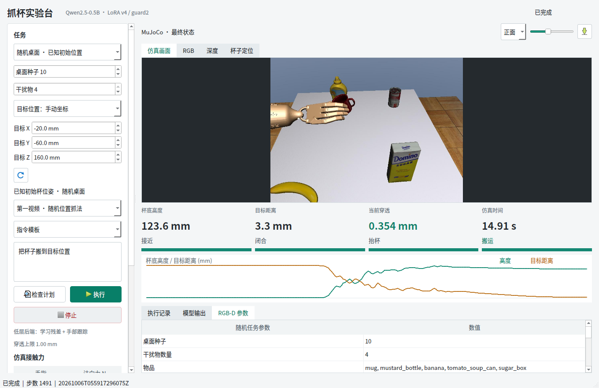
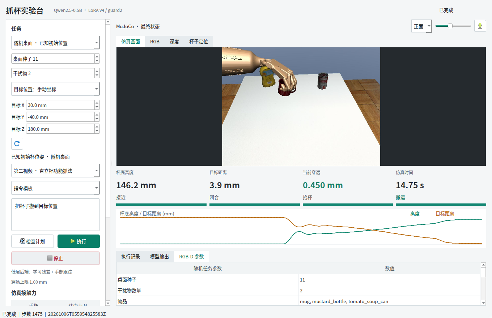

# 随机桌面任务：答辩资料

最终独立完整任务 **80/80**：第一、第二视频各 40/40；同一组 40 个布局上两种抓法均成功，布局级 Wilson 95% 区间为 **91.24%–100%**。最大目标误差 **5.86 mm**，穿透峰值 **0.762 mm**；Qt 六项、目标边界 4/4 和软件 249/249 全部通过。共执行 119400 次学习策略动作，无动作截断，无杯子位姿写入或辅助力。

按干扰物数量 0、1、2、3、4 分组，回放通过数分别为 22/22、14/14、20/20、12/12、12/12；三种桌面外观分别为 24/24、26/26、30/30。这些都是同一个 80 次评估的分组，不能相加当成额外样本。

## 推荐六页讲述

1. **目标与边界**：同一个训练杯子，物品数量和布局变化，杯位置与目标独立随机；已知初始杯位姿。任务是抓起并搬运保持，不是松手放置或拥挤避障。
2. **系统结构**：中文指令 -> LoRA 与语义门控 -> 技能序列 -> 随机任务参数 -> 物体相对参考适配 -> 原学习残差 -> MuJoCo。Qt 与批量测试调用同一 `RandomTask.run`，避免两套控制逻辑不一致。
3. **第一视频目标变换**：保留人手参考的手指动作，抬杯后才平滑调整搬运平移；不对每个新目标手写抓取动作。
4. **第二视频问题与修复**：最初抓住却距目标约 40 mm。直接加手部积分不能解决接触相对运动，保留了该失败。改为抓稳姿态的伺服平衡指令，加三指正运动学运动估计，解决固定动态指令造成的搬运偏差。
5. **独立实验**：开发 12 种子 × 两视频；源码、模型和分布冻结后，新 40 种子 × 两视频。按完整任务统计，所有失败计入，单独给出每种抓法、物品数量、桌面外观的结果。共享布局按配对结构报告置信区间。
6. **界面与结论**：实际修改目标坐标、改变物品数量，展示连续抓取画面和参数；说明没有新增训练，没有证明真实机器人泛化或四指逐帧视频忠实度。

## 公式与实现

第一视频的搬运位置变换：

```python
s = clip((index - lift_stop) / (transport_stop - lift_stop), 0, 1)
blend = s**3 * (10 - 15*s + 6*s*s)
desired_root += R_world_to_base @ (goal - reference_endpoint) * blend
```

第二视频的本体感觉预测：

```python
predicted_cup_position = initial_cup_position + mean(current_tips - grasp_anchor_tips)
# Tips come from hand forward kinematics, not the live mug pose.
```

这里是近似刚性抓持模型，不保证杯子滑落时仍准确；接触丢失和物理门槛会独立触发停止。预测误差只在报告中用真值评价，不反馈到策略。

第二视频伺服重锚定利用 MuJoCo 执行器的增益和偏置，按实际抓稳关节位置及手部重力项计算平衡指令。手指仍使用原抓稳命令，既不更改杯子质量/摩擦，也不直接施加物体力。

代码入口：

- 随机场景：[random_scene.py](../../../src/fromrealhand/tabletop/random_scene.py)
- 统一执行器：[random_task.py](../../../src/fromrealhand/tabletop/random_task.py)
- 第一视频目标变换：[functional_reference.py](../../../src/fromrealhand/tabletop/functional_reference.py)
- Qt 参数：[random_window.py](../../../src/fromrealhand/desktop/random_window.py)
- 冻结和评估：`scripts/170_freeze_random_tabletop.py`、`scripts/167_evaluate_random_tabletop.py`。

## 两张真实截图





截图来自 Qt 实际物理执行，不是预录视频。独立成功率来自 [heldout.json](evidence/heldout.json)，不是这两张开发界面截图。

## 借鉴来源

- [MimicGen 代码结构](https://mimicgen.github.io/docs/modules/overview.html)：物体中心的子任务参考变换。这里复用思路适配已有手部参考，没有引入或声称复现其完整数据生成训练系统。
- [robosuite 物体模型与放置](https://robosuite.ai/docs/_sources/modules/objects.html)：保持物体边界与有效初始放置的原则。现有 DexMV 已复用 robosuite arena，本轮用确定性分离采样避免生成重叠初态。
- [MuJoCo 执行器公式](https://mujoco.readthedocs.io/en/2.1.2/XMLreference.html)：位置伺服的 gain/bias 关系用于重建抓稳后的手腕平衡命令，不是提高闭合力。
- [Qt 数字输入控件](https://doc.qt.io/qtforpython-6/PySide6/QtWidgets/QAbstractSpinBox.html)：用标准数值输入和自动值状态表示目标设置，保持 Qt 环境不依赖训练用 NumPy。

工程贡献是把参考迁移、学成残差、本体感觉纠偏、随机场景协议和可调目标界面接通；当前实验不支持宣称新算法优于已有方法。
