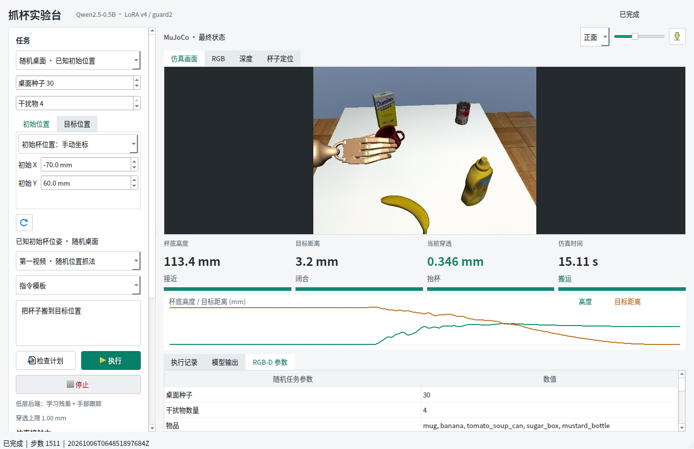
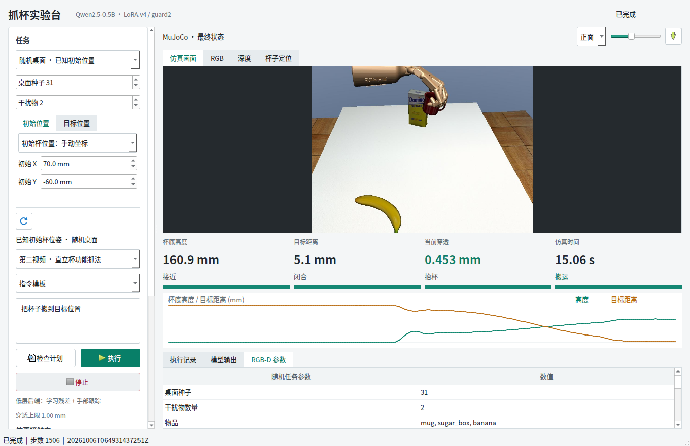

# 扩大工作区与初始杯位置编辑

## 答辩重点

- 用户需求：杯子的初始位置不能只在很小范围变化，需要独立编辑初态与目标。
- 界面：初始 XY、目标 XYZ 分页输入，均支持跟随种子；运行时冻结参数，后台校验与界面使用同一配置。
- 范围：杯子初始平面从 9 × 6 cm 到 15 × 15 cm；目标 X ±75 mm、Y ±90 mm、Z 140–200 mm。
- 方法：保留原学习权重与控制器，扩展参考适配范围，固定安装坐标重分配滑轨余量。初始手部世界姿态不跟着杯子随机移动。
- 反例：110–220 mm 的目标高度没有通过行程检查。保留失败和首次越界关节/帧，不通过修改 MuJoCo 限位或裁剪目标来制造成功。
- 验证：24 个开发回放、16 个角点组合、40 个新布局 × 两视频独立回放；Qt 六项真实操作。分别统计，不混为一个独立样本集。

## 可直接用于结果页的数字

- 新留出：40 个布局、两视频共 80/80 成功；布局级双视频成功率 Wilson 95% 区间 91.24%–100%。
- 新留出最大目标误差 5.759 mm，最大穿透 0.764 mm，原阈值为 20 mm 和 1 mm。
- 开发 24/24；初始四角与两个对角目标端点组合 16/16，后者最大误差 6.905 mm、穿透 0.780 mm。
- Qt 六项通过，软件测试 252 项通过；动作裁剪、执行中物体位姿写入均为零，没有额外物体助力。
- 不把扩大工作区说成新算法或重新训练；这里验证的是原学习控制系统的受限工作区扩展。

## 实际界面





初态参数通过 worker 命令行传到 `RandomTask.run(cup_xy=...)`，最终布局与界面数值在 Qt 测试中逐项核对。截图来自实时模拟执行，不是示意图。

## 代码与原理

```python
# Draw the seed values first, then override only the selected field.
cup = rng.uniform(config['cup_xy_min_m'], config['cup_xy_max_m'])
if cup_xy is not None:
    cup = validate_cup(cup_xy, config)
```

因此修改初始杯坐标不会改变种子生成的目标坐标；修改目标也不会覆盖初态。物体间距检测仍按最终实际布局执行。

主要文件：`configs/tabletop-random-v6.json`、`random_scene.py`、`random_task.py`、`desktop/random_window.py`，以及 `scripts/173_check_workspace_boundaries.py`。

参考 [MuJoCo 官方 joint range 与 actuator 文档](https://mujoco.readthedocs.io/en/2.1.2/XMLreference.html)：扩大任务参数范围不等于机械手具有无限行程，必须对整段关节参考和实际执行分别检查。本轮没有扩大机械关节限位。

完整统计与原始失败：[evidence/summary.json](evidence/summary.json)、[evidence/failure-history.json](evidence/failure-history.json)。边界结果在 `boundaries.json`，独立结果在 `heldout.json`。

结论只针对这个受限工作区、同杯型及清晰中央通道，不是整张桌面任意位置、拥挤避障或实物部署保证。
