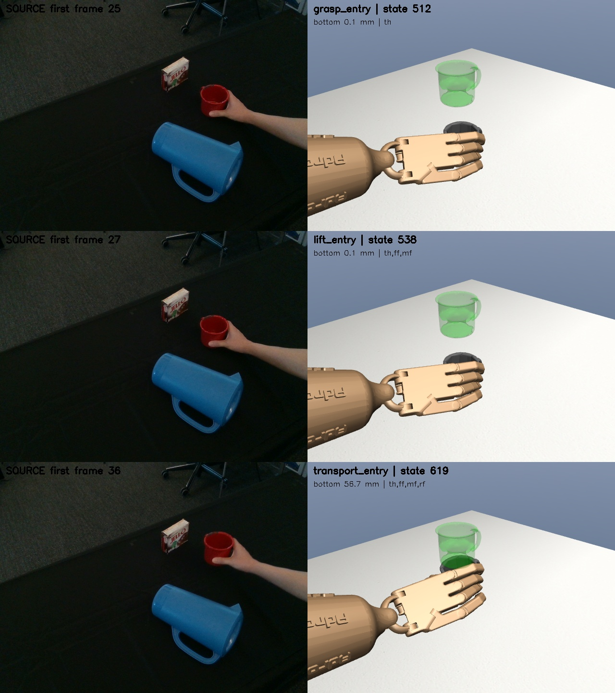
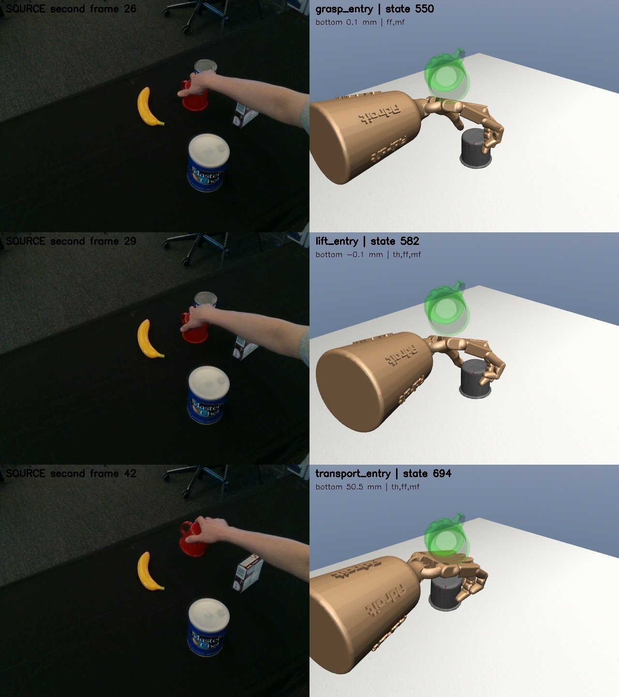

# 阶段 4.1：技能边界与原视频复核

**本轮完成工程复核和助手画面对照，第一子阶段尚未完整验收。** 第二视频存在一项搬运交接警告；用户人工确认仍为 pending。没有把警告改成成功，也没有自动修改冻结边界或正在训练的策略。

[五个子阶段工作表](../../STAGE4_PLAN.md) · [完整复核记录](evidence/boundary-review/review.json) · [冻结输入哈希](evidence/boundary-review/freeze.json)

## 实际执行

- 冻结两条名义轨迹的 manifest、片段、几何、原视频元信息、原帧映射和复核代码，结束时哈希全部一致。
- 两段视频 RGB 均已能读取，本次实际核对六张对应原帧，不再沿用“共享盘不可读”的旧状态。
- 两条整轨迹重新执行，只有开头恢复一次初态，后续全部 `env.step(action)`。每步与已验收轨迹比较，最大 qpos/qvel 误差均为 0，渲染不改变物理状态。
- 六个切换边界均复现原连续 5 步确认规则；源时钟单调，末段目标保持通过。
- 对握开始时，两视频拇指/其他手指的承力法向最小余弦约为 -0.940 / -0.993；所有杯底超过 15 mm 的采样步均存在反向承力法向对。这不是摩擦力闭合或真实接触力证明。
- 预先固定的九组敏感性检查中，接触力阈值由 0.005 到 0.02 N 不改变同一确认步数下的边界。改变确认步数后，第一视频最大漂移 50 ms，第二视频 190 ms，未据此重新选参。

## 边界与短窗检查

以下百分比是切换之后 250 ms 内，前一技能结束条件继续成立的比例，不是完整任务成功率。

| 视频 | 进入闭合 | 进入抬杯 | 进入搬运 | 切换后条件保持比例 |
|---|---|---|---|---|
| 第一视频 | 状态 512，5.12 s | 状态 538，5.38 s | 状态 619，6.19 s | 100% / 92% / 84% |
| 第二视频 | 状态 550，5.50 s | 状态 582，5.82 s | 状态 694，6.94 s | 88% / 92% / **72%，警告** |

### 第二视频为什么只有 72%

在边界后的 25 个控制步中，7 步未持续满足综合抬杯条件：

- 动作索引 695 至 699：仍有拇指、食指、中指承力，但杯底回落到 49.421 至 49.885 mm，略低于 50 mm 事件阈值，共 5 步。
- 动作索引 714、716：杯底已经高于 60 mm，但中指暂时不承力，只剩拇指和食指达到接触阈值，共 2 步。

因此不能把 72% 简单解释为“28% 的时间没有抓住杯子”。这是阈值附近的高度回摆，加上短暂的第三指接触丢失。整条原动作仍通过物理回放，然而直接把这个边界当作稳定技能调用入口还不够稳妥。

**后续处理建议**：在单独的分段版本中验证更长的事件确认和交接保持，不增加闭合力，不移动杯子，不放宽 1 mm 物理门槛。九组诊断中，连续确认 10 步的第二视频搬运边界在状态 710；它不是本轮采用的新边界，也尚未作为新技能切片验收。

## 抓法语义与原视频

### 第一视频



助手看图记录：原视频第 25、27 帧中手已围住杯身，36 帧可见杯子抬起；仿真对应接触形成、三指支撑和杯底抬升三个状态。不同手型与视角下不能靠这三帧推断每个手指的真实接触力。仿真无名指首次连续承力确认在 5.48 s，晚于三指对握成立的 5.38 s。小指始终未达到本次承力阈值。

### 第二视频



助手看图记录：原视频第 26、29 帧中手从杯子上方围握，42 帧可见杯子离开原桌面位置并发生姿态变化；仿真也表现为上方闭合再抬杯。杯身遮挡和当前相机角度不足以确认无名指何时开始承力，不能声明原视频接触时序已完全复现。

仿真无名指首次连续承力确认在 **11.13 s，对应参考源帧约 72.09**，明显晚于进入搬运的 6.94 s；末秒接触比例虽为 100%，也不能反推抬杯时已经四指稳定抓住。两个视频的小指末秒承力比例都是 0%。这是阶段 4 需要保留的标签限制，而不是隐藏的“全部忠实”成功。

图中绿色半透明杯子是目标位姿标记，深色杯子才是由接触动力学推动的物体。两列不是同一个相机视角，不用于像素级对齐验收。

## 审核状态

- 自动机械检查：通过。
- 助手原帧/仿真画面复核：已完成，保留上面的遮挡、接触时序和交接风险。
- 第二视频稳定交接：有警告，需在进入批量扩展前确定处理方式。
- 用户人工确认：未完成，原数据的 `review_status` 没有被改为 approved。

本轮不进入 4.2 批量扩展，也不额外训练技能策略。下一步先处理第二视频边界的短窗稳定性，并确认“边界描述的是仿真执行事件，不是真实接触力标签”这一语义。

## 训练监督记录

第 14 次更新的第二视频开发工况 `former_test_cup_y_minus` 出现一次任务和严格级失败：仿真时间约 7.538 s，`C_thdistal` 与 `collision_mug_13` 穿透 1.015373 mm。该轨迹仍抬杯，最终目标距离约 11.354 mm；失败原因是超过 1 mm 穿透门槛，不是没抓住或搬运不到位。

该工况早已转为开发数据，名字中的 `former_test` 不代表当前独立留出。监督器按普通探索失败记录告警，没有放宽验收、切换模型或停止正常更新。具体迭代进度见 [带时间戳快照](evidence/boundary-review/training-progress.json)，不是实时网页监控或泛化结果。

第 18 次更新时的快照为：36 条采样，任务级 35/36、严格级 33/36。除上述穿透外，第 17、18 次第一视频的两个工况因指尖误差未过严格级，但都通过任务级并抬起杯子。前 18 次完整迭代指标与此前同种子的 20 次短训对应部分逐项一致；这些早期结果是复现检查，不是新增泛化证据。

新增 5 项边界复核单元测试后，完整回归测试 **117 项通过**。

## 复现命令

```bash
cd /home/smgbro/mujoconew/GITHUB
conda activate dexmv
export OPENBLAS_NUM_THREADS=1 OMP_NUM_THREADS=1
export LD_LIBRARY_PATH=/home/smgbro/.mujoco/mujoco200/bin:/usr/lib/x86_64-linux-gnu
export LD_PRELOAD=/usr/lib/x86_64-linux-gnu/libstdc++.so.6
export __NV_PRIME_RENDER_OFFLOAD=1 __GLX_VENDOR_LIBRARY_NAME=nvidia

# 已有目录不会覆盖；复跑先另存配置并使用新的 output。
python scripts/94_review_skill_boundaries.py --config configs/stage4-boundary-review.json
python scripts/95_publish_boundary_review.py
PYTHONPATH=src python -m unittest discover -s tests -q
```
