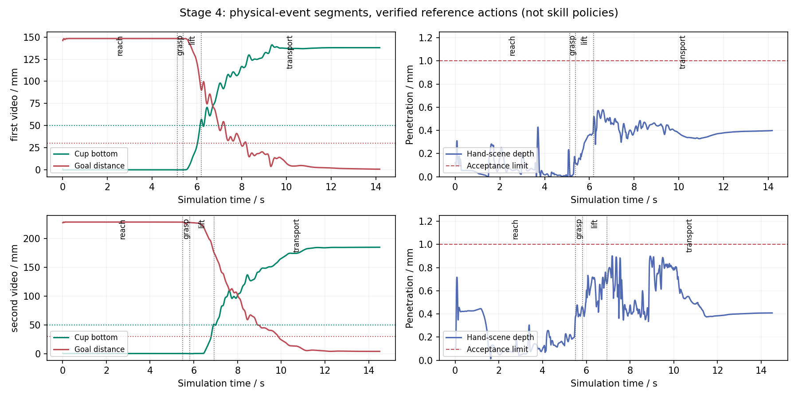

# 阶段 4 框架与 200 次训练启动记录

最新结果：已按用户确认的机械事件口径完成 [4.1 至 4.5 工作表](../../STAGE4_PLAN.md) 的数据与接口工程交付。27 条轨迹、108 个技能片段通过，入口扰动仍有明显不足；详见 [v2 结果、两张新图与答辩提纲](V2_RESULTS.md)。以下是 v1 框架历史记录，旧边界及未确认状态不代表最新结果。

## 可以用于答辩的结论

- 已将两段真实视频衍生的、经过物理验证的专家示范转换为 8 个技能片段。
- 接触、对握、杯底高度、目标误差构成可解释的自动边界，保留原视频参考时钟；人工审核尚未完成。
- 8/8 独立片段、2/2 不重置连续回放通过。连续执行只有手部动作输入，物体不被逐帧定位。
- 200 次整体任务残差 DAPG 已在独立后台服务启动并自动监督。进度以带时间戳的快照为准，不能写作“200 次已完成”。

## 一张图



图中竖线表示物理事件确认后的边界。杯底与目标距离使用毫米，穿透门槛保持 1 mm。这是两条名义专家参考动作的证据，不是当前长训策略的新测试结果。

不重复截取大量仿真图，抓法外观可继续引用 [v14 三张关键画面](../v14/README.md)。本轮重点保留事件与状态复现的可核查证据。

## 建议三页讲法

1. **为什么拆技能**：完整动作轨迹没有清晰调用边界，先把“接近、对握、抬起、搬运”转换成可检查的输入、结束事件与失败原因。
2. **如何避免伪成功**：独立回放只在起点恢复一次完整状态；连续回放切换技能不 reset；动作归一化一次；保存 solver warm start 后 qpos/qvel 误差不超过 `1.715e-13`。
3. **当前能力边界**：框架和专家片段可执行，不代表独立技能策略已学会，更不是高层语言理解或实物泛化。下一步人工审核、扩展开发片段、训练低层技能。

## 关键代码

```python
# src/fromrealhand/skills.py 中的执行结构：技能切换不接触仿真状态。
skill = reference.skill_at(step)
env.step(reference[step])
row = measure()
active.update(row)
```

`SegmentedReference` 是已验证动作的适配器；`SkillContract` 只检查状态，不生成专家力矩，也不是混合专家模型（MoE）。后续可以把动作适配器替换为 `policy(observation, skill, goal)`，但必须重新验证闭环和入口扰动。

## 原始证据索引

- [分段和 10 次回放的完整小型结果](evidence/skill-replay.json)
- [带时间戳的训练进度快照](evidence/training-progress-snapshot.json)
- [技能格式、门槛与复现命令](../../STAGE4_SKILLS.md)
- [训练服务与告警规则](../../TRAINING_200.md)
- [本轮工作日志](../../run_logs/2026-10-02-stage4-framework.md)

大数据、MANO/YCB 模型、训练权重和逐帧 pickle 不上传 GitHub。
