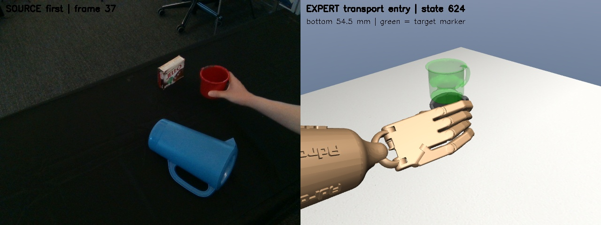
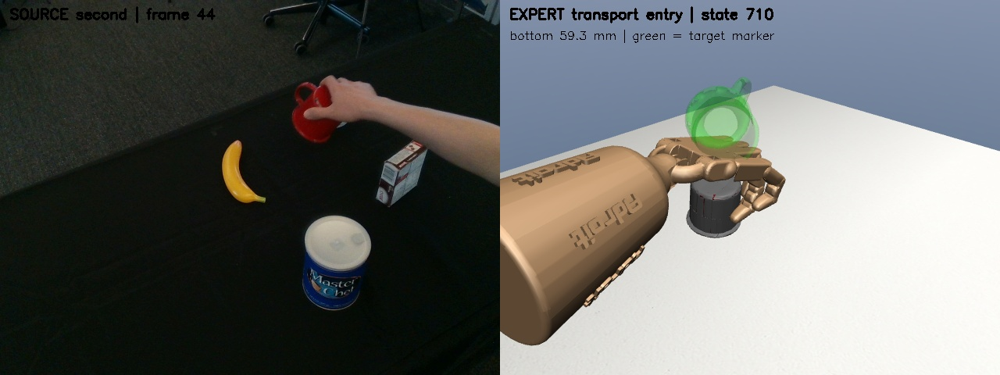

# 阶段 4 v2：技能数据与接口交付

日期：2026-10-02。结论：**阶段 4.1 至 4.5 的工程交付完成，可为阶段 5 名义技能小试提供数据；鲁棒技能策略尚未训练或证明。** 用户已确认以仿真接触、三指支撑、抬杯和搬运为边界，四指视频忠实度单独记录。这不是用户逐帧核实真实接触力。

## 结果一览

| 子阶段 | 实际结果 | 证据 |
|---|---|---|
| 4.1 边界确认 | 两视频 8 个独立片段、2 条连续拼接通过；第二视频搬运交接短窗保持率 72% → 88% | [子阶段回执](evidence/v2/subphase-receipts.json) |
| 4.2 开发片段扩展 | 35 条中准入 27 条、108 片段，隔离 8 条；108 独立重放和 27 连续拼接通过 | [准入与拒绝明细](evidence/v2/admission.json) |
| 4.3 训练输入 | 122 维输入、30 维残差标签；训练 96 片段 / 34,404 帧，内部验证 12 片段 / 4,317 帧 | [检查结果](evidence/v2/summary.json) |
| 4.4 入口与停止 | 名义 8/8；±0.5 mm 入口扰动 12/32；五类停止单元检查通过 | [40 次实际回放](evidence/v2/entry-cases.json) |
| 4.5 交付冻结 | 281 个文件哈希冻结，126 项测试通过；两张物理回放截图 | [冻结清单](evidence/v2/freeze.json)、[交付回执](evidence/v2/receipt.json) |

27 条轨迹仍然只来自 **两段真实视频**；不是 27 个独立真实抓法。训练/内部验证为 24/3 条轨迹，按完整场景参数分组，同场景的不同种子不能跨组。预选验证工况之一 `first/synthetic_cup_yaw_5` 未通过，保留拒绝记录，没有从成功样本里临时替换。内部验证不是新的独立留出测试。

## 方法及借鉴

1. **因果事件边界**：借鉴 [MimicGen 终止信号](https://github.com/NVlabs/mimicgen/blob/main/docs/tutorials/subtask_termination_signals.md) 的子任务分段思路，接近/闭合/抬杯分别需连续满足 5/10/10 步。后续 25 步保持率只作准入检查，不用于提前选择边界。这里未移植 MimicGen 的插值和数据生成算法。
2. **训练输入不跨边界**：参考 [robomimic SequenceDataset](https://robomimic.github.io/docs/v0.4/api/robomimic.utils.html) 的序列与掩码机制，本地实现片段内采样、末帧补齐与损失掩码。以视频和技能平衡抽样，避免长搬运阶段压过短闭合阶段；这不是已证明的策略提升。
3. **复现与拒绝优先**：MuJoCo 的确定性依赖完整积分状态，参见 [官方计算文档](https://github.com/google-deepmind/mujoco/blob/main/doc/computation/index.rst)。本地恢复求解器历史后仍有两条不一致，直接隔离，不放宽误差阈值。
4. **入口需要适配**：MimicGen 的 [TaskSpec](https://github.com/NVlabs/mimicgen/blob/main/docs/modules/task_spec.md) 用物体相关子任务和连接参数组织新场景。本轮未照搬位姿插值，而先量化固定动作的入口敏感性，后续必须通过手部动作生成可达的恢复轨迹，不能直接拉动杯子。

未升级旧 MuJoCo/Python 环境，未改长训冻结策略，也没有给物体附加辅助力。此次 72% → 88% 是**延后技能交接**的结果，不是抓取动力学变好。

## 边界与物理标准

| 视频 | reach | grasp | lift | transport |
|---|---|---|---|---|
| 第一 | [0,512) | [512,543) | [543,624) | [624,1417) |
| 第二 | [0,550) | [550,601) | [601,710) | [710,1450) |

100 Hz 控制；动作区间为左闭右开。有效接触大于 0.01 N，对握至少三指且包含拇指；杯底抬升 50 mm，目标距离 30 mm 内保持 100 步。穿透仍不得超过 1 mm，关节超限上限 0.02 rad。抬杯/搬运连续丢失支撑 20 步触发停止。所有接触力均来自仿真，不是真实视频标签。

连续拼接只在整条轨迹开始恢复一次初态，切换技能不 reset。每步只执行归一化动作 `env.step(action)`，无逐帧物体位姿写入。准入片段最大 qpos/qvel 复现误差 `7.4352e-9`，上限仍为 `1e-7`。

## 不隐藏的失败

六条交接短窗不合格：`first/synthetic_cup_yaw_-5`、`first/synthetic_cup_yaw_5`、`first/synthetic_cup_yaw_10`、`first/video_seed_2`、`first/video_seed_4`、`second/cup_y_minus`。

两条状态恢复后不能精确复现：`second/former_test_yaw_plus`、`second/goal_x_plus`。它们部分回放完成了任务契约，但状态误差不合格；不能统称为抓取失败，根因也尚未证实。其片段没有进入训练输入。名称中的 `former_test` 是已转为开发用途的历史工况，不是本轮独立留出。

| ±0.5 mm 入口扰动 | reach | grasp | lift | transport |
|---|---|---|---|---|
| 第一视频 | 4/4 | 2/4 | 0/4 | 1/4 |
| 第二视频 | 3/4 | 0/4 | 1/4 | 1/4 |

共 20 次未通过：15 次入口条件拒绝、4 次参考动作耗尽仍未达到事件、1 次穿透失败。扰动仅在独立回放初态设置，执行期间不写状态。这是固定动作敏感性诊断，不是学习策略泛化率；突然偏移已夹住的杯子也不等价于真实闭环的可达误差分布。

五类停止检查（不安全初态、非有限状态、错误入口、持续丢失接触、超时）是合成指标单元检查，不冒充五次真实物理故障实验。失败动作和被拒绝的入口均未作为新成功示范。

## 两张关键图





左侧为原始 RGB，右侧为执行专家手部动作后的物理状态；深色杯子是真实动力学物体，绿色半透明杯子是目标标记。它们不是长训网络的新结果，也不是证明四指逐帧忠实度的截图。原帧分别为 37/44，映射及文件哈希均记录在 summary 中。

首次截图检查发现渲染器构造会执行 `sim.forward()`，对照 [mujoco-py 官方源码](https://github.com/openai/mujoco-py/blob/master/mujoco_py/mjrendercontext.pyx) 后，改为先创建渲染器再恢复初态，重新执行全部前缀动作。最终两图均通过像素非空、状态复现及渲染前后状态不变检查。失败尝试保留在本机 `delivery-render-rejected-01/`，没有发布为有效证据。

## 可放 PPT 的代码

```python
# 参考使用原轨迹时钟，不在技能开始时错误地归零。
x = [state_features, video_id, skill_id, local_phase, goal,
     reference_actions[global_step]]
residual_target = expert_actions[global_step] - reference_actions[global_step]

# 片段尾部重复最后一帧，但不把补齐帧计入损失。
loss = (squared_error * padding_mask).sum() / (padding_mask.sum() * 30)

# 技能切换不恢复物体状态；不满足入口条件则拒绝执行。
guard = GuardedSkill(skill, config, initial_metrics)
if guard.status != 'failed':
    env.step(normalized_action)
    guard.update(actual_metrics)
```

这是算法示意。实现见 `src/fromrealhand/skill_inputs.py`、`skill_pipeline.py` 和 `scripts/stage4_pipeline_common.py`。参考动作来自每个视频的冻结原参考，不是把本条轨迹的专家标签当作输入。目标来自已知任务指令，不是未来实测状态。

## 训练监督与下一步

存档快照为北京时间 **15:36，49/200**：98 条训练采样中任务级 97、严格级 92，无停止告警，49 次更新均非零；见 [带时间戳快照](evidence/v2/training-snapshot.json)。这不是独立评估成功率。第 14 轮的 1.015 mm 穿透失败保留，未提高原 1 mm 门槛。

下一步待用户授权后实现阶段 5 小规模条件技能残差 BC：先做名义独立片段和连续拼接，再定位闭合入口偏离，补可达接触恢复数据。配置建议在 `configs/stage5-skill-smoke.template.json`，默认 `enabled=false`，没有训练入口或自动长训。通过开发闭环后再冻结候选和新的独立场景清单；跨视频结论需要新真实视频。已有 200 次整体任务训练继续由后台监督器执行，两条工作线分开。

## 复现与核验

```bash
cd /home/smgbro/mujoconew/GITHUB
conda activate dexmv
export LD_LIBRARY_PATH=/home/smgbro/.mujoco/mujoco200/bin:/usr/lib/x86_64-linux-gnu
export LD_PRELOAD=/usr/lib/x86_64-linux-gnu/libstdc++.so.6
export OPENBLAS_NUM_THREADS=1 OMP_NUM_THREADS=1

python scripts/90_supervise_training.py status
python scripts/99_finalize_stage4.py --verify-only
PYTHONPATH=src python -m unittest discover -s tests -v
```

构建顺序：`96_stage4_prepare.py pilot` → `96_stage4_prepare.py build` → `97_build_skill_inputs.py` → `98_validate_skill_entries.py` → `99_finalize_stage4.py`。各步骤拒绝覆盖已有目录；本机直接使用上述只读核验即可。重做实验需新配置和输出目录，不覆盖 v2。最后一步渲染需设置 `__NV_PRIME_RENDER_OFFLOAD=1 __GLX_VENDOR_LIBRARY_NAME=nvidia`。可信本地 pickle 反序列化需要完整 MuJoCo 环境，即使只生成输入也一样。

## 五页答辩提纲

1. **问题**：整条成功专家不自动等于可组合技能，尤其接触交接非常敏感。
2. **方法**：持续事件确认、原时钟参考条件、平衡序列采样、物理准入和入口契约。
3. **证据**：27/35 准入，108 独立片段和 27 连续拼接；展示两张原视频/仿真图。
4. **负结果**：±0.5 mm 仅 12/32，说明下一步应学接触恢复，而不是宣称已经泛化。
5. **边界与后续**：工程贡献是可检查的数据与执行流程，尚无新的算法优越性结论；阶段 5 做小规模技能闭环，长训和独立测试需另行验收。
