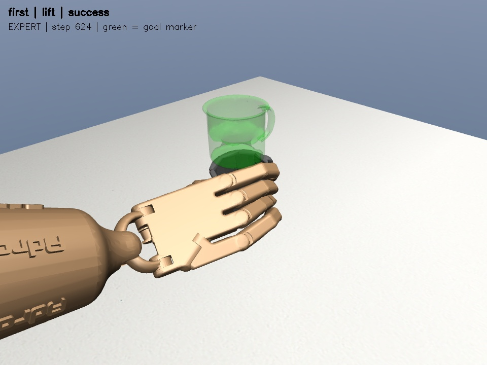
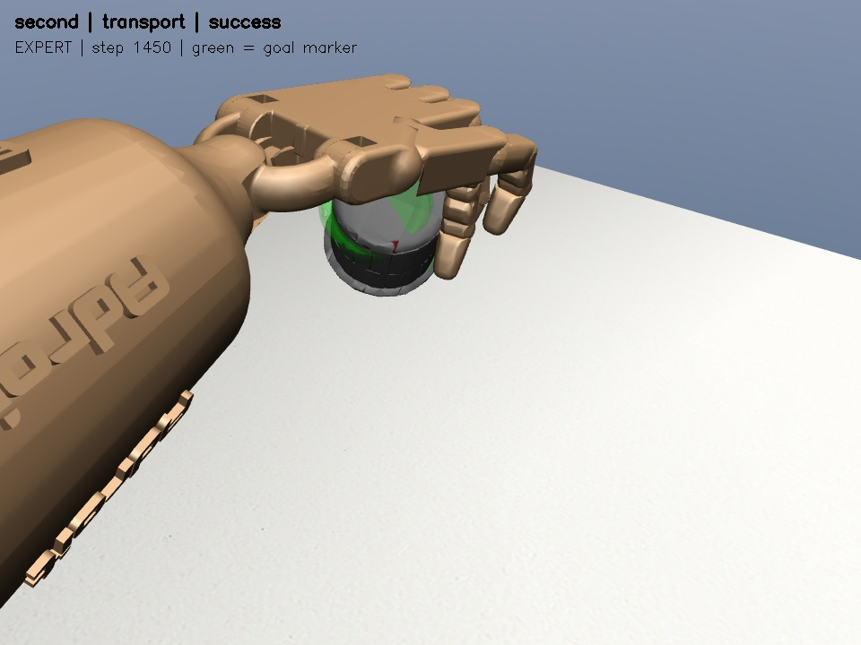

# 阶段 5 答辩材料：规则层次化技能执行

日期：2026-10-02。范围按用户最新定义为 C4 + D1，**不是本轮训练四个技能策略或语言模型**。当前底层使用阶段 4 冻结的物理专家参考动作，上层完成计划、约束和执行管理。

## 核心结果

| 指标 | 实测 |
|---|---|
| 普通固定计划 | 两视频各“抓起”和“搬运”，4/4 完成 |
| 故障注入 | 12/12 按预期处理：4 次继续完成，8 次停止；不是 12 次抓取全成功 |
| 全部仿真用例 | 16/16 验收检查通过，执行期间物体状态写入为 0 |
| 中文规则 | 15 条别名正确映射；6 条否定、未知物体、倒水、任意坐标等指令被拒绝 |
| 单元测试 | 142 项全部通过，包含本轮新增的 16 项层次化测试 |
| 状态复现 | 四个正常计划与原专家参考的最大 qpos/qvel 差为 0 |

来源：[完整仿真用例与事件日志](evidence/v1/cases.json)、[语言测试](evidence/v1/language.json)、[汇总](evidence/v1/summary.json)、[代码与数据来源哈希](evidence/v1/protocol.json)。这不是独立留出测试，不改变阶段 4 的微扰仅 12/32 通过这一限制。

## 物理结果

| 场景 / 目标 | 动作步数 | 最终杯底高度 | 最终目标误差 | 全程最大穿透 |
|---|---:|---:|---:|---:|
| 第一 / 抓起 | 624 | 54.46 mm | 不作为抓起验收 | 0.520 mm |
| 第二 / 抓起 | 710 | 59.30 mm | 不作为抓起验收 | 0.800 mm |
| 第一 / 搬运 | 1417 | 137.99 mm | 0.853 mm | 0.577 mm |
| 第二 / 搬运 | 1450 | 185.12 mm | 3.858 mm | 0.901 mm |

初态仅恢复一次，切换技能不 reset，不把杯子吸到手上。动作通过 `env.step` 执行，穿透标准仍为 1 mm。第二视频抬杯结束时无名指尚未承力，不能由“完成计划”推导“忠实复现四指抓法”。

## 故障处理证据

| 注入类型 | 第一视频 | 第二视频 | 解释 |
|---|---|---|---|
| 闭合开始暂时取不到动作一次 | 重试 1 次后完成，624 步 | 重试 1 次后完成，710 步 | 不重复任何物理动作 |
| 闭合开始请求重校验计划一次 | 剩余 `grasp → lift`，完成 | 同左，完成 | 重新核对实时入口，不回退到 reach |
| 闭合步数预算缩为 3 | 第 515 步停止 | 第 553 步停止 | 后续 lift 未启动 |
| 持续取不到动作 | 第 512 步停止 | 第 550 步停止 | 2 次重试耗尽 |
| 持续请求重规划 | 第 512 步停止 | 第 550 步停止 | 1 次重规划预算耗尽 |
| 返回 NaN 动作 | 第 512 步停止 | 第 550 步停止 | 非有限动作未传入 MuJoCo |

注入发生在真正的 MuJoCo 动作执行链中，但故障本身是软件动作源中断、重校验请求和预算缩短，**不是已经演示了物理滑落恢复**。穿透/关节/非有限状态与取消等分支还通过合成指标单元测试，不混同为真实物理故障试验。

## 两张截图





黑色/灰色杯子为动力学物体，绿色半透明杯子为目标标记。两图均来自层次化执行器逐步施加手部动作后的状态，经过非空像素与渲染前后状态不变检查。它们不是训练中 DAPG 网络的评估图。

## 方法来源与取舍

- [BehaviorTree.CPP Sequence](https://www.behaviortree.dev/docs/nodes-library/SequenceNode/)：借鉴按成功推进、失败中止后续技能的语义；本地是小型 Python 顺序执行器，不声称移植了完整行为树框架。
- [BehaviorTree.CPP Retry / Timeout](https://www.behaviortree.dev/docs/nodes-library/DecoratorNode/)：采用有限重试与超时思想，但只对动作获取异常重试，物理不安全不能重复尝试。
- [SayCan 官方项目](https://github.com/google-research/google-research/blob/master/saycan/README.md)：参考“高层计划必须受低层可执行性约束”的分层思路。这里仅有规则和布尔前置条件，没有 LLM、价值函数或学到的 affordance，不能称为 SayCan 复现。

原有动作时钟对接触非常敏感，因此没有在失败后把参考片段从第 0 帧重播，也没有通过重置杯子来获得成功。新增层主要改变任务组织和失败处理，不改善原动作本身的泛化能力。

## 关键代码

```python
registry = SkillRegistry.load('configs/skill_registry.yaml')
plan = RulePlanner(registry).plan('抓起杯子', scene='first')
# plan['skills'] == ['reach', 'grasp', 'lift']

# executor 内部每步检查预算、安全和动作，再交给独立后端。
action = backend.action(active_skill)
metrics = backend.step(action)
guard.update(metrics)
```

一次性动作获取失败的执行逻辑是“保留游标 → 检查当前状态 → 消耗重试预算 → 再取同一动作”，不是“恢复初态 → 再跑整段”。失败日志里记录 `provider_failure`、`provider_retry`、`replanned`、`plan_finished`，答辩可以直接展示事件因果链。

## 五页讲解建议

1. **为何需要高层**：完整动作成功并不等于系统理解任务，需要命令、技能、物理状态之间的可检查契约。
2. **架构**：中文规则 → Schema/注册表 → 执行器 → 专家动作 → MuJoCo → 条件反馈。
3. **执行证据**：4 个固定计划真实物理完成，两张图与高度/误差表。
4. **可靠性**：12 个故障注入的重试、重校验与停止；突出不重置、不伪造成功。
5. **局限**：只支持两个名义参考、没有新学习技能或自由语言泛化，下一步是 C3 学习后端与可达接触恢复。

## 训练监督

本报告训练快照为北京时间 **17:43，161/200**，当时 322 条训练采样任务通过 317、严格通过 293，存在探索失败告警，无停止错误，详情见 [快照](evidence/v1/training-snapshot.json)。这不是最终策略的独立测试。

已检查最新任务失败：零基 `iteration=159`，即完成第 160 轮，第二视频 `cup_y_minus` 在约 7.536 s 的拇指 `C_thdistal` / `collision_mug_13` 穿透 1.061 mm，杯子仍抬起，终点误差 9.58 mm。超过 1 mm 后如实记任务失败；未改门槛，未达到监督器原有 5 mm 紧急停止阈值。另有严格指尖误差失败，训练结束仍需重新评估。

[操作与原生窗口命令](../../STAGE5_HIERARCHY.md) · [执行日志](../../run_logs/2026-10-02-stage5-hierarchy.md)
