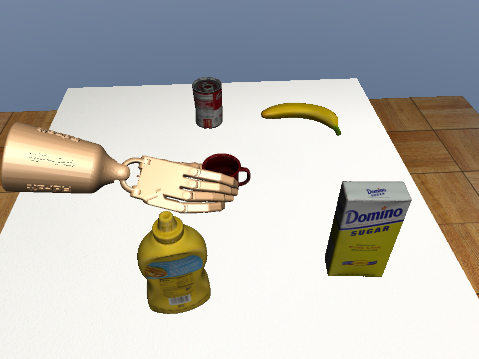
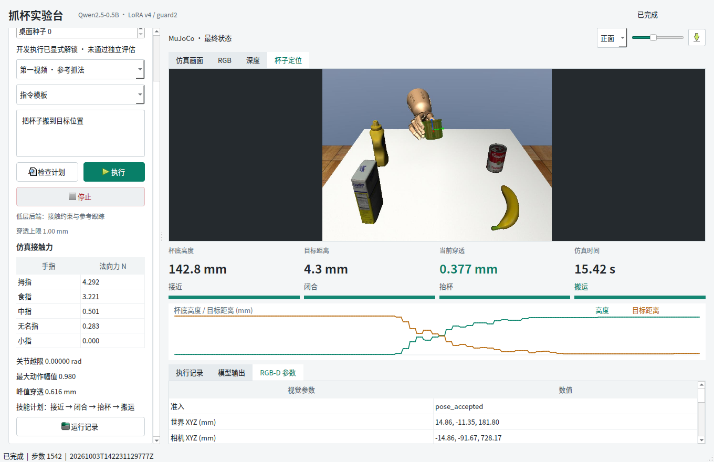
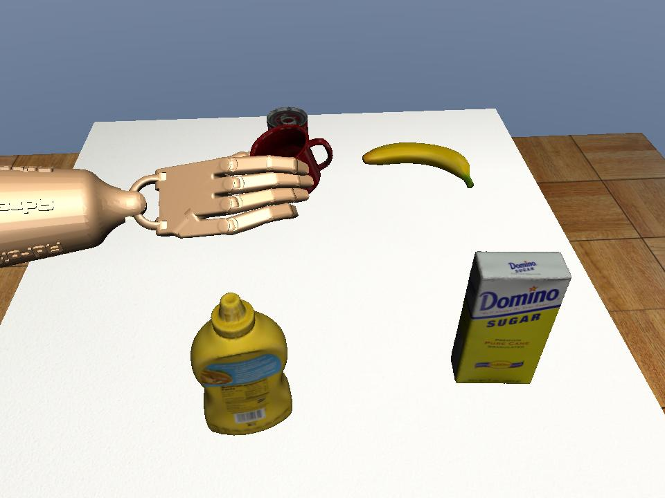

# 接触约束与跟踪修正：答辩材料

日期：2026-10-03。材料口径：第一视频、桌面种子 0、侧向虚拟 RGB-D 的开发验证；未训练、未做独立泛化或实机验收。

## 三张实测图



图 1：独立开发运行中，拇指、食指、中指形成相对法向支撑并连续保持 0.5 秒。接触依据是 MuJoCo 力与几何记录，不是凭截图判断。



图 2：实际中文指令、原 LoRA、RGB-D、参考跟踪与 MuJoCo 同时运行。不是视频播放。该图上方是侧向 RGB-D 定位叠加视图；界面末态关节越限为 0，不表示整个执行从未短暂越限。



图 3：同一次最终 Qt 运行的主观察视角。杯子由实际电机驱动的手指接触抬起，执行中没有物体状态写入或辅助外力。

## 五页 PPT 提纲

| 页 | 标题 | 关键内容 |
| --- | --- | --- |
| 1 | 问题定位 | v1 接近 512 步但没有指尖接触；刚体变换本身通过核对，沉降前锚点与动力学跟踪存在偏差 |
| 2 | 接触约束控制 | 稳定物体锚点、手腕误差反馈、三指相对法向与 0.5 秒确认、阶段末端最多 1 秒等待 |
| 3 | 视觉跟踪修复 | 前臂污染检测框、空中倾角与初始化分离；保留前视失败，侧向 RGB-D 改善可见性 |
| 4 | 实验与对照 | 两次 Qt 完整流程通过；手腕误差 11.16 -> 6.63 mm，下降 40.6%；额外指尖增力触发饱和而未采用 |
| 5 | 结果与边界 | 最终杯底 14.28 cm、目标误差 4.32 mm、峰值穿透 0.616 mm；仅开发工况、未训练、无实机结论 |

## 关键代码

`src/fromrealhand/tabletop/contact_control.py`，接触合力方向门控：

```python
dots[f] = float(np.dot(th, v) / (t * n))
opposition = sum(dot < dot_threshold for dot in dots.values()) >= min_opposed
```

默认要求至少两指与拇指的法向合力点积 < -0.3，同时检查每指载荷；不把同向碰撞算作对握。

手腕反馈节选：

```python
desired = self.adapter.desired_qpos(index)
error = desired - d.qpos[:30]
action[:6] += factor[:6] * self.root_gain * error[:6]
```

最终配置额外手指反馈为 0；原视频派生的参考手指动作保留。代码中的可选笛卡尔支路有开发失败证据，不可在答辩中说成最终成功方案。

`scripts/143_stream_visual_grasp.py`，保持阶段但仍执行真实动力学：

```python
index = min(cursor, bounds[phase][1] - 1)
action = contact_controller.action(index, sim, pose)
env.step(action, audit)
if not holding:
    cursor += 1
```

保持的是参考时钟，不是冻结物理状态。手、杯子、接触和视觉观测继续演化，安全检查仍执行。

## 数字与措辞

- 可以说：指定开发场景完成稳定对握、抬杯、搬运悬持；完整物理控制 1542 步。
- 可以说：接触门控避免“参考播放到末尾就视作成功”；Qt 停止约 0.54 秒，218 项软件测试通过。
- 必须说明：关节曾出现采样最大 0.00807 rad 的短时越限，低于原 0.02 rad 容差；最终为 0。
- 不可以说：新训练模型成功率 100%、任意物体泛化、真实接触力标签、五指忠实复现或实机已部署。
- 不可以说：完全复现 DexMachina/FoundationPose，或接触映射与鲁棒 ICP 是本项目首创。

可主张的工程改进是：以稳定物体参考修正动作迁移、用可测接触条件管理技能时钟、把视觉失败和安全停止接入同一条可追溯执行链路。

## 资料入口

- [完整结果与方法](../../TABLETOP_CONTACT_V2_RESULTS.md)
- [实验/命令记录](../../run_logs/2026-10-03-tabletop-contact-v2.md)
- [汇总 JSON](evidence/summary.json)、[开发失败与对照](evidence/development-cases.json)、[校验清单](evidence/manifest.json)
- [DexMachina 官方接触重定向](https://mandizhao.github.io/dexmachina-docs/3_retargeting.html)
- [FoundationPose 官方注册/跟踪示例](https://github.com/NVlabs/FoundationPose/blob/main/run_demo.py)
- [Open3D 鲁棒配准](https://www.open3d.org/docs/release/tutorial/pipelines/robust_kernels.html)
