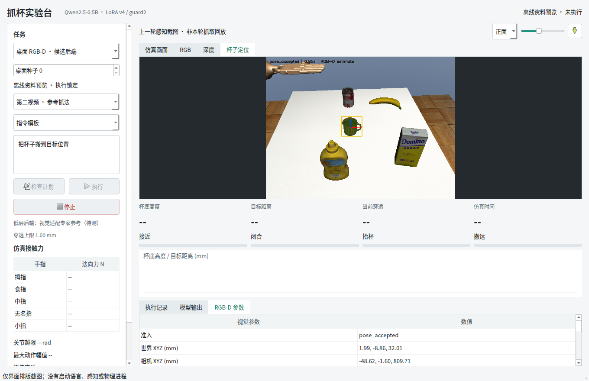

# 视觉抓取候选集成：答辩材料（测试前）

> 本目录为历史离线排版资料。实际运行截图与测量结果见 [开发测试答辩资料](../tabletop_control_tests/README.md)。

2026-10-03。代码实现阶段，不是效果验收报告。

## 一张界面图



图注必须保留：**离线界面排版截图；图中的杯子定位来自上一轮静态感知资料，不是本轮视觉抓取结果。**

## 建议四页内容

1. **问题**：旧控制参考绑定原场景；新桌面杯子位置必须从 RGB-D 获取，不能直接用 MuJoCo 真值冒充感知。
2. **方法**：语言技能顺序不变，使用物体相对轨迹变换适配手腕；保留原手指动作，加有界关节反馈。借鉴 MimicGen 思想，不声称论文级原创或复现完整 MimicGen。
3. **系统**：Qt / 旧 MuJoCo / 新视觉模型分进程隔离。暂停式 RGB-D 更新、时间戳与哈希校验、安全停止、默认测试锁。
4. **边界和下一步**：离桌跟踪、遮挡、初始碰撞、抓取与搬运均待测；冻结候选后再做独立评估。没有本轮成功率，没有新训练结果。

## 关键代码

动作适配：`src/fromrealhand/tabletop/control.py`。

```python
T_delta = T_visual_object @ np.linalg.inv(T_reference_object)
# Candidate supports bounded translation/yaw; finger actions stay unchanged.
action[:6] += actuator_factor * (shifted_reference - reference + feedback)
# Saturation is a stop condition, not silently clipped.
```

真实电机步进：`src/fromrealhand/tabletop/control_scene.py`。

```python
self.sim.data.ctrl[:] = self.mid + self.rng * action
for _ in range(self.substeps):
    self.sim.step()
    audit()
```

这段是实际候选代码对应的归一化语义；没有逐帧物体 qpos 写入。场景初始化与控制执行分开。

## 来源

- [MimicGen 论文](https://arxiv.org/abs/2310.17596)、[官方源码](https://github.com/NVlabs/mimicgen)：物体相对参考轨迹变换。
- [robosuite 控制器](https://robosuite.ai/docs/modules/controllers.html)：参考跟踪与控制接口设计。未导入其完整新版控制器。
- [Open3D ICP](https://www.open3d.org/docs/release/tutorial/pipelines/icp_registration.html)：局部点云配准；对初值、遮挡和几何歧义敏感。

配置及测试清单见 [测试前交付说明](../../TABLETOP_CONTROL_PRETEST.md)。
