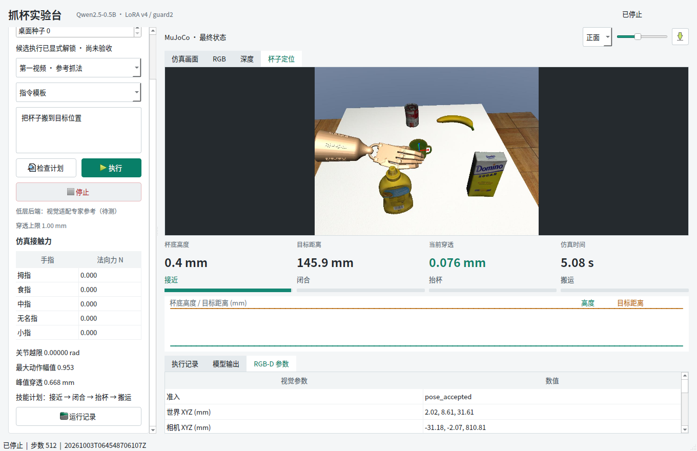
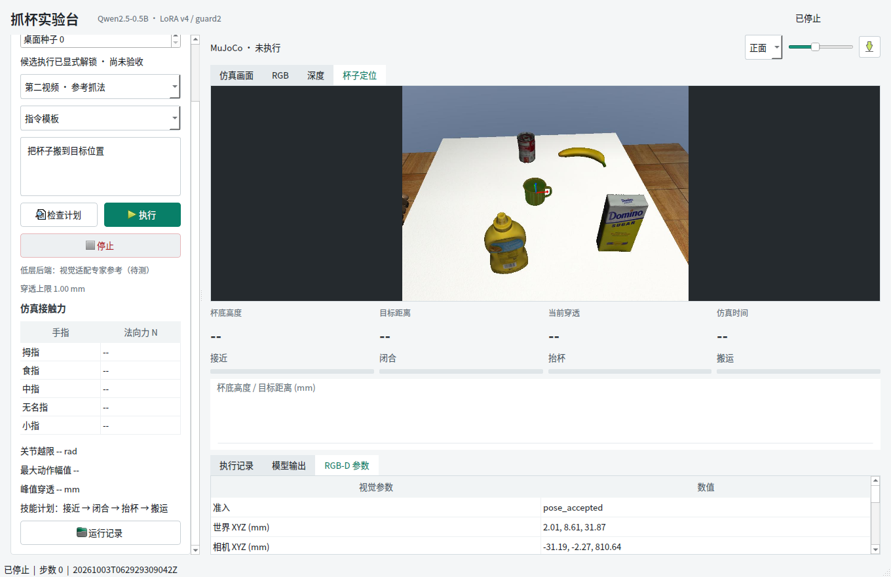

# 视觉桌面抓取：开发测试答辩资料

日期：2026-10-03。结论：**从语言到视觉控制的工程链路可运行，物理抓取尚未成功。**

## 两张实际截图



图 1：真实 Qt、语言模型、视觉模型和 MuJoCo 同时运行的截图，不是离线回放。截图显示的是定位叠加视图；物理流收到 99 个不同画面。接近进度条表示已播放的参考时长，不表示技能成功。界面最后显示帧与停止后诊断可能相差几步；峰值穿透 0.668 mm 是整次运行统计。



图 2：杯子定位成功不等于参考动作可执行。第二视频参考近倒置，新桌面杯子直立，0 步拒绝。上方图像来自该次 RGB-D，未执行抓取动作；具体拒绝原因见 `cases.json`。

## 建议五页 PPT

| 页 | 主题 | 要讲清楚的结论 |
| --- | --- | --- |
| 1 | 系统与数据边界 | 中文指令 -> LoRA/门控 -> 技能计划 -> RGB-D -> 位姿 -> 参考适配 -> 电机 -> 物理反馈；真值只用于事后诊断 |
| 2 | 迁移方法 | 物体相对刚体变换、平滑引入、固定工作空间重定位、整段预检查；低层没有换成新训练的视觉策略 |
| 3 | 遮挡问题与修复 | 手进入框导致普通配准质量下降；Tukey 核和几何筛选使缓存 23 帧通过，但这不是泛化成功率 |
| 4 | 实测结果 | 211 单元/回归通过，界面连续、停止约 0.59 秒；第一视频 0/512 步有效指尖接触，抓取未通过 |
| 5 | 局限与下一步 | 用物体相对指尖接触约束改进参考迁移；第二参考重新核对直立杯几何；通过开发抓取后才冻结评估 |

## 关键代码片段

以下为对应实现的节选；省略了参数和异常检查。完整文件保留检查，不可直接把节选当控制器使用。

`src/fromrealhand/tabletop/control.py`：

```python
self.delta = self.estimate @ np.linalg.inv(self.reference)
self.rotation_vector = Rotation.from_matrix(self.delta[:3, :3]).as_rotvec()
rotation = Rotation.from_rotvec(self.rotation_vector * blend).as_matrix()
desired[:3] = br.T @ (rotation @ (point-anchor)+anchor+offset-bp)
```

`src/fromrealhand/perception/tracking.py`：

```python
estimator = reg.TransformationEstimationPointToPlane(reg.TukeyLoss(k=.008))
keep = np.flatnonzero(distances < .006)
if len(keep) < 300 or retained < .5 or cells < 40:
    raise ValueError('Insufficient visible model surface under occlusion')
```

`scripts/143_stream_visual_grasp.py`：

```python
action = adapter.action(cursor, sim.data.qpos[:30].copy())
audit(); actions.append(action.copy()); env.step(action, audit); cursor += 1
```

`audit` 在物理子步检查穿透、越限、非目标碰撞和停止信号。技能成功必须满足真实接触条件，不能因为参考时钟到段尾就继续下一段。

## 可引用数字

- 211 项单元/回归测试通过；这不是抓取样本数。
- 最终第一视频：512 步、99 个不同渲染画面、峰值穿透 0.668 mm、无关节越限、有效指尖接触 0 步。
- 末帧位置估计误差 0.0647 mm：仅适用于该虚拟 RGB-D 场景，不能写成实物测量精度。
- 第二视频：姿态不匹配，执行前拒绝；不计为一次成功抓取。
- 用户停止约 0.59 秒；冻结语言校验通过。
- 没有新的独立泛化成功率，没有新增 DAPG/LoRA 训练。

## 来源与证据

- [完整报告](../../TABLETOP_CONTROL_TEST_RESULTS.md)、[运行记录](../../run_logs/2026-10-03-tabletop-control-tests.md)。
- [质量报告](evidence/quality.json)、[用例汇总](evidence/cases.json)、[SHA256 清单](evidence/manifest.json)。
- [MimicGen 官方方法](https://mimicgen.github.io/docs/modules/datagen.html)：物体相对轨迹适配，不代表完整复现。
- [Open3D 官方鲁棒核](https://www.open3d.org/docs/release/tutorial/pipelines/robust_kernels.html)：Tukey 配准，非新发明的算法。
- [MuJoCo 官方建模说明](https://mujoco.readthedocs.io/en/stable/modeling.html)：刚体局部坐标和模型层次。

可以强调的工程贡献是旧仿真与新视觉依赖隔离、观测来源可追溯、动作整段准入、阶段事件和失败证据统一记录；尚不足以宣称论文级算法创新或实机迁移成功。
