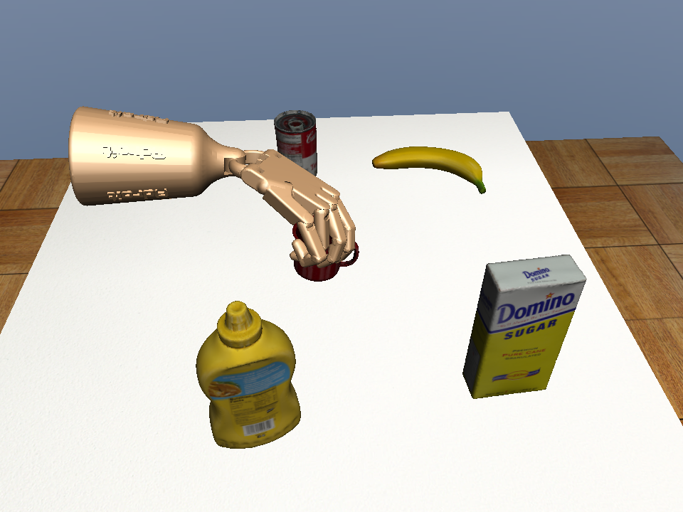
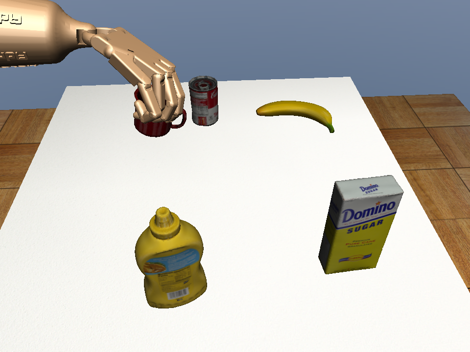
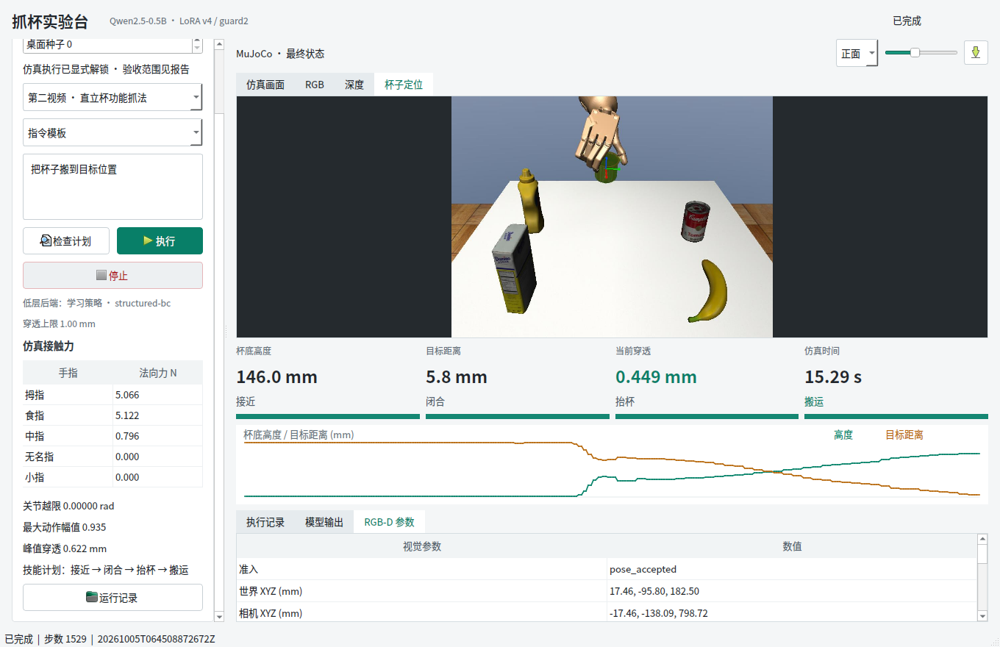

# 两视频视觉抓取的小规模学习与独立评估

最终独立物理测试：结构化 BC **8/8**，同感知设置专家 **8/8**；第一视频真值误差 2.03–3.54 mm，第二视频 5.91–6.37 mm，全程手部相关穿透峰值 0.755 mm。零动作截断。属于有限场景下成功蒸馏专家反馈，不是优于专家的证据。

## 答辩讲述顺序

1. **从可执行示范开始**：两段真实视频的参考经过功能重定向，在虚拟 RGB-D 桌面产生八条物理可执行轨迹。六条训练，另两条开发验证；按整段场景划分，不随机拆散相邻帧。
2. **动作前输入对齐**：139 维输入包含手部本体状态、视觉杯位姿相对量、目标、视频和阶段、阶段进度、参考动作以及关节跟踪误差。视觉估计期间暂停仿真，参考时钟与真实执行步分别记录。
3. **两个学习对照**：共享网络预测全部绝对动作；分视频/分阶段八分支网络只预测参考动作的残差。两组都使用现有示范、相同批量和 60 轮 GPU 行为克隆。分支模型参数更多，不能宣称等算力公平优势。
4. **闭环而非只看损失**：输入来自策略实际访问的状态，动作只送入 `env.step`。不逐帧设置杯子状态、不施加辅助力。开发验证先检查接近、闭合、抬杯、搬运；失败日志同样保留。
5. **逐轮冻结后独立测试**：首轮 16 个视频/种子组合，后两轮各八个，分别提前登记模型、源码、种子和门槛。前轮失败可指导下一轮开发，但已见场景随即转为回归，不再作为新独立证据。最终八例没有参与模型选择或调参；专家基线使用相同场景。
6. **Qt 完整链路**：中文指令 -> Qwen/LoRA 计划 -> 技能门控 -> 视觉参考条件学习策略 -> MuJoCo。单独测试停止、默认锁定、越界拒绝和连续画面。界面明确区分学习策略与专家参考。

## 核心公式与代码

残差标签和策略分别为：

```python
target = executed_expert_action - current_reference_action
action = clip(current_reference_action + network(normalized_input, route), -1, 1)
env.step(action, audit)
```

`route = video_id * 4 + phase_id`。技能边界由真实仿真接触与视觉条件决定，不因为参考时间到了就强行进入下一阶段。

入口：`scripts/161_prepare_tabletop_bc.py`。加载和推理：`src/fromrealhand/tabletop/learned_control.py`。物理评估：`scripts/162_evaluate_tabletop_policy.py`。冻结：`scripts/163_freeze_tabletop_candidate.py`。

## 验收口径

- 连续 50 步三指承载对握，至少两个手指法向与拇指相反。
- 杯底抬高至少 50 mm，目标误差不超过 20 mm；搬运持续满足原成功步数，至少两个独立视觉帧确认。
- 全程每个物理子步检查：手部相关穿透不超过 1 mm，关节越界不超过 0.02 rad，无手部与非目标物碰撞；保持原速度门槛。
- 用停止后的物体真值独立检查目标误差，真值不参与动作选择。
- 不把 loss 下降、图片看起来抓住或专家回放通过当成学习策略成功。

最终统计在 `evidence/summary.json`，逐场景明细、开发阶段偏差和失败原因也归档在同目录。截图只保留开发验证第二视频种子 3 的对握、搬运，以及真实 Qt 执行三张；不把开发截图当成独立成功率证据。

最终软件回归 242/242，实际 Qt 七项全部通过：两视频抬杯与搬运四项，以及停止、默认锁定、越界拒绝三项。所有界面保持响应，未遗留工作进程。







开发验证已定位的偏离：绝对动作 BC 两视频第一步就超过 0.01 的动作误差，分别在 29、69 个完整控制步之后触发穿透停止。残差第一视频四阶段动作最大误差均低于 0.006；第二视频搬运阶段在第 804 步首次超过 0.01，但仍完成任务。这里的 0.01 仅为动作差异诊断阈值，不替代物理成功门槛。

## 方法来源

- [Residual Policy Learning](https://arxiv.org/abs/1812.06298)：保留参考控制的结构，学习动作补偿。本轮借鉴残差参数化，训练是监督 BC，**不是复现论文的强化学习**。
- [Residual Reinforcement Learning for Robot Control](https://arxiv.org/abs/1812.03201)：控制信号与学习补偿相加的机器人控制思路。
- [DAgger 原论文](https://www.ri.cmu.edu/pub_files/2011/4/Ross-AISTATS11-NoRegret.pdf)：解释单纯 BC 在自身状态分布上可能累计误差。本轮若未收集学生访问状态的专家标签，不得称为完成 DAgger。
- [Towards Generalization and Simplicity in Continuous Control](https://arxiv.org/abs/1703.02660)：简单策略参数化也值得作为控制基线。本轮后续增加从示范拟合的对角线性残差，不复现论文的自然策略梯度训练。
- [PyTorch CUDA 内存管理](https://docs.pytorch.org/docs/stable/notes/cuda.html)：本轮并发多个视觉进程曾触发显存不足，按资源失败保留，Qt 改为单独执行；不通过改物理阈值绕开问题。

## 结论边界

这是相同杯型、相机、桌面和参考动作族内的**局部场景泛化**。独立种子不等于新视频、新杯型或实物迁移。目标随参考变换，不是任意大范围目标。第二视频仍是直立杯功能重定向，不是原人手姿态逐帧复现。

残差策略依赖已验证参考、反馈与阶段调度，不能描述为完全摆脱专家的端到端视觉策略。相对专家的改进需依据配对测试，不能只凭相对较弱绝对动作 BC 的优势证明新算法创新。

## 第二轮修正策略

首轮 MLP 残差的第二视频留出案例出现失败后，原 101–108 种子保持为历史测试和回归证据，不再用作新模型的独立测试。新预注册集合为 201–204、两视频共八例，配置见 `configs/tabletop-dual-v4-fresh-test.json`。

新结构化 BC 从同一训练集拟合 `delta_action[j] = gain[j] * joint_error[j]`，不读取仿真器增益作为标签或参数。训练得到 30 个系数，其中仅 6 个非零；手指动作保留参考。这是对专家反馈规律的低维蒸馏，不是发现新的抓法，也不应预先声称比专家更强。

训练采用 GPU 双精度最小二乘闭式解；开发验证最大残差拟合误差约 `5.59e-8`。这只证明拟合关系吻合，是否通过仍以物理闭环和新独立场景为准。

旧失败回归已经通过 2/2，但种子 103 的真值误差 19.81 mm，距离 20 mm 门槛仅约 0.19 mm，视觉定位偏差仍是边界问题。成功不是放宽阈值得到的，也不意味着这个场景具有充足安全余量。

## 第三轮：修复感知与动作时间尺度

第二轮 201–204 的结构化策略和专家均为 7/8。共同失败发生在第二视频 202 的抬杯阶段：相隔 0.21 s 的两次测量间杯子真实移动约 41.45 mm，视觉测得 41.39 mm，当前视觉位置误差仅 0.067 mm，却超过了原 40 mm 跳变门槛。这不是应当增加闭合力或继续训练的问题。

修正为抬杯阶段每 0.10 s 获取新 RGB-D，其他阶段仍 0.20 s。保留 40 mm、30 度跳变门槛和原物理门槛，不裁剪估计位姿，也不沿用过期位置。训练权重保持不变。依据 [Open3D ICP 文档](https://www.open3d.org/docs/release/tutorial/pipelines/icp_registration.html)区分配准质量与时序检查，避免把正常运动误判成估计错误。

202 转入回归集合；下一轮独立集合预登记为 301–304、两视频共八例。所有历史测试结果分别保留，不能把三轮合并成一次未经调参的独立评估。

缩短抬杯采样间隔后，三个失败回归全部通过，202、103、105 的真值目标误差分别约 5.84、6.47、6.31 mm；旧 103 在第二轮仅约 0.19 mm 的到位余量得到改善。这里没有重新训练权重，因此改善应归因于感知/控制时序修正，不能归因于新网络学习。
