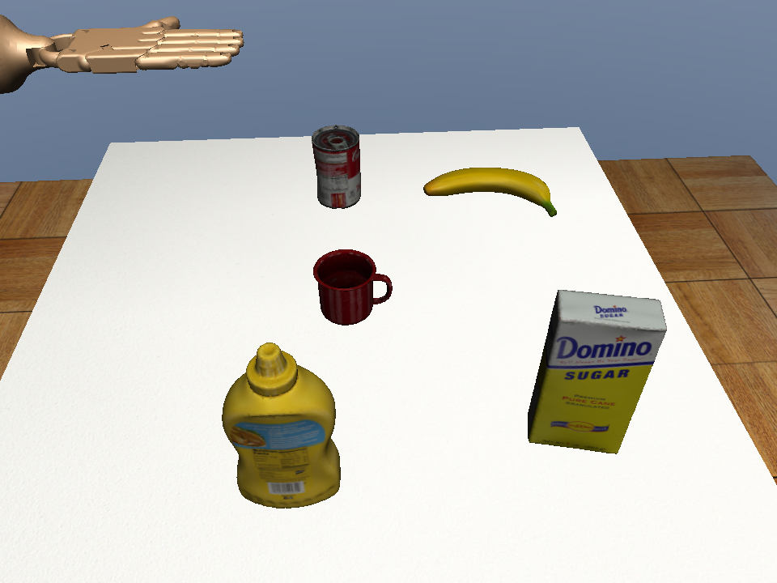
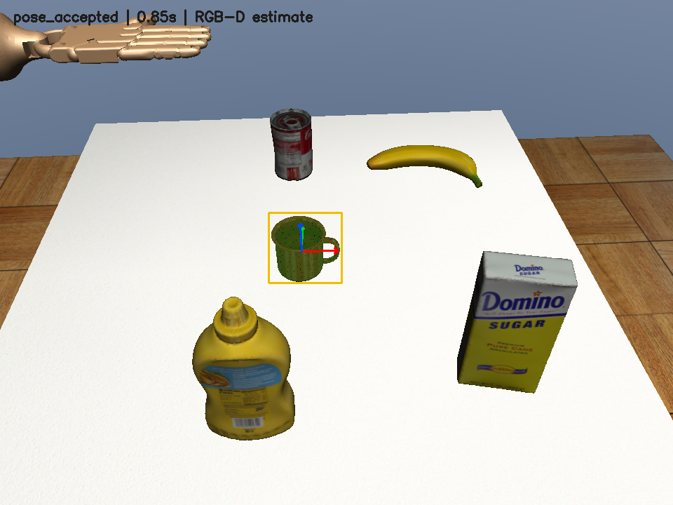

# 桌面 RGB-D 感知答辩素材

本轮只完成场景、相机和感知前三步。研究问题是：在保留旧 MuJoCo 与 Adroit 的条件下，能否不读取仿真杯子坐标，自动得到可供后续控制使用的位姿？

## 图 1 桌面与相机



目标是训练使用的 025_mug，另外四件为干扰物。手被停放，仅用于保持后续机器人场景结构；本图不证明抓取成功。

## 图 2 噪声输入的位姿估计



检测框来自 Grounding DINO，绿色前景来自深度分割，三轴来自几何配准。输入增加 1 mm 深度噪声及 2% 缺失；原物体位姿不输入感知算法。深度单图见 [米制深度的彩色预览](evidence/tabletop-depth.png)。

## 五页讲述顺序

| 页 | 内容 | 证据 |
| --- | --- | --- |
| 1 | 从固定专家回放走向视觉输入，区分已有能力和新目标 | 任务书、前三步范围 |
| 2 | 复用 robosuite 派生桌面与 YCB，隔离旧环境 | 图 1、场景资产 SHA256 |
| 3 | 米制深度、坐标约定和 MSAA 误差定位 | 0.37 mm 到约 0.00086 mm 的桌面反投影检查 |
| 4 | 检测、几何分割、多起点 ICP 与质量门控 | 图 2、代码片段、来源 |
| 5 | 测试前冻结，20 布局理想/噪声对照与拒绝测试 | [量化结果](RESULTS.md)、独立报告 |

## 可解释实现

```python
# 相机系为 OpenCV：右、下、前；从 OpenGL 外参显式换轴。
T_world_camera[:3, :3] = R_world_gl @ np.diag([1., -1., -1.])

# OpenGL 深度缓冲先线性化，不能直接当成米。
depth_m = near / (1 - depth_buffer * (1 - near / far))

# ICP 是已有库实现，不是人为指定杯子坐标。
fit = open3d.pipelines.registration.registration_icp(
    observed_cloud, cad_cloud, threshold, initial_transform,
    open3d.pipelines.registration.TransformationEstimationPointToPlane())
```

示意变量名经过简化，完整实现见 `tabletop/camera.py` 和 `perception/registration.py`。注册在所有偏航初值上运行，再由数据残差和支撑平面约束选择结果；没有从真值选择最优候选。

## 不应宣称的结论

本轮没有训练新模型、没有视觉闭环抓取、没有高频跟踪，也没有实物迁移。误差小来自理想渲染、精确 CAD、固定相机和直立先验，不能当成真实相机的精度。FoundationPose 和 SAM 2 未安装运行，替代方案为 Grounding DINO + 深度几何 + Open3D。

创新表述应限定为本项目的工程方法：输入与真值隔离、旧环境兼容、深度误差诊断和可复现对照；不是声称发明检测或 ICP 算法。

操作及论文/官方来源见 [交付指南](../../RGBD_TABLETOP_PROGRESS.md)。
