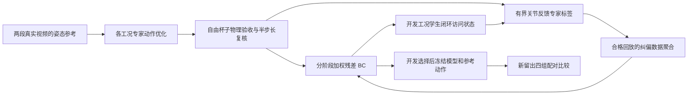

# 方法与代码摘录



训练时专家可读取对应工况的完整合格轨迹。独立评估时学习策略只读取当前仿真状态、进度和已指定的视频技能编号，叠加该视频的名义参考动作；不调用场景专家、优化器或未来杯子轨迹。因此这是带时间参考的双技能残差控制，不是无参考的通用策略。

## 1. 为什么不是继续加大闭合力度

v10 的主要失败包含手与杯子穿透、末端目标误差，以及第一视频的指尖误差。更多闭合力不一定改善这些指标，还可能增加自碰撞。因此保留原质量、摩擦、碰撞网格和接触参数，只优化动作。

在开发工况中搜索 6 个参数：手根部三轴的小平移偏置，以及拇指、小指、中指的短时卸载幅度。平移上限 6 mm；卸载等效关节幅度上限 0.06 rad。卸载在 6.3–7.2 s 平滑进入、9.8–11.2 s 退出，避免改变保持阶段的既有抓法。每个工况最多评估 160 次；早期根部单独搜索单独归档，不计作新的独立实验。

```python
# scripts/71_develop_safe_experts.py: SafetyProblem.action_sequence
pulse = smooth((t - 6.3) / .9) * (1 - smooth((t - 9.8) / 1.4))
actions = root_adjusted_actions + pulse[:, None] * finger_delta
```

优化器使用 Powell 无导数搜索，每次评估完整 MuJoCo 动作轨迹。接触非光滑，不能保证全局最优；目标函数变好也不等于物理验收通过。搜索候选必须重新通过完整门槛、动作精确重放和半时间步长检查。原始候选仍保留，可在新候选失败时回退。

安全目标分两层：原完整验收的穿透上限仍为 1 mm；本轮偏好为不超过 0.75 mm。后者是额外余量，不是放宽或替换原门槛。MuJoCo 是软接触求解器，小的非零穿透不等于禁用碰撞。

## 2. 专家纠偏的含义

本轮专家是“通过物理验收的轨迹 + 有界关节状态反馈”，不是新的人类标注，也不是最优控制器。专家读取学生实际状态，按当前阶段参考状态给出控制建议：

```python
# src/fromrealhand/corrective_learning.py
dq = clip(q_reference - q_actual, joint_error_limits)
dv = clip(v_reference - v_actual, -1, 1)
delta = gain * conversion * (dq + 0.02 * dv)
teacher = scene_expert_action + delta
residual_label = clip(teacher - nominal_reference, -limits, limits)
executed = beta * (nominal_reference + residual_label) + (1-beta) * student
```

`conversion = kp / (actuator_gain * act_rng)`，只把等效关节偏置换算一次；输出仍是环境期望的归一化动作。所有反馈都通过 `env.step(action)`，杯子只在初态复位时设置位置，执行中自由受力运动。

反馈增益只用开发工况比较 0.1、0.25、0.5。DAgger 两轮混合系数分别为 0.5、0，第二轮完全由学生执行、专家只标注。仅完整回放通过原门槛的状态-标签对进入监督学习；失败回放和标签保留但排除。它们是纠偏样本，不伪装成“专家动作导致这些后继状态”的连续示范。

这里验收的是实际执行的混合控制或学生轨迹，不是逐一执行每个未采用的专家动作再证明其安全。纠偏标签只是局部反馈建议，不能保证从任意失稳状态恢复；是否有用必须由无专家接管的闭环测试判断。

## 3. 阶段与网络

输入为 84 维：环境观测 39、速度 36、杯子旋转矩阵前两列构成的姿态特征 6、进度 1、视频类别 2。两段视频分别使用自己的初态、参考动作、时长和相位。输出 30 维有界动作残差，叠加各自参考动作。

网络为两层 64 单元 MLP。基础行为克隆比较 50、150 epoch；纠偏聚合每轮 40 epoch。训练使用 CUDA，但 MuJoCo 物理回放仍在 CPU 上。没有启动长轮次 DAPG。

### 冻结前的开发补充

基础开发结果为 BC 50 轮 21/35、150 轮 24/35、第一轮 DAgger 20/35。微小残差会消耗第二视频本来就不大的接触余量，因此在任何新留出测试运行之前，另行登记 `configs/v11-residual-gain-amendment.json`：对原四个候选中开发最优者，额外比较 0.25 与 0.5 的全局残差输出增益，不增加训练轮次。

实现只缩放网络输出的偏移与尺度，不缩放固定参考动作、不改物理参数，之后仍应用原残差上限。它是保守的控制增益对照，不是新的专家纠偏算法。所有候选仍按原开发指标排序，原始候选冻结文件保留，新选择另存 `safety_frozen_policy.json`。两个增益的设置发生在查看开发结果之后，属于透明记录的开发补充，不能称为最初预注册内容。

采样先平衡视频与轨迹，再平衡阶段，而不是让长时间保持段吞掉其他阶段：准备、接近、闭合、抬杯、搬运保持的总权重依次为 0.15、0.15、0.20、0.30、0.20。开发选择优先看两视频等权的完整通过率，再看 0.75 mm 余量通过率、目标误差；不按训练损失选最终模型。

## 4. 新留出与归因

v10 已看过的失败转入开发，不再称作独立验证。新留出工况在 `configs/v11-study.json` 提前声明；候选模型和参考动作 SHA256 写入 Git 后才允许测试。固定 24 个工况、4 组控制器，共 96 次回放：

| 比较 | 回答的问题 |
|---|---|
| 新固定动作 vs 旧固定动作 | 专家动作优化是否有帮助 |
| 新残差 vs 新固定动作 | 学习的反馈是否带来额外价值 |
| 新残差 vs 旧残差 | 新数据与纠偏方法整体是否改善 |

测试包含新扰动值，不包含第三段视频、新杯子网格或真实机器人。因此最多支持“两段已知视频周围新仿真工况”的结论，不能宣称跨视频、跨物体或实机泛化。测试后不继续调参。

本轮使用一个训练随机种子和固定的小规模工况网格，不提供统计显著性结论。新旧残差的比较同时包含专家动作、开发数据、阶段采样和纠偏的变化；DAgger 的单独作用先看开发对照，不能把留出集的全部差异都归因于纠偏一个因素。

## 5. 验收与边界

关键原门槛如下；代码依据为 `src/fromrealhand/grasp_gate.py`、`scripts/30_validate_video_faithful.py`、`scripts/33_optimize_surface_grasp.py` 与 `scripts/v10_common.py`。

| 项目 | 完整通过条件 |
|---|---|
| 抬起与保持 | 保持至少 1 s，末段杯底离桌大于 15 mm，最小合接触力大于 0.05 N |
| 到位 | 最终杯子到目标距离不超过 20 mm |
| 接触几何 | 全程手-场景及手-杯最大穿透不超过 1 mm，初始不超过 0.5 mm，承力接触间隙不超过 0.5 mm |
| 动作与数值 | 数值有限，关节越界不超过 0.02 rad，动作饱和占比小于 1%，末段滑移不超过 5 mm |
| 抓法接触 | 拇指、食指及至少四指各自的末段承力接触占比不低于 80% |
| 指尖参考误差 | 全程平均小于 20 mm，末段平均小于 15 mm，各指末段平均最大值小于 25 mm |
| 本轮额外偏好 | 完整通过基础上，最大手-场景穿透不超过 0.75 mm；专家还要求半步长同时满足 |

- 区分格式通过、能运行、稳定抬杯、完整物理及抓法通过、额外安全余量通过。
- 接触和穿透在物理子步审计，不只看稀疏截图；完整门槛沿用旧实现。
- 开发专家动作额外进行精确动作重放和半步长检查；策略留出统计使用预注册的标准时间步长，不冒称全部做过半步长。
- 开始本轮时共享盘缺席，随后恢复挂载，MANO 相关测试已通过。公开素材使用真实 MuJoCo 截图；含原视频帧的对照图保留在本机 `data/processed/dual_video_v11/renders/source_second_local/`，不把原始数据或模型上传 GitHub。
- 模拟接触力不是真实力标签；小指持续接触、无名指加入时机与真实视频仍有差异。
- 只有两种已知抓法；本轮没有实现语言高层任务规划器，也没有完成实机迁移。
