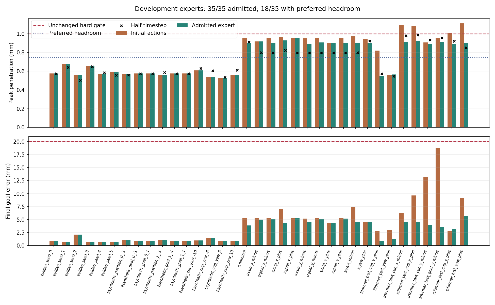
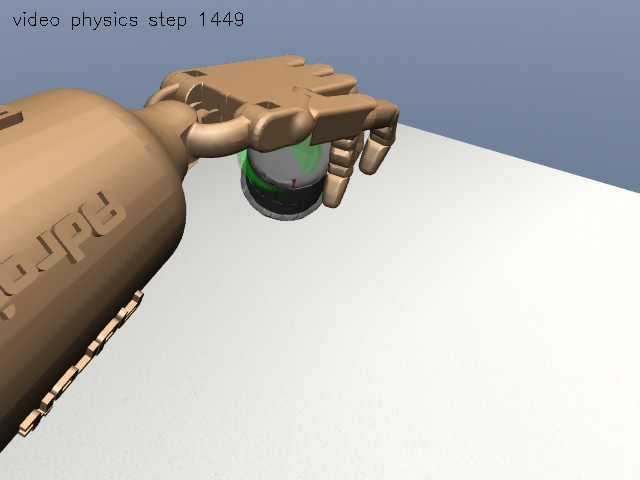
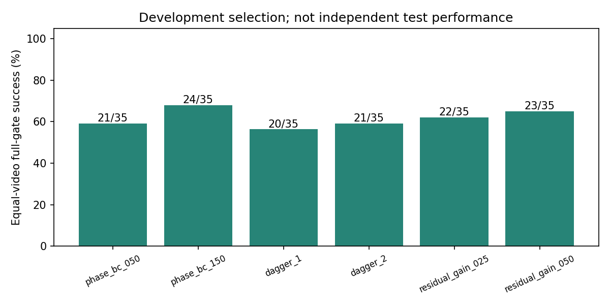

# v11 关键阶段专家纠偏与接触安全余量

本轮接续 v10，原示范、模型和测试记录全部保留。先改善开发专家动作，再补充专家对学习策略访问状态的纠偏标签，最后冻结候选、运行新的留出集。不会启动长轮次 DAPG。

## 预注册

- 原 27 条合格示范作为开发数据；v10 残差的 8 个已知失败工况明确转为开发用途，不能再称为独立测试。
- 原硬门槛仍为手-场景最大穿透 1 mm，开发优化偏好收紧到 0.75 mm，以留出动作误差余量。不改质量、摩擦、网格或接触 margin。
- 专家纠偏是基于成功轨迹的有界关节状态反馈，不是逐帧设置手或杯子位姿，也不是真人提供的新标签。
- 新留出集每视频 12 项：杯子 XY 正负 4.25 mm、目标 XY 正负 19 mm、朝向正负 6.5 度，以及两个组合扰动。冻结前不运行。
- 最终比较旧固定动作、旧残差、新固定动作、新残差。分开归因“专家动作改善”和“学习改善”。

详细参数见 `configs/v11-study.json`。成功率仍按原完整物理与抓法门槛计算，不因偏好安全余量的变化修改历史评分。

## 进度

- [x] 核对旧失败与运行环境，预注册新的开发/留出划分。
- [x] 开发专家动作优化、重放和半步长复核：35/35 通过原门槛，18/35 达到额外安全余量。
- [x] 关键阶段加权学习与专家纠偏数据收集：两轮纳入 45 条合格回放、64,194 帧纠偏标签。
- [x] 开发评估后冻结候选：150 轮 BC，24/35 开发完整通过；纠偏及缩小残差的候选均未胜出。
- [ ] 新留出配对评估、答辩素材与 GitHub 同步。

本目录将保存实际实验方法、代码摘录、截图、图表、失败记录和结论。没有原始视频、MANO 模型或大 checkpoint 上传。

已导出 35 条专家轨迹、50,156 帧训练输入，仍只来源于两段真实视频。第二视频 17 个开发工况的平均峰值穿透由初始动作的 0.975 mm 降至 0.909 mm，但没有任何第二视频工况同时在标准与半步长下达到 0.75 mm 偏好目标。这是局部改善，不是安全余量问题已经解决。

[方法与代码摘录](METHODS.md) · [复现与窗口命令](COMMANDS.md) · [答辩 PPT 提纲](PPT_OUTLINE.md) · [专家准入原始指标](evidence/experts.json)

冻结候选：`phase_bc_150.pickle`，SHA256 `d281b45c0243e4d26cf83efe056fb559c37ab7b66702cb7c4e57ca0eb466c451`。两轮纠偏的模型和数据保留，但不是最终选中的策略；不能将本轮策略的效果归因于纠偏训练成功。

## 开发中的诊断调整

根部平移单独优化使第二视频名义穿透由 0.954 mm 降至 0.890 mm，但主峰转为 7.178 s 的 `C_lfdistal` / `C_rfmiddle` 自碰撞，中指与杯子峰值也接近 0.876 mm。该结果仍通过原 1 mm 门槛，却没有达到 0.75 mm 偏好目标。

因此在开发阶段加入 THJ0、LFJ1、MFJ1 的短时卸载脉冲：6.3–7.2 s 平滑进入，9.8–11.2 s 平滑退出；保留根部三项小偏置。没有改变物理门槛、动力学参数或留出工况。根部单独搜索及中断的下一工况保存在 `data/processed/dual_video_v11/diagnosis/root_only_second/`，不会删除失败证据。
