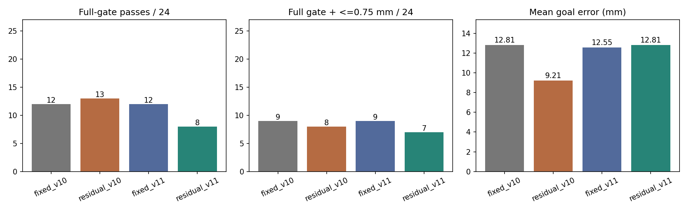
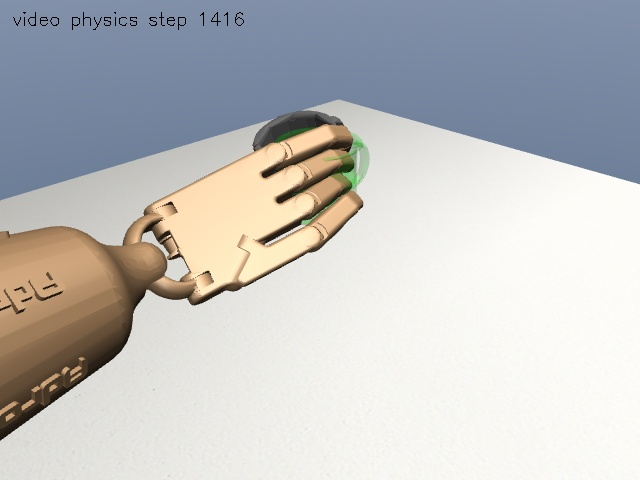

# v11 实验结果与未解决问题

完成日期：2026-10-02。结论：专家动作库扩充和纠偏实验已完成，但新策略留出表现退化，不替换旧模型，不启动长轮次 DAPG。

## 1. 专家动作与安全余量

- 35/35 开发工况通过原完整门槛、动作精确重放和半步长复核，重放最大观测误差全部为 0。
- 共 50,156 帧：第一视频 18 条、第二视频 17 条。仍只有两段真实视频，不是 35 段独立真实视频。
- 第二视频各工况单独优化后，平均峰值穿透从初始动作的 0.975 mm 降至 0.909 mm。
- 第一视频 18/18 同时在标准与半步长下满足额外 0.75 mm 偏好；第二视频 0/17 满足。因此没有解决第二视频的充分安全余量。
- 第二视频名义工况：标准步长穿透 0.954 → 0.901 mm；半步长则从约 0.796 增至 0.912 mm。不能只展示标准步长的改善。新动作仍通过原 1 mm 门槛。
- 旧失败中第二视频正向旋转 4.5° 的专家修复通过：标准/半步长穿透约 0.900/0.851 mm，终点误差 5.62 mm，末段平均指尖误差 13.56 mm。

这些是“每个开发工况各自优化后的专家动作”成绩，不是一个固定动作或一个网络在 35 个工况中都能成功。原质量、摩擦、网格和碰撞参数没有改动，杯子执行中由物理引擎自由运动。

## 2. 纠偏数据与开发选择

开发试验选择专家反馈增益 0.25。两轮纠偏分别以 0.5、0 的专家执行比例收集状态，纳入 25/35、20/35 条回放，共 45 条回放、64,194 帧标签。失败回放未加入监督训练，但记录和标签保留。这些是重复开发场景中的状态访问，不是新增独立视频。

| 候选 | 完整通过 | 两视频等权平均目标误差 |
|---|---|---|
| 固定窗口加权 BC，50 轮 | 21/35 | 6.60 mm |
| 固定窗口加权 BC，150 轮 | **24/35** | 8.01 mm |
| 第一轮 DAgger，40 轮微调 | 20/35 | 7.98 mm |
| 第二轮 DAgger，40 轮微调 | 21/35 | **5.43 mm** |
| 最佳 BC 残差乘 0.25 | 22/35 | 5.61 mm |
| 最佳 BC 残差乘 0.5 | 23/35 | 5.85 mm |

按预先声明的完整通过率优先规则，选中 `phase_bc_150`。纠偏降低了部分目标误差，但没有提高完整成功率，两个输出增益也未胜出。最终模型不是 DAgger 模型，不可把它的结果称作“专家纠偏训练成功”。

## 3. 冻结后的新留出评估

冻结提交：`ff7d2bf0164231bd720e5c2b247ddbab8f6fff90`，在测试启动前已推送 GitHub。候选 SHA256：`d281b45c0243e4d26cf83efe056fb559c37ab7b66702cb7c4e57ca0eb466c451`。

每视频 12 个未参与本轮调参的新扰动工况：杯子 XY ±4.25 mm、目标 XY ±19 mm、朝向 ±6.5°、两个组合扰动。四组共 96 次闭环物理回放；四组在同一组 24 工况上比较。

| 方法 | 完整通过 | 第一/第二视频 | 稳定抬杯 | 完整通过且穿透≤0.75 mm | 平均目标误差 |
|---|---|---|---|---|---|
| 旧固定动作 | 12/24 | 9/12、3/12 | 24/24 | 9/24 | 12.81 mm |
| **旧残差 v10** | **13/24** | **9/12、4/12** | 24/24 | 8/24 | **9.21 mm** |
| 新固定动作 | 12/24 | 9/12、3/12 | 24/24 | 9/24 | 12.55 mm |
| 新候选 v11 | **8/24** | **7/12、1/12** | 24/24 | 7/24 | **12.81 mm** |

新候选相对旧残差是 0 个完整通过的新增胜例、5 个退化案例；相对新固定动作为 1 胜、5 负。不能宣称残差优势或泛化改善。专家在开发工况中的穿透改善，也没有转化为共享新固定动作的留出成功率改善。

这里的 24 工况不是 v10 旧报告中的 20 工况，不应直接比较两份报告的百分比；上表才是本轮同条件配对比较。一个训练种子、两段已知视频的小型扰动网格，不代表新视频、实物杯子或真实机器人泛化。

## 4. 失败发生在哪里

新候选 16 个失败：目标不到位 5、指尖参考误差超限 4、穿透超限 6、接触模式不足 1。它们不能统称为“没抓起来”，因为 24/24 都满足稳定抬杯标准。

- 第一视频目标 X +19 mm：保持抓杯，但终点误差 34.52 mm；目标 Y +19 mm 则为 26.90 mm。
- 第二视频杯子 X +4.25 mm：在约 7.546 s，拇指 `C_thdistal` 与 `collision_mug_13` 最大穿透 1.157 mm；末段四指仍全部承力，接触多不等于余量足够。
- 第二视频杯子 Y -4.25 mm：末段食指、中指承力接触占比均为 0，只剩拇指与无名指维持抓取，未通过四指抓法门槛。
- 第二视频组合工况 B：杯子未掉落，但距目标 30.38 mm。

绿色透明杯子是无碰撞目标标记。成功和失败截图均来自保存动作的真实物理重放，两个视频策略、专家和失败画面的重放观测误差均为 0；不是逐帧设置杯子位姿。

## 5. 事后时间窗审计

本轮“阶段加权”实际使用固定控制时间窗，没有精确跟随五次时间缩放后的源帧阶段。实际闭合仅得到约 10.7% 采样质量，抬杯约 17%，而不是原意的 20%、30%。详见 [方法与修正说明](METHODS.md) 和 [相位审计](evidence/phase-window-audit.json)。

已新增按源帧非线性时钟计算的 `aligned_phase_weights` 并通过测试；它尚未接入本轮训练入口、未用于本轮 checkpoint，也没有重新运行本轮留出以挑选模型。因此这里只能报告实现修正已准备好，不能报告策略收益已验证。

## 6. 验证与交付

- 82 项单元测试全部通过，含 MANO、动作缩放、状态不写回、卸载脉冲、残差增益和相位采样测试。
- 35 条专家精确重放及半步长门槛检查通过。
- 96 条留出记录唯一，完整通过标志与原门槛重新计算一致。
- 测试前 Git 冻结回执、模型 SHA256、参考动作 SHA256 及协议已核对；第一视频新旧固定动作的物理指标完全一致。
- 32 张公开仿真关键帧、6 张图表、精简原始指标、代码摘录及 PPT 提纲已归档。原视频对照图、完整轨迹、checkpoint 和授权模型留在本机。
- 未启动长 DAPG，测试完成后未改变候选参数或重新训练。新增相位采样函数仅供后续独立实验。

## 7. 下一步

1. 单独开新协议，接入已测试的精确相位采样；v11 留出已被看过，不能再作为后续选模型的独立测试。
2. 对第二视频共享参考动作做多开发工况的最坏情况优化，保留四指接触，避免“每条各自成功但共享参考不稳”。
3. 比较闭合/抬杯阶段的残差限制与接触状态反馈，检查专家建议在学生偏离状态上是否确实可执行，不再只看监督损失。
4. 只有冻结后新测试的完整通过率、安全余量和目标误差同时改善，才讨论长轮次训练。当前不建议直接跑 2000 次。
