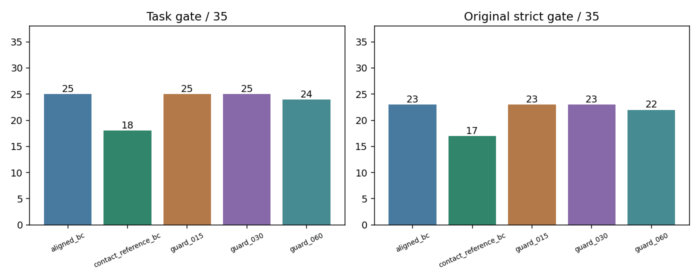
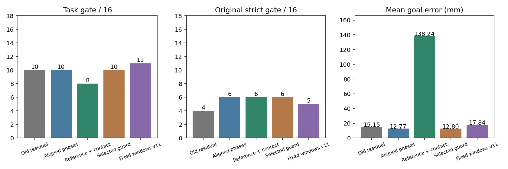

# v12 实验结果

日期：2026-10-02。以下只适用于两段已知视频及本轮合成扰动，不代表实物泛化。

## 开发集：35 工况

| 方法 | 任务级 | 原严格级 | 等权平均目标误差 |
|---|---|---|---|
| 精确阶段采样 BC | 25/35 | 23/35 | 5.65 mm |
| 参考条件＋接触 BC | 18/35 | 17/35 | 84.03 mm |
| 法向卸载 0.15 | 25/35 | 23/35 | 5.65 mm |
| 法向卸载 0.30 | 25/35 | 23/35 | 5.66 mm |
| 法向卸载 0.60 | 24/35 | 22/35 | 5.70 mm |

原 v11 固定时间窗 BC 的开发结果为严格 24/35；按本轮任务门槛重新统计为 27/35。改变采样时序不等于必然提高成功率。

## 冻结后的新留出集

候选在测试前选择为 **精确阶段采样 BC**。每视频 8 个组合扰动，五种方法共 80 次回放。

| 方法 | 任务级 | 原严格级 | 稳定抬杯 | 平均目标误差 |
|---|---|---|---|---|
| 旧残差 v10 | 10/16 | 4/16 | 16/16 | 15.15 mm |
| 精确阶段采样 BC | 10/16 | 6/16 | 16/16 | 12.77 mm |
| 参考条件＋接触 BC | 8/16 | 6/16 | 8/16 | 138.24 mm |
| 开发选中的法向卸载 | 10/16 | 6/16 | 16/16 | 12.80 mm |
| 原固定时间窗 v11 | 11/16 | 5/16 | 16/16 | 17.84 mm |

任务级放宽了目标精度及抓法忠实度要求，但没有放宽 1 mm 穿透上限。改善必须在同一标准、同一组工况下比较；不能拿本轮 16 工况的比例直接对比 v11 的 24 工况。

## 短训练接口

完成 20 次 DAPG 接口短训，20 次非零参数更新。每次两条完整轨迹；BC 和价值网络使用 GPU，MuJoCo 与旧 MJRL 策略自然梯度更新使用 CPU。

该短训策略仅作接口检查，未使用本轮已看过的测试集再次评估，也未替换冻结 BC。名义工况结果：
- first：任务级 True，严格级 True，目标误差 1.19 mm。
- second：任务级 True，严格级 True，目标误差 3.99 mm。

## 可复现与边界

- 完整轨迹、模型及原始数据留本机；公开代码、配置、冻结哈希、指标与仿真截图。
- 所有新策略均使用实际物理闭环执行，不对运行中的杯子写入位姿。
- 第二组是参考适配、参考误差和接触特征的组合试验，不能单独归因于某篇论文或某个特征。
- 没有新的人类纠偏数据、完整 CR-DAgger 复现或大规模 MimicGen 数据生成。
- 没有启动 2000 次长训练。

[方法与代码说明](METHODS.md) · [运行命令](COMMANDS.md)
