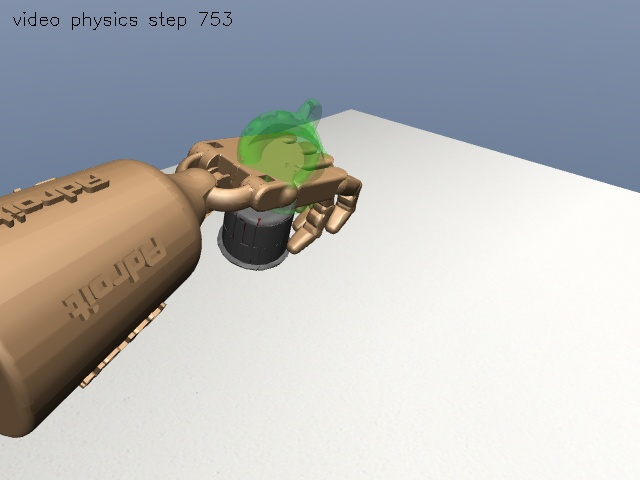
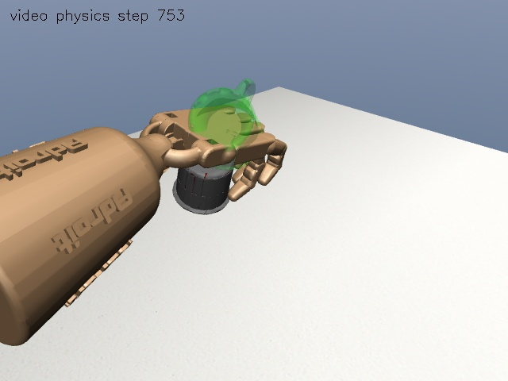
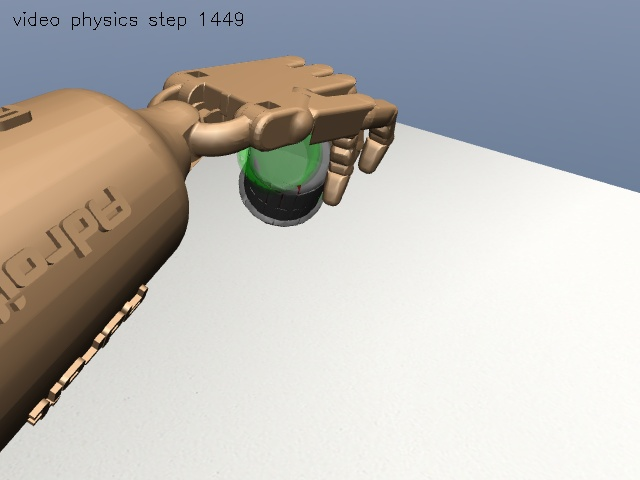

# v14c 结果：预测接触修正与长训准入

日期：2026-10-02。冻结提交：`a57b33bb362a619acc67e8ec71e5448334a73d4b`。

## 开发集

| 方法 | 任务级 | 严格级 | 第一视频任务/严格 | 第二视频任务/严格 | 平均目标误差 |
|---|---|---|---|---|---|
| v13 共享残差 BC 最佳候选 | 29/35 | 27/35 | 18/18、16/18 | 11/17、11/17 | 5.74 mm |
| v14c 同一网络 + 预测接触修正 | 35/35 | 33/35 | 18/18、16/18 | 17/17、17/17 | 5.74 mm |

第一视频没有触发动作修改；两项严格失败均是指尖误差。第二视频六项任务失败全部修复。两视频平均目标误差几乎不变，不能宣称所有指标都有改善。

开发小试保留了两个负结果：30 ms 固定未来动作的法向修正通过 2/4；150 ms 未来参考的法向修正也只通过 2/4。增加有界正负关节及手腕候选后才达到 4/4。三种配置与原始结果均保留，没有覆盖。

第二视频各阶段相对合格专家的杯子位置 RMSE，按 17 个开发工况平均：

| 方法 | 接近 | 闭合 | 抬杯 | 搬运/保持 |
|---|---|---|---|---|
| 原残差 | 0.108 mm | 1.378 mm | 2.829 mm | 5.822 mm |
| 预测修正 | 0.108 mm | 1.337 mm | 3.540 mm | 6.352 mm |

抬杯、搬运的专家轨迹误差略增，但任务接触验收改善。这是接触与轨迹目标的取舍，不是模仿精度全面提升。逐工况动作和杯子阶段指标见 `evidence/phases.json`。

## 冻结后的独立留出

每视频 8 个新组合工况，共 16 个；原残差和带预测修正器的残差在相同场景配对测试，共 32 次回放。杯子 XY 为正负 4 mm、目标 XY 正负 18 mm、杯子朝向正负 6 度以内的组合扰动；这是同两段视频的合成新工况，不是新视频、新物体或实物泛化。

| 方法 | 任务级 | 严格级 | 稳定抬杯 | 第一视频任务/严格 | 第二视频任务/严格 | 平均目标误差 |
|---|---|---|---|---|---|---|
| 原残差 | 11/16 | 6/16 | 16/16 | 8/8、4/8 | 3/8、2/8 | 9.16 mm |
| 原残差 + 预测修正 | 15/16 | 7/16 | 16/16 | 8/8、4/8 | 7/8、3/8 | 8.86 mm |

任务通过率从 68.75% 到 93.75%，增加 25 个百分点；严格抓法只增加一个工况。样本少、仅一个训练种子，没有统计显著性或跨视频泛化结论。冻结后没有根据这些结果修改策略、过滤器或验收阈值。

第二视频候选的全部剩余严格失败：

| 工况 | 失败项 | 实测量 |
|---|---|---|
| fresh_01 | 手与场景穿透 | 7.538 s 的 `C_thdistal / collision_mug_13` 达到 1.059 mm；任务级也失败 |
| fresh_02 | 四指接触模式 | 拇指、食指、中指末段接触均 100%，无名指 0%；仅通过三指任务门槛 |
| fresh_03 | 指尖误差 | 任务级通过，严格抓法失败 |
| fresh_04 | 指尖误差 | 任务级通过，严格抓法失败 |
| fresh_07 | 严格到位精度 | 20.153 mm，略大于严格级 20 mm，小于任务级 30 mm |

第一视频四个严格失败均为指尖误差。**不能把任务级 15/16 写成四指人手抓法复现成功 15/16。**

`fresh_01` 的关节修正曾达到 0.06 rad 上限，但不能仅由此认定扩大限幅就能修复。该工况没有再用于本轮调参；若将来针对它优化，必须把它转为开发数据并另设新测试。

## 物理和数值复核

| 名义工况半步长 | 任务/严格 | 最大穿透 | 目标误差 |
|---|---|---|---|
| 第一视频 | 通过/通过 | 0.614 mm | 0.674 mm |
| 第二视频 | 通过/通过 | 0.795 mm | 15.419 mm |

第二视频原步长目标误差约 3.752 mm，半步长约 15.419 mm，仍有数值/接触敏感性。半步长通过只表示未破坏当前准入门槛，不表示两条动力学轨迹相同。

独立预测副本与下一真实状态的误差上限：开发约 `5.6e-10`，留出约 `3.77e-10`；审计门槛为 `1e-7`。这验证副本预测的一步执行一致性，不等于对未建模物理的安全保证。

本轮没有修改原物体质量、摩擦或碰撞网格，没有给杯子施加辅助力，也没有在回放过程中写杯子位姿。所有验收来自完整 `env.step(action)` 物理轨迹。

## 短训和最终准入

**27 项自动准入检查全部通过，允许开始受控长训练；本轮已停在启动前，没有运行长训练。** [自动准入记录](evidence/readiness.json) · [训练记录](evidence/dapg-smoke.json) · [97 项测试核验](evidence/verification.json)。

完成 20/20 次有限且非零的参数更新，共 57,340 步；最大实测 KL 为 0.000636，低于 0.002 上限。40 条带随机探索的训练轨迹任务级通过 39 条、严格级通过 37 条；第 14 轮第二视频 `former_test_cup_y_minus` 穿透 1.015 mm，作为失败保留。短训接口准入不要求每条探索轨迹成功，也不把训练损失或采样回报当泛化证据。

| 训练后确定性名义回放 | 任务/严格 | 最大穿透 | 目标误差 |
|---|---|---|---|
| 第一视频 | 通过/通过 | 0.620 mm | 0.601 mm |
| 第二视频 | 通过/通过 | 0.889 mm | 4.627 mm |

短训末次策略未做新留出测试，不宣称优于冻结 BC，也不替换它。长训练从已独立评估的冻结 BC 加预测修正器开始，而不是从短训末次策略开始。当前结论是训练最低条件通过，不是阶段三的全部科研目标完成。

GPU 用于价值网络，旧版 MuJoCo 与自然梯度策略仍在 CPU。过滤器额外做未来动力学预测，不声称 100 Hz 实时控制或 GPU 并行仿真。32 次留出配对回放耗时约 543 秒，短训加前后检查总耗时 1,446.81 秒，约 24 分钟。按第 1 至 20 次 checkpoint 时间估算，每次更新约 65.8 秒；相同计算负载下 200 次约 3.7 小时，2000 次约 36.6 小时。这只是线性粗估，预测修正触发频率及机器负载变化会改变耗时。建议先 200 次分段验证，不直接盲跑 2000 次。

## 三张关键画面

同一第二视频开发工况 `cup_y_minus`，物理峰值从约 1.079 mm 降到 0.995 mm。图片来自保存的控制动作经物理引擎重放，回放最大观测误差为零。绿色透明杯子为无碰撞目标标记。

| 原残差，第 753 步 | 预测修正，第 753 步 |
|---|---|
|  |  |

亚毫米接触差异不能靠肉眼截图定量判断，前后结论依据完整接触记录。本工况仍接近穿透上限，截图也不能证明全场景四指接触。

[8 页答辩提纲与代码片段](PPT_OUTLINE.md) · [方法与论文来源](README.md) · [原生仿真窗口与命令](COMMANDS.md)
