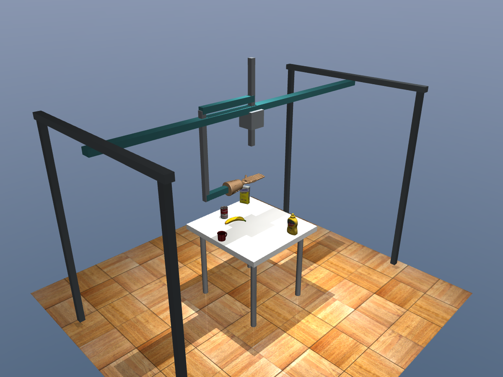
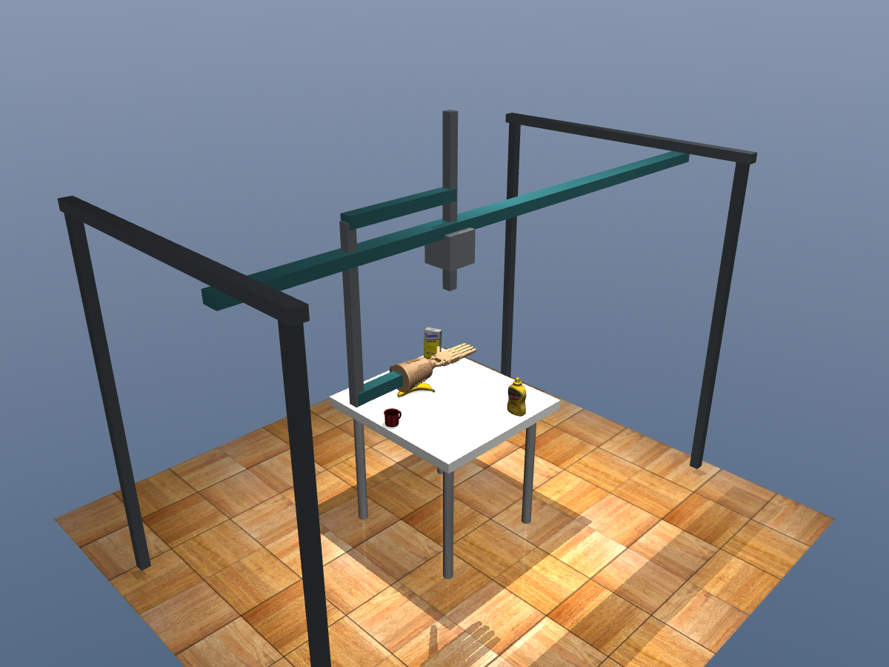

# F1 答辩资料：整桌平台与物理到位

日期：2026-10-07。范围：平台与布局，不是整桌抓取成功率。

## 1. 实际新增什么

- 85 × 80 cm 桌面、固定 YCB mug、0–4 件随机位置/朝向干扰物，不预留中央走廊。
- 三轴有质量、有阻尼、有力上限的平移平台，搭载现有 Adroit。
- 空手平台运动使用有限执行器控制与 MuJoCo 积分；杯子仍是自由物体。
- 原生窗口连续播放，旧 Qt 和模型不改。本轮不训练、不做带杯搬运、不做避障。

杯子中心合法范围约 X `[-0.38193, 0.38302]` m、Y `[-0.35459, 0.34136]` m，来自网格尺寸及 5 mm 台边余量。不能把“全桌”解释成杯子中心可以放在桌边导致杯体悬空。

## 2. 两张实际仿真图



图 1：杯子与四件干扰物来自种子 9。杆件包括立柱、横梁、滑块、Z 滑杆、前臂安装连接；原 Adroit 在 F1 暂时由相对关节约束保持姿态。



图 2：平台到达角区上方，物体没有被抓起。这是平台运动证据，不是局部策略或抓取效果图。

## 3. 验收与局限

最终数值以 [summary.json](evidence/f1/summary.json) 为准；原始布局和每次运动记录一并归档。平台运动门槛与附加物体低速度诊断分开统计。

最终运行 `f1-final`：布局支撑 **20/20**、杯子极限角点 **4/4**、空手九点到位 **9/9**、近限位 **6/6**、非法目标拒绝 **7/7**、刹停通过。最大 `S_grasp` 到位误差 **0.0572 mm**、全场景最大接触穿透 **0.712 mm**；刹停峰值加速度 **0.0906 m/s²**，最终最大速度 **0.000633 mm/s**。这些是理想仿真中的结果，不是实物机构定位精度。

最终附加低速度诊断同样为 **11/20**；物体瞬时最大线速度 **9.18 mm/s**、角速度 **0.154 rad/s**。原生窗口验证：10.00 s 墙钟时间、10.0045 s 仿真时间、626 次渲染，平台位置实际变化，没有 GL 报错。两张 PNG 均为 1200×900，像素标准差分别约 44.36、43.81，且已人工检查非空白、资产纹理正确。

| 项目 | 门槛 / 说明 |
| --- | --- |
| 20 个随机布局 | 网格不越出台面，底面高度 -1 至 +2 mm，穿透峰值 ≤1 mm |
| 4 个合法杯子边角 | 各带四件干扰物，实际物理落稳后检查支撑 |
| 9 个空手悬停目标 | 位置误差 ≤3 mm；不是九点抓取 |
| 6 个近关节限位 | 距边界 5 mm，检查到位、速度/加速度、越界和碰撞 |
| 7 个非法目标 | 拒绝且不推进仿真时间，包括 NaN |
| 运动中刹停 | 连续参考交接；最终速度 <1 mm/s；原平台运动门槛不变 |
| 附加低速度诊断 | 所有物体线速度 <10 mm/s、角速度 <0.05 rad/s；未全部通过 |
| 软件和窗口 | 264 项测试；原生 GLFW/GLX 窗口10秒连续运行 |

附加低速度检查在 v3 中为 **11/20**；干扰物仍有小幅数值抖动。更小步长改善但没有完全消除问题，不能声称静止物体零速度。该指标是在原 F1 工作包之外追加的诊断，最终单列，并公开保留 v3 的不通过记录；不是修改原平台门槛来得到通过。

没有新抓取成功率、没有两视频新平台控制结果，没有带载避障结果，也没有实物平台参数标定。平台质量和执行器参数是仿真设定。

## 4. 可放入 PPT 的方法代码

**按名称绑定，避免前 30 个 qpos/actuator 的假设：**

```python
joint_ids = [model.joint_name2id(name) for name in PLATFORM_JOINTS]
platform_qpos = model.jnt_qposadr[joint_ids]
platform_actuators = [model.actuator_name2id(name + '_servo')
                      for name in PLATFORM_JOINTS]
```

最终模型中平台 qpos 为 0–2，但执行器为 30–32；原手 qpos 为 3–32、执行器为 0–29。执行器控制统一按名字分组，物体 freejoint 不纳入 33 个受控标量通道。

**刹停必须保持参考连续，不能突然跳回实测位置：**

```python
duration, stop = braking(reference(t),
                         reference.derivative(1)(t),
                         reference.derivative(2)(t))
```

首版使用实测 q/v/a 生成刹停参考，突然消除了伺服跟踪滞后，产生约 2.07 m/s² 加速度；改为参考 C2 连续交接后约 0.091 m/s²，没有增加力度或放宽门槛。

## 5. 参考和下一步

平台使用 [MuJoCo 运动树](https://mujoco.readthedocs.io/en/2.1.2/modeling.html#kinematic-tree)，轨迹插值使用现有 [SciPy BPoly](https://docs.scipy.org/doc/scipy/reference/generated/scipy.interpolate.BPoly.from_derivatives.html)。数值问题排查参考 [官方软约束说明](https://mujoco.readthedocs.io/en/2.1.2/overview.html#softness-and-slip)。这些是工程复用，不宣称新算法贡献。

下一步 F2：先检查微抖对接触判定的影响，再解除局部手架/手指固定，完成局部坐标和控制接口适配，在平台锁定条件下验证两段视频的原抓法。F3 才接入整桌避障与带载运动。
