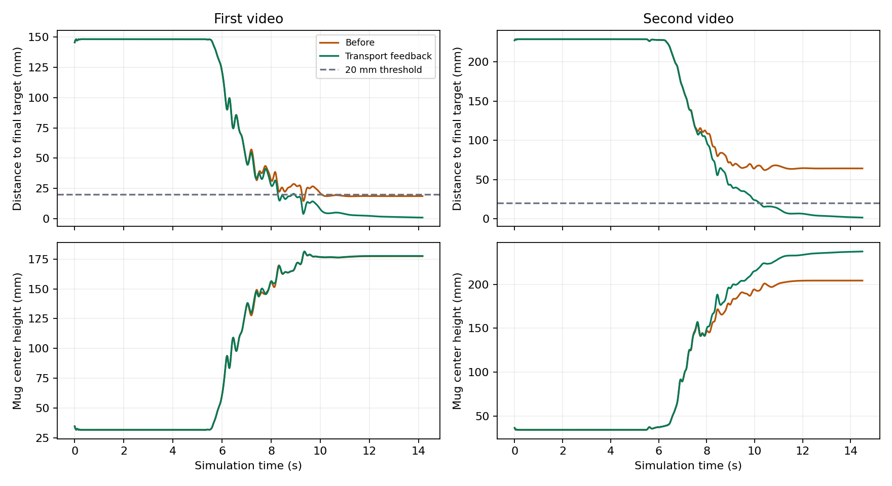

# v6：抓稳后的目标闭环补偿

## 专家控制结果

第二视频的搬运终点偏差已由约 64 mm 降到约 1.6 mm。相同反馈也改善第一视频的精度。这里首先报告专家控制器的结果，学习策略的结果单独记录。

| 项目 | 第一视频 | 第二视频 |
| --- | --- | --- |
| 旧专家 seed 0 终点误差 | 约 18.6 mm | 64.25 mm |
| 新专家 seed 0 终点误差 | 0.853 mm | 1.602 mm |
| seed 0、20–24 及两种半步长检查的误差范围 | 0.698–1.614 mm | 1.594–1.760 mm |
| 上述检查的最短持续抬杯 | 8.33 s | 7.84 s |
| seed 0 最大手与场景穿透 | 0.577 mm | 0.903 mm |
| seed 0 末段平均指尖误差 | 13.99 mm | 14.00 mm |
| 物理及 20 mm 精度准入 | 通过 | 通过 |
| 严格视频忠实度准入 | 通过 | 未通过 |

两条轨迹的保存动作重放误差均为 0。物理步长减半后，分别测试了保存动作与在线专家反馈。所有碰撞、滑移、关节和动作饱和门槛沿用原设置。



图由保存的仿真状态生成，采样位于动作执行前；下图是杯子中心高度，不是杯底高度。

## 控制方法

保留视频重定向得到的抓握与搬运参考。在拇指和食指已有承力接触、杯底离桌面超过 15 mm、到达抬杯阶段后，连续稳定 0.2 s 才启用补偿。

根据“参考杯子位置减实际杯子位置”计算误差，使用有界 PI 控制积累手根部平移补偿。本轮最佳参数为比例增益 0、积分增益 0.5，最大额外平移 80 mm、变化速度上限 30 mm/s。接触丢失时冻结积分和补偿，避免继续累积。

补偿通过手根部的平移雅可比转换成关节方向，再按执行器增益换算成归一化动作增量。加入关节范围与动作限幅，通过 `env.step(action)` 执行。没有逐帧写入杯子状态，也没有修改质量、摩擦或碰撞网格。

第二视频搜索了 8 组比例／积分参数，以物理通过优先，再比较终点距离；第一视频直接检验同一参数。搜索只用 seed 0，20 到 24 用于后续独立初态验证。这些初态仍是毫米级扰动，不能等同于新的真实视频。

实现位于 `src/fromrealhand/transport_control.py` 和 `scripts/55_optimize_transport.py`。旧控制默认行为不变，新反馈在独立实验类中启用。

## 学习数据与评估安排

`scripts/56_export_transport_demos.py` 只接受第一视频已通过精度及忠实度验收的候选。每条新示范再次检查物理、忠实度、20 mm 终点精度和保存动作重放，输出数据哈希与逐条报告。

预定训练集来自原来的 6 个初态、6 个位置／目标变化和 4 个杯子朝向变化，总计 16 条，仍只有一个独立真实视频来源。第二视频因四指持续接触要求未通过而不进入该训练集。

新残差评估使用 `test-v6`：X/Y 各 -8、-2 mm 初态，X/Y 各 ±22 mm 目标变化，杯子 ±8° 旋转。固定动作基线使用模型自身保存的参考动作，保证两者的差别只是是否加入网络残差。这个测试集不加入训练，也不用来挑选 checkpoint。

16 条示范实际全部通过，终点误差 0.703–2.090 mm，最大重放误差为 0。新 GPU BC 的 100 epochs 模型在开发种子 0、2、5 上完整通过 3/3，终点误差分别为 1.590、3.429、3.155 mm。这些是开发初态，不能代替留出场景测试。

300 epochs 训练及开发集评估也已完成，完整通过 3/3，离线动作 RMSE 为 0.000484。检查点已保存为 `bc_residual/policy_bc_300.pickle`。本轮最后评估完成时额度读数约 86%，停止新增实验并收尾。[BC 检查点评估证据](evidence/v6-bc-comparison.json)。

额度接近收尾线时停止新增实验，`test-v6` 尚未运行。因此本轮能确认专家精度改善和开发初态上的学习结果，不能宣称新残差已经在未见场景中优于基线。后续运行：

```bash
python scripts/48_expand_grasp_distribution.py --case-set test-v6 --skip-expert-replay \
  --policy data/processed/seq_dexycb_001/learning_v6/bc_residual/policy_bc_300.pickle \
  --output data/processed/seq_dexycb_001/learning_v6/test
python scripts/52_summarize_policy_pairs.py \
  --evaluation data/processed/seq_dexycb_001/learning_v6/test/evaluation.json \
  --output data/processed/seq_dexycb_001/learning_v6/test/paired_summary.json
```

执行前确认 300 epochs 检查点存在；若训练因额度停止，先查看 `completion.json` 并完成预定训练。`--skip-expert-replay` 仅省略生成专家示范，固定动作与网络策略仍各自完整执行物理评估。

## 查看与验证

```bash
cd /home/smgbro/mujoconew/GITHUB
bash scripts/57_view_transport_gpu.sh first
bash scripts/57_view_transport_gpu.sh second
```

两条命令均已通过实际 GPU 窗口测试，分别回放 1417／1450 步。这是保存的专家控制动作的物理回放。

本轮 47 项 unittest 全部通过，包含新增的接触启动、接触丢失冻结、三维速度与位移限制测试。MANO 路径本轮已恢复可读，资产测试也通过。

重新查看了第二视频第 60 帧的四个相机视角（840412060917、836212060125、839512060362、932122060861）。这次抽查不足以确认无名指全程持续接触，因此没有修改严格忠实度门槛。

主要产物：

- `data/processed/seq_dexycb_001/transport_v6/admission.json`
- `data/processed/seq_dexycb_002/transport_v5/admission.json`
- `data/processed/seq_dexycb_001/learning_v6/`
- `docs/run_logs/evidence/v6-transport-comparison.png`

原始视频、模型、轨迹和 checkpoint 保留本机，GitHub 同步代码及小型验证证据。

验收证据：[第一视频](evidence/v6-first-transport-admission.json)、[第二视频](evidence/v6-second-transport-admission.json)。
