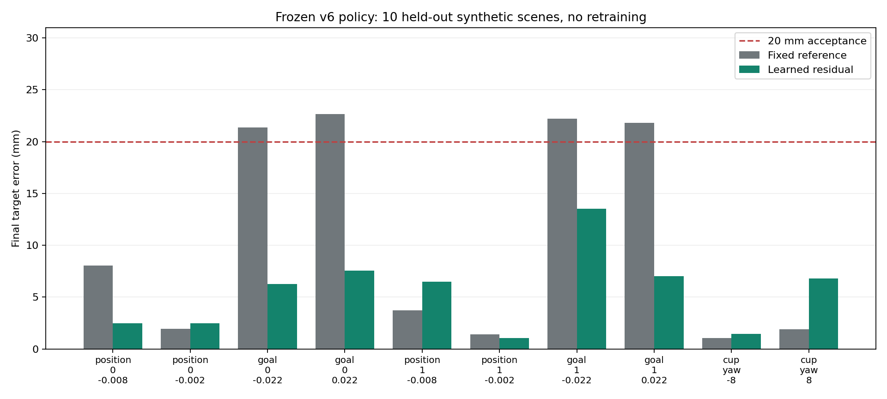

# v7：新场景配对验证与第二视频无名指诊断

> 2026-10-01 更正：本页扩大 margin 的静态距离和可达性候选不再作为可靠几何证据。同一姿态下改变 margin 会改变当前旧版凸体接触结果，见 [v8 原参数对照与连续规划](2026-10-01-contact-continuation-v8.md)。本页真实 `env.step` 动态失败记录仍保留有效；静态结论需要用原碰撞参数重新验证。

本轮只做评估、控制优化和验证。没有启动 BC、DAPG 或任何新策略训练；训练前需要先向用户汇报并等待确认。

## 已完成：冻结模型的新场景测试

模型：`data/processed/seq_dexycb_001/learning_v6/bc_residual/policy_bc_300.pickle`。

SHA-256：`c4e1cb3177a41df62d7d4c2f3c5c225f6229eecce77c5afc5adc0723523e5585`。

模型未重新训练，没有用测试场景选择 checkpoint。固定动作基线使用该模型自身的 `action_reference`，两者都通过 `env.step` 执行，杯子自由运动。

| 指标 | 固定动作 | 学习残差 |
| --- | ---: | ---: |
| 物理通过 | 10/10 | 10/10 |
| 物理及数值抓法门槛通过 | 10/10 | 10/10 |
| 同时满足目标距离 <=20 mm | 6/10 | 10/10 |
| 平均目标误差 | 10.612 mm | 5.510 mm |
| 最大目标误差 | 22.657 mm | 13.509 mm |

分组解释：

- 四个目标偏移场景：平均误差 22.011 -> 8.588 mm，精度通过 0/4 -> 4/4，残差确有改善。
- 四个初态位置偏移：平均误差 3.775 -> 3.120 mm，只在其中两个场景更好。
- 两个杯子旋转场景：平均误差 1.485 -> 4.134 mm，残差反而变差，但仍通过 20 mm 门槛。
- 总体 6/10 场景误差下降，不能说每个场景都优于基线。

这十个场景是预先定义的合成留出变化，不是十段新实拍视频。结果支持有限范围内的目标适应优势，不是跨视频、跨杯型或实机泛化证明。



[汇总证据](evidence/v7-paired-summary.json)。完整逐场景记录在本机 `data/processed/seq_dexycb_001/learning_v6/test/evaluation.json`。

运行命令（公共环境见文末）：

```bash
python scripts/48_expand_grasp_distribution.py --case-set test-v6 --skip-expert-replay --quota-stop 80 \
  --policy data/processed/seq_dexycb_001/learning_v6/bc_residual/policy_bc_300.pickle \
  --output data/processed/seq_dexycb_001/learning_v6/test
python scripts/52_summarize_policy_pairs.py \
  --evaluation data/processed/seq_dexycb_001/learning_v6/test/evaluation.json \
  --output data/processed/seq_dexycb_001/learning_v6/test/paired_summary.json
```

这些输出目录已存在，重跑应使用新的独立目录。

## 第二视频：方法和证据边界

保留 `transport_v5` 原版，不覆盖数据、示范或 checkpoint。没有改质量、摩擦或碰撞网格，也没有在动态回放中逐帧写入杯子位姿。

1. `59_refine_ring_contact.py`：先做无名指侧摆、近端屈曲、末端联动的有界坐标搜索。19 个候选将末段无名指标签误差从 20.34 降到 11.24 mm，但没有获得持续接触。这说明标签误差下降不等于接触改善。
2. `60_refine_contact_targets.py`：对无名指建立杯子三角网格最近表面的控制目标，偏移最多 25 mm，闭合时逐渐启用。原始标签保持不变，所有忠实度指标仍对原标签计算。尝试反馈强度和深度，过强反馈出现碰撞越界，不能采用。
3. 进一步测试只让该手指的任务反馈作用于其自身关节，避免带动手腕破坏其他手指。这仍没有单独解决接触。
4. `62_probe_ring_reachability.py`：静态约束 IK 诊断。只优化无名指时，三个局部解仍有约 6.2–7.3 mm 的碰撞几何间隙，侧摆接近关节上限。这不是全局不可达证明，但解释了局部控制搜索停滞。
5. 联动手腕与所有手指的静态搜索找到两个满足几何门槛的候选，以及一个明显失败候选。失败候选不进入动态测试。静态可接触不能作为物理抓取成功证据，必须再运行连续动作。

静态诊断仅扩大碰撞检测距离，并只调用运动学、肌腱几何和碰撞查询，不推进仿真、不建立接触力。扩大检测距离的模型没有用于物理验证。最初直接调用 `sim.forward()` 触发约束缓存容量错误，已改为几何查询，未修改原始 MuJoCo XML 或缓存容量。

缓存标签的无名指末段距网格表面约 17 mm；三角面最近点计算也约 17.01 mm。该距离不能单独说明视频里没有无名指接触：关节标签不是完整皮肤表面，且没有真实接触力标签。因此没有把四指门槛改成三指，也没有宣称新增接触是视频中已确认的接触。

## 验收标准

- 整条动态轨迹仅用动作控制，自由杯子；保存动作重放观测误差 <1e-8。
- 全手与场景最大穿透 <=1 mm；初始穿透 <=0.5 mm；承力接触间隙 <=0.5 mm。
- 关节越界 <=0.02 rad，末段滑移 <=5 mm，动作饱和比例 <1%，无非有限状态。
- 拇指和食指接触占比 >=80%；至少四指末段接触 >=80%。
- 末段平均指尖误差 <15 mm，各指 <25 mm，目标误差 <=20 mm。
- 候选通过后再验证种子 30–34、保存动作，以及半仿真步长的保存动作和在线控制。
- 单帧 IK、数据格式正确、策略可运行、持续物理抓取分别记录，不能互相替代。

## 收尾结论与下一步

第一项已完成验证，但第二项尚未解决。静态全手候选直接控制时，半幅修正可保持三指但仍不能让无名指承力，完整修正则会丢失抓握。新增的延后过渡实验先保留旧抓握，再平滑改变参考，也没有消除这一问题。没有将这些候选导出为合格训练示范。

七组开发搜索累计 72 次动态试验，含重复基线；49 次物理门槛通过，0 次完整门槛通过，无名指末段接触占比最大值仍为 0。这些不是 72 个独立视频或独立测试场景。[搜索证据](evidence/v7-ring-search-summary.json)、[静态候选证据](evidence/v7-static-reachability.json)。

本机目录均位于 `data/processed/seq_dexycb_002/`：`ring_v7`、`contact_targets_v7`、`contact_targets_v7_high`、`contact_joint_v7`、`contact_isolated_v7`、`whole_hand_dynamic_v7`、`whole_hand_late_v7`。诊断回放与静态求解在 `contact_inspection_v7`。

延后过渡实验的复现入口：

```bash
python scripts/59_refine_ring_contact.py \
  --candidate data/processed/seq_dexycb_002/contact_inspection_v7/admission.json \
  --proposals data/processed/seq_dexycb_002/contact_inspection_v7/whole_hand_reachability.json \
  --late-correction --quota-stop 80 \
  --output data/processed/seq_dexycb_002/whole_hand_late_v7_rerun
```

因此不启动新训练，也不把 `candidate.json` 当成准入证书。旧 `transport_v5` 仍是第二视频推荐的稳定物理版本，其四指限制依然存在。

后续应转向整段轨迹的接触约束优化：

1. 固定已有拇指、食指、中指的支撑阶段，联合优化手腕和手指的连续参考，而不是用单个终点修正整条视频。
2. 在过渡各帧加入支撑接触、无名指接近、碰撞、肌腱范围、关节速度及加速度约束，保留原标签误差报告。
3. 把优化参考交给原始接触参数下的动作控制验证，先检查接近、闭合、抬杯和保持各阶段的接触变化。
4. 只有主轨迹通过，才做保存动作重放、独立种子和半步长检查。随后先通知用户，不自动开始训练。

修改影响的回归测试：关闭新增选项，第二视频原控制器重新运行，目标距离、保持时间、末段平均指尖误差和最大手场景穿透与旧报告差值均为 0。[证据](evidence/v7-original-controller-regression.json)。

## 测试与运行环境

53 项 unittest 通过。首次未设置 `PYTHONPATH` 的测试命令有一项导入失败，修正环境后全套通过。

```bash
conda activate dexmv
export PYTHONPATH=src
export OPENBLAS_NUM_THREADS=1 OMP_NUM_THREADS=1
export LD_LIBRARY_PATH=/home/smgbro/.mujoco/mujoco200/bin:/usr/lib/x86_64-linux-gnu
export LD_PRELOAD=/usr/lib/x86_64-linux-gnu/libstdc++.so.6
python -m unittest discover -s tests -q
```

本次尝试离屏渲染诊断回放时，`MjRenderContextOffscreen` 报 `Failed to initialize OpenGL`，未生成仿真截图。数值验证正常；柱状图是实际评估记录生成的图表，不是仿真截图。

额度取本机会话最近的 300 分钟窗口记录；按用户要求以已用 80% 为收尾线。控制搜索脚本参数显式设为 `--quota-stop 80`，短程诊断由外层检查额度。本轮在约 71% 开始收尾，不再开新实验，留出记录和测试时间；不自动启动训练。
